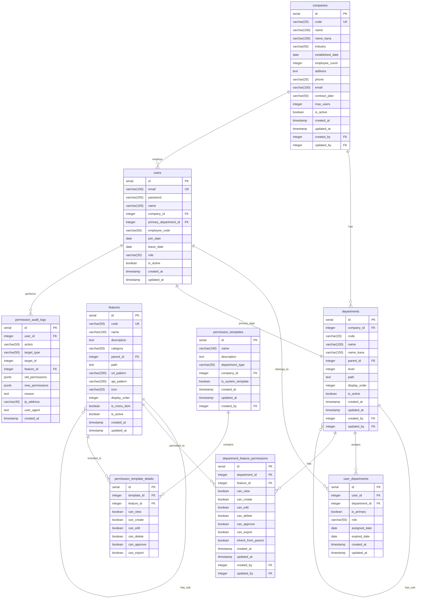

# 機能管理システム データベース設計書

## 1. ER図



## 2. テーブル詳細設計

### 2.1 companies（会社マスタ）

| カラム名 | データ型 | 制約 | 説明 |
|---------|---------|------|------|
| id | SERIAL | PK | 会社ID |
| code | VARCHAR(20) | UK, NOT NULL | 会社コード |
| name | VARCHAR(100) | NOT NULL | 会社名 |
| name_kana | VARCHAR(100) | | 会社名カナ |
| industry | VARCHAR(50) | | 業種 |
| established_date | DATE | | 設立日 |
| employee_count | INTEGER | | 従業員数 |
| address | TEXT | | 住所 |
| phone | VARCHAR(20) | | 電話番号 |
| email | VARCHAR(100) | | メールアドレス |
| contract_plan | VARCHAR(50) | DEFAULT 'STANDARD' | 契約プラン |
| max_users | INTEGER | DEFAULT 100 | 最大ユーザー数 |
| is_active | BOOLEAN | DEFAULT true | 有効フラグ |
| created_at | TIMESTAMP | DEFAULT CURRENT_TIMESTAMP | 作成日時 |
| updated_at | TIMESTAMP | DEFAULT CURRENT_TIMESTAMP | 更新日時 |
| created_by | INTEGER | FK(users.id) | 作成者 |
| updated_by | INTEGER | FK(users.id) | 更新者 |

**インデックス:**
- idx_companies_code ON code
- idx_companies_active ON is_active

### 2.2 departments（部署マスタ）

| カラム名 | データ型 | 制約 | 説明 |
|---------|---------|------|------|
| id | SERIAL | PK | 部署ID |
| company_id | INTEGER | FK(companies.id), NOT NULL | 会社ID |
| code | VARCHAR(20) | NOT NULL | 部署コード |
| name | VARCHAR(100) | NOT NULL | 部署名 |
| name_kana | VARCHAR(100) | | 部署名カナ |
| parent_id | INTEGER | FK(departments.id) | 親部署ID |
| level | INTEGER | DEFAULT 1, NOT NULL | 階層レベル |
| path | TEXT | | 階層パス |
| display_order | INTEGER | DEFAULT 0 | 表示順 |
| is_active | BOOLEAN | DEFAULT true | 有効フラグ |
| created_at | TIMESTAMP | DEFAULT CURRENT_TIMESTAMP | 作成日時 |
| updated_at | TIMESTAMP | DEFAULT CURRENT_TIMESTAMP | 更新日時 |
| created_by | INTEGER | FK(users.id) | 作成者 |
| updated_by | INTEGER | FK(users.id) | 更新者 |

**制約:**
- UNIQUE(company_id, code)

**インデックス:**
- idx_departments_company ON company_id
- idx_departments_parent ON parent_id
- idx_departments_path ON path
- idx_departments_active ON is_active

### 2.3 users（ユーザーマスタ）※拡張

| カラム名 | データ型 | 制約 | 説明 |
|---------|---------|------|------|
| id | SERIAL | PK | ユーザーID |
| email | VARCHAR(100) | UK, NOT NULL | メールアドレス |
| password | VARCHAR(255) | NOT NULL | パスワード |
| name | VARCHAR(100) | NOT NULL | 氏名 |
| company_id | INTEGER | FK(companies.id) | 会社ID |
| primary_department_id | INTEGER | FK(departments.id) | 主所属部署ID |
| employee_code | VARCHAR(50) | | 社員番号 |
| join_date | DATE | | 入社日 |
| leave_date | DATE | | 退職日 |
| role | VARCHAR(20) | DEFAULT 'USER' | システムロール |
| is_active | BOOLEAN | DEFAULT true | 有効フラグ |
| created_at | TIMESTAMP | DEFAULT CURRENT_TIMESTAMP | 作成日時 |
| updated_at | TIMESTAMP | DEFAULT CURRENT_TIMESTAMP | 更新日時 |

**インデックス:**
- idx_users_company ON company_id
- idx_users_primary_dept ON primary_department_id

### 2.4 user_departments（ユーザー所属）

| カラム名 | データ型 | 制約 | 説明 |
|---------|---------|------|------|
| id | SERIAL | PK | 所属ID |
| user_id | INTEGER | FK(users.id), NOT NULL | ユーザーID |
| department_id | INTEGER | FK(departments.id), NOT NULL | 部署ID |
| is_primary | BOOLEAN | DEFAULT false | 主所属フラグ |
| role | VARCHAR(50) | DEFAULT 'MEMBER' | 部署内役割 |
| assigned_date | DATE | DEFAULT CURRENT_DATE | 配属日 |
| expired_date | DATE | | 終了日 |
| created_at | TIMESTAMP | DEFAULT CURRENT_TIMESTAMP | 作成日時 |
| updated_at | TIMESTAMP | DEFAULT CURRENT_TIMESTAMP | 更新日時 |

**制約:**
- UNIQUE(user_id, department_id)

**インデックス:**
- idx_user_departments_user ON user_id
- idx_user_departments_dept ON department_id
- idx_user_departments_primary ON is_primary

### 2.5 features（機能マスタ）

| カラム名 | データ型 | 制約 | 説明 |
|---------|---------|------|------|
| id | SERIAL | PK | 機能ID |
| code | VARCHAR(50) | UK, NOT NULL | 機能コード |
| name | VARCHAR(100) | NOT NULL | 機能名 |
| description | TEXT | | 機能説明 |
| category | VARCHAR(50) | NOT NULL | カテゴリ |
| parent_id | INTEGER | FK(features.id) | 親機能ID |
| path | TEXT | | 階層パス |
| url_pattern | VARCHAR(200) | | URLパターン |
| api_pattern | VARCHAR(200) | | APIパターン |
| icon | VARCHAR(50) | | アイコン |
| display_order | INTEGER | DEFAULT 0 | 表示順 |
| is_menu_item | BOOLEAN | DEFAULT true | メニュー表示フラグ |
| is_active | BOOLEAN | DEFAULT true | 有効フラグ |
| created_at | TIMESTAMP | DEFAULT CURRENT_TIMESTAMP | 作成日時 |
| updated_at | TIMESTAMP | DEFAULT CURRENT_TIMESTAMP | 更新日時 |

**カテゴリ値:**
- USER_MGMT: ユーザー管理
- LOG_MGMT: ログ管理
- PERMISSION_MGMT: 権限管理
- REPORT: レポート
- MASTER: マスタ管理
- SYSTEM: システム管理

**インデックス:**
- idx_features_code ON code
- idx_features_category ON category
- idx_features_parent ON parent_id
- idx_features_active ON is_active

### 2.6 department_feature_permissions（部署機能権限）

| カラム名 | データ型 | 制約 | 説明 |
|---------|---------|------|------|
| id | SERIAL | PK | 権限ID |
| department_id | INTEGER | FK(departments.id), NOT NULL | 部署ID |
| feature_id | INTEGER | FK(features.id), NOT NULL | 機能ID |
| can_view | BOOLEAN | DEFAULT false | 閲覧権限 |
| can_create | BOOLEAN | DEFAULT false | 作成権限 |
| can_edit | BOOLEAN | DEFAULT false | 編集権限 |
| can_delete | BOOLEAN | DEFAULT false | 削除権限 |
| can_approve | BOOLEAN | DEFAULT false | 承認権限 |
| can_export | BOOLEAN | DEFAULT false | 出力権限 |
| inherit_from_parent | BOOLEAN | DEFAULT true | 親部署継承フラグ |
| created_at | TIMESTAMP | DEFAULT CURRENT_TIMESTAMP | 作成日時 |
| updated_at | TIMESTAMP | DEFAULT CURRENT_TIMESTAMP | 更新日時 |
| created_by | INTEGER | FK(users.id) | 作成者 |
| updated_by | INTEGER | FK(users.id) | 更新者 |

**制約:**
- UNIQUE(department_id, feature_id)

**インデックス:**
- idx_dept_feature_dept ON department_id
- idx_dept_feature_feature ON feature_id
- idx_dept_perm_lookup ON (department_id, feature_id) INCLUDE (can_view, can_create, can_edit, can_delete)

### 2.7 permission_templates（権限テンプレート）

| カラム名 | データ型 | 制約 | 説明 |
|---------|---------|------|------|
| id | SERIAL | PK | テンプレートID |
| name | VARCHAR(100) | NOT NULL | テンプレート名 |
| description | TEXT | | 説明 |
| department_type | VARCHAR(50) | | 部署タイプ |
| company_id | INTEGER | FK(companies.id) | 会社ID |
| is_system_template | BOOLEAN | DEFAULT false | システムテンプレートフラグ |
| created_at | TIMESTAMP | DEFAULT CURRENT_TIMESTAMP | 作成日時 |
| updated_at | TIMESTAMP | DEFAULT CURRENT_TIMESTAMP | 更新日時 |
| created_by | INTEGER | FK(users.id) | 作成者 |

**部署タイプ値:**
- SALES: 営業部
- HR: 人事部
- IT: 情報システム部
- FINANCE: 経理部
- GENERAL: 総務部
- PRODUCTION: 製造部
- MARKETING: マーケティング部

### 2.8 permission_template_details（権限テンプレート詳細）

| カラム名 | データ型 | 制約 | 説明 |
|---------|---------|------|------|
| id | SERIAL | PK | 詳細ID |
| template_id | INTEGER | FK(permission_templates.id), NOT NULL | テンプレートID |
| feature_id | INTEGER | FK(features.id), NOT NULL | 機能ID |
| can_view | BOOLEAN | DEFAULT false | 閲覧権限 |
| can_create | BOOLEAN | DEFAULT false | 作成権限 |
| can_edit | BOOLEAN | DEFAULT false | 編集権限 |
| can_delete | BOOLEAN | DEFAULT false | 削除権限 |
| can_approve | BOOLEAN | DEFAULT false | 承認権限 |
| can_export | BOOLEAN | DEFAULT false | 出力権限 |

**制約:**
- UNIQUE(template_id, feature_id)

### 2.9 permission_audit_logs（権限変更監査ログ）

| カラム名 | データ型 | 制約 | 説明 |
|---------|---------|------|------|
| id | SERIAL | PK | ログID |
| user_id | INTEGER | FK(users.id), NOT NULL | 実行ユーザーID |
| action | VARCHAR(50) | NOT NULL | アクション |
| target_type | VARCHAR(50) | NOT NULL | 対象タイプ |
| target_id | INTEGER | NOT NULL | 対象ID |
| feature_id | INTEGER | FK(features.id) | 機能ID |
| old_permissions | JSONB | | 変更前権限 |
| new_permissions | JSONB | | 変更後権限 |
| reason | TEXT | | 変更理由 |
| ip_address | VARCHAR(45) | | IPアドレス |
| user_agent | TEXT | | ユーザーエージェント |
| created_at | TIMESTAMP | DEFAULT CURRENT_TIMESTAMP | 作成日時 |

**アクション値:**
- GRANT: 権限付与
- REVOKE: 権限剥奪
- MODIFY: 権限変更
- TEMPLATE_APPLY: テンプレート適用

**対象タイプ値:**
- DEPARTMENT: 部署
- USER: ユーザー
- TEMPLATE: テンプレート

**インデックス:**
- idx_audit_user ON user_id
- idx_audit_action ON action
- idx_audit_target ON (target_type, target_id)
- idx_audit_created ON created_at DESC

## 3. データベース初期データ

### 3.1 機能マスタ初期データ

```sql
-- システム管理機能
INSERT INTO features (code, name, description, category, display_order) VALUES
('USER_MGMT', 'ユーザー管理', 'ユーザーの登録・編集・削除', 'SYSTEM', 10),
('DEPT_MGMT', '部署管理', '部署の登録・編集・削除', 'SYSTEM', 20),
('COMPANY_MGMT', '会社管理', '会社情報の管理', 'SYSTEM', 30),
('PERMISSION_MGMT', '権限管理', '権限の設定・管理', 'SYSTEM', 40),
('LOG_MGMT', 'ログ管理', 'システムログの閲覧・管理', 'SYSTEM', 50),

-- ユーザー管理の子機能
('USER_LIST', 'ユーザー一覧', 'ユーザー一覧の表示', 'USER_MGMT', 11),
('USER_CREATE', 'ユーザー登録', '新規ユーザーの登録', 'USER_MGMT', 12),
('USER_EDIT', 'ユーザー編集', 'ユーザー情報の編集', 'USER_MGMT', 13),
('USER_DELETE', 'ユーザー削除', 'ユーザーの削除', 'USER_MGMT', 14),
('USER_IMPORT', 'ユーザー一括登録', 'CSVによる一括登録', 'USER_MGMT', 15),

-- ログ管理の子機能
('LOG_SEARCH', 'ログ検索', 'ログの検索・閲覧', 'LOG_MGMT', 51),
('LOG_STATISTICS', 'ログ統計', 'ログの統計表示', 'LOG_MGMT', 52),
('LOG_EXPORT', 'ログエクスポート', 'ログのエクスポート', 'LOG_MGMT', 53),
('LOG_CLEANUP', 'ログクリーンアップ', '古いログの削除', 'LOG_MGMT', 54),

-- レポート機能
('REPORT_USER', 'ユーザーレポート', 'ユーザー関連レポート', 'REPORT', 61),
('REPORT_PERMISSION', '権限レポート', '権限設定レポート', 'REPORT', 62),
('REPORT_AUDIT', '監査レポート', '監査ログレポート', 'REPORT', 63);
```

### 3.2 権限テンプレート初期データ

```sql
-- システム管理者用テンプレート
INSERT INTO permission_templates (name, description, department_type, is_system_template)
VALUES ('システム管理者', '全機能へのフルアクセス', 'IT', true);

-- テンプレート詳細（全権限付与）
INSERT INTO permission_template_details (template_id, feature_id, can_view, can_create, can_edit, can_delete, can_approve, can_export)
SELECT 1, id, true, true, true, true, true, true FROM features;

-- 一般部署用テンプレート
INSERT INTO permission_templates (name, description, department_type, is_system_template)
VALUES ('一般部署', '基本機能のみ', 'GENERAL', true);

-- テンプレート詳細（閲覧のみ）
INSERT INTO permission_template_details (template_id, feature_id, can_view, can_create, can_edit, can_delete, can_approve, can_export)
SELECT 2, id, true, false, false, false, false, false
FROM features
WHERE category NOT IN ('SYSTEM', 'PERMISSION_MGMT');
```

## 4. パフォーマンス最適化設計

### 4.1 インデックス戦略

**高頻度クエリ用インデックス:**

```sql
-- 権限チェック用複合インデックス
CREATE INDEX idx_permission_check
ON department_feature_permissions(department_id, feature_id)
INCLUDE (can_view, can_create, can_edit, can_delete, can_approve, can_export)
WHERE department_id IS NOT NULL;

-- ユーザー所属検索用
CREATE INDEX idx_user_dept_active
ON user_departments(user_id, is_primary)
WHERE expired_date IS NULL OR expired_date > CURRENT_DATE;

-- 部署階層検索用
CREATE INDEX idx_dept_hierarchy
ON departments(company_id, parent_id, level)
WHERE is_active = true;
```

### 4.2 パーティショニング戦略

```sql
-- 監査ログのパーティショニング（月単位）
CREATE TABLE permission_audit_logs_2024_01
PARTITION OF permission_audit_logs
FOR VALUES FROM ('2024-01-01') TO ('2024-02-01');

CREATE TABLE permission_audit_logs_2024_02
PARTITION OF permission_audit_logs
FOR VALUES FROM ('2024-02-01') TO ('2024-03-01');

-- 自動パーティション作成
CREATE OR REPLACE FUNCTION create_monthly_partition()
RETURNS void AS $$
DECLARE
  partition_name text;
  start_date date;
  end_date date;
BEGIN
  start_date := date_trunc('month', CURRENT_DATE + interval '1 month');
  end_date := start_date + interval '1 month';
  partition_name := 'permission_audit_logs_' || to_char(start_date, 'YYYY_MM');

  EXECUTE format('
    CREATE TABLE IF NOT EXISTS %I
    PARTITION OF permission_audit_logs
    FOR VALUES FROM (%L) TO (%L)',
    partition_name, start_date, end_date);
END;
$$ LANGUAGE plpgsql;
```

## 5. データ整合性保証

### 5.1 トリガー定義

```sql
-- 部署階層パス自動更新
CREATE OR REPLACE FUNCTION update_department_path()
RETURNS TRIGGER AS $$
BEGIN
  IF NEW.parent_id IS NULL THEN
    NEW.path = '/' || NEW.id;
    NEW.level = 1;
  ELSE
    SELECT path || '/' || NEW.id, level + 1
    INTO NEW.path, NEW.level
    FROM departments
    WHERE id = NEW.parent_id;
  END IF;
  RETURN NEW;
END;
$$ LANGUAGE plpgsql;

CREATE TRIGGER trg_update_department_path
BEFORE INSERT OR UPDATE ON departments
FOR EACH ROW
EXECUTE FUNCTION update_department_path();

-- ユーザー主所属の一意性保証
CREATE OR REPLACE FUNCTION ensure_single_primary_dept()
RETURNS TRIGGER AS $$
BEGIN
  IF NEW.is_primary = true THEN
    UPDATE user_departments
    SET is_primary = false
    WHERE user_id = NEW.user_id
    AND id != NEW.id;
  END IF;
  RETURN NEW;
END;
$$ LANGUAGE plpgsql;

CREATE TRIGGER trg_ensure_single_primary
AFTER INSERT OR UPDATE ON user_departments
FOR EACH ROW
WHEN (NEW.is_primary = true)
EXECUTE FUNCTION ensure_single_primary_dept();
```

### 5.2 制約定義

```sql
-- 部署の循環参照防止
ALTER TABLE departments
ADD CONSTRAINT chk_no_self_reference
CHECK (id != parent_id);

-- 日付の整合性
ALTER TABLE user_departments
ADD CONSTRAINT chk_date_validity
CHECK (expired_date IS NULL OR expired_date > assigned_date);

ALTER TABLE users
ADD CONSTRAINT chk_employment_dates
CHECK (leave_date IS NULL OR leave_date > join_date);

-- 権限の論理整合性
ALTER TABLE department_feature_permissions
ADD CONSTRAINT chk_permission_logic
CHECK (
  (can_view = true) OR
  (can_create = false AND can_edit = false AND can_delete = false AND can_approve = false AND can_export = false)
);
```

## 6. バックアップ・リカバリ設計

### 6.1 バックアップ戦略

```sql
-- 権限設定のバックアップビュー
CREATE VIEW v_permission_backup AS
SELECT
  d.company_id,
  c.code AS company_code,
  d.code AS department_code,
  f.code AS feature_code,
  p.can_view,
  p.can_create,
  p.can_edit,
  p.can_delete,
  p.can_approve,
  p.can_export,
  p.created_at,
  p.updated_at
FROM department_feature_permissions p
JOIN departments d ON p.department_id = d.id
JOIN companies c ON d.company_id = c.id
JOIN features f ON p.feature_id = f.id;

-- バックアップテーブル
CREATE TABLE permission_backups (
  id SERIAL PRIMARY KEY,
  backup_date TIMESTAMP DEFAULT CURRENT_TIMESTAMP,
  backup_type VARCHAR(50),
  backup_data JSONB,
  created_by INTEGER REFERENCES users(id)
);
```

### 6.2 リストア手順

```sql
-- 権限設定のリストア関数
CREATE OR REPLACE FUNCTION restore_permissions(backup_id INTEGER)
RETURNS void AS $$
DECLARE
  backup_record RECORD;
  perm RECORD;
BEGIN
  SELECT * INTO backup_record
  FROM permission_backups
  WHERE id = backup_id;

  FOR perm IN SELECT * FROM jsonb_array_elements(backup_record.backup_data)
  LOOP
    INSERT INTO department_feature_permissions
    (department_id, feature_id, can_view, can_create, can_edit, can_delete, can_approve, can_export)
    VALUES (
      (perm->>'department_id')::INTEGER,
      (perm->>'feature_id')::INTEGER,
      (perm->>'can_view')::BOOLEAN,
      (perm->>'can_create')::BOOLEAN,
      (perm->>'can_edit')::BOOLEAN,
      (perm->>'can_delete')::BOOLEAN,
      (perm->>'can_approve')::BOOLEAN,
      (perm->>'can_export')::BOOLEAN
    )
    ON CONFLICT (department_id, feature_id)
    DO UPDATE SET
      can_view = EXCLUDED.can_view,
      can_create = EXCLUDED.can_create,
      can_edit = EXCLUDED.can_edit,
      can_delete = EXCLUDED.can_delete,
      can_approve = EXCLUDED.can_approve,
      can_export = EXCLUDED.can_export,
      updated_at = CURRENT_TIMESTAMP;
  END LOOP;
END;
$$ LANGUAGE plpgsql;
```

## 7. 監視・メンテナンス

### 7.1 統計情報ビュー

```sql
-- 権限利用統計
CREATE VIEW v_permission_statistics AS
SELECT
  c.name AS company_name,
  d.name AS department_name,
  COUNT(DISTINCT p.feature_id) AS total_features,
  COUNT(DISTINCT CASE WHEN p.can_view THEN p.feature_id END) AS viewable_features,
  COUNT(DISTINCT CASE WHEN p.can_create THEN p.feature_id END) AS creatable_features,
  COUNT(DISTINCT u.user_id) AS total_users
FROM departments d
LEFT JOIN companies c ON d.company_id = c.id
LEFT JOIN department_feature_permissions p ON d.id = p.department_id
LEFT JOIN user_departments u ON d.id = u.department_id
WHERE d.is_active = true
GROUP BY c.id, c.name, d.id, d.name;

-- 監査ログ統計
CREATE VIEW v_audit_statistics AS
SELECT
  DATE(created_at) AS audit_date,
  action,
  target_type,
  COUNT(*) AS action_count,
  COUNT(DISTINCT user_id) AS unique_users
FROM permission_audit_logs
GROUP BY DATE(created_at), action, target_type;
```

### 7.2 メンテナンススクリプト

```sql
-- 未使用権限の検出
CREATE OR REPLACE FUNCTION find_unused_permissions()
RETURNS TABLE(
  department_id INTEGER,
  department_name VARCHAR,
  feature_id INTEGER,
  feature_name VARCHAR,
  last_used TIMESTAMP
) AS $$
BEGIN
  RETURN QUERY
  SELECT
    p.department_id,
    d.name,
    p.feature_id,
    f.name,
    MAX(al.created_at) AS last_used
  FROM department_feature_permissions p
  JOIN departments d ON p.department_id = d.id
  JOIN features f ON p.feature_id = f.id
  LEFT JOIN permission_audit_logs al ON al.feature_id = p.feature_id
  WHERE (p.can_view OR p.can_create OR p.can_edit OR p.can_delete)
  GROUP BY p.department_id, d.name, p.feature_id, f.name
  HAVING MAX(al.created_at) < CURRENT_DATE - INTERVAL '90 days'
     OR MAX(al.created_at) IS NULL;
END;
$$ LANGUAGE plpgsql;

-- 権限の一括クリーンアップ
CREATE OR REPLACE FUNCTION cleanup_expired_permissions()
RETURNS INTEGER AS $$
DECLARE
  deleted_count INTEGER;
BEGIN
  -- 退職者の権限削除
  DELETE FROM user_departments
  WHERE user_id IN (
    SELECT id FROM users
    WHERE leave_date < CURRENT_DATE - INTERVAL '30 days'
  );

  GET DIAGNOSTICS deleted_count = ROW_COUNT;

  -- 無効部署の権限削除
  DELETE FROM department_feature_permissions
  WHERE department_id IN (
    SELECT id FROM departments
    WHERE is_active = false
    AND updated_at < CURRENT_DATE - INTERVAL '90 days'
  );

  RETURN deleted_count;
END;
$$ LANGUAGE plpgsql;
```