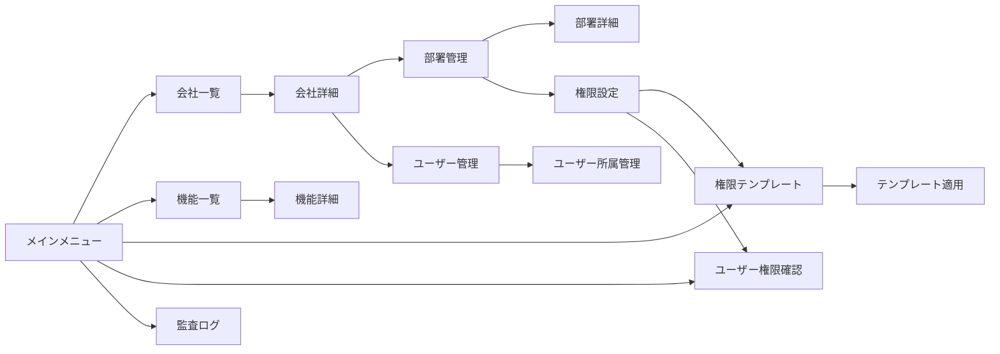

# 機能管理システム画面設計書

## 1. 画面一覧

| No | 画面ID | 画面名 | 説明 | 権限要件 |
|----|--------|--------|------|---------|
| 1 | SCR_COMPANY_LIST | 会社一覧 | 会社の一覧表示・検索 | COMPANY_MGMT.VIEW |
| 2 | SCR_COMPANY_DETAIL | 会社詳細 | 会社情報の詳細表示・編集 | COMPANY_MGMT.VIEW/EDIT |
| 3 | SCR_DEPT_TREE | 部署管理 | 部署のツリー表示・管理 | DEPT_MGMT.VIEW |
| 4 | SCR_DEPT_DETAIL | 部署詳細 | 部署情報の詳細表示・編集 | DEPT_MGMT.VIEW/EDIT |
| 5 | SCR_USER_DEPT | ユーザー所属管理 | ユーザーの部署所属管理 | USER_MGMT.EDIT |
| 6 | SCR_FEATURE_LIST | 機能一覧 | システム機能の一覧管理 | PERMISSION_MGMT.VIEW |
| 7 | SCR_PERM_MATRIX | 権限設定 | 部署別権限のマトリクス設定 | PERMISSION_MGMT.EDIT |
| 8 | SCR_PERM_TEMPLATE | 権限テンプレート | テンプレートの管理・適用 | PERMISSION_MGMT.EDIT |
| 9 | SCR_PERM_USER | ユーザー権限確認 | ユーザー別の有効権限表示 | PERMISSION_MGMT.VIEW |
| 10 | SCR_AUDIT_LOG | 監査ログ | 権限変更履歴の表示 | PERMISSION_MGMT.VIEW |

## 2. 画面詳細設計

### 2.1 会社一覧画面（SCR_COMPANY_LIST）

#### レイアウト
```
┌─────────────────────────────────────────────────────────────────┐
│ 会社管理                                           [新規登録]     │
├─────────────────────────────────────────────────────────────────┤
│ 検索条件:                                                        │
│ ┌──────────────┐ ┌──────────────┐ ┌──────────┐ [検索] [クリア] │
│ │会社名/コード  │ │業種         │ │状態      │               │
│ └──────────────┘ └──────────────┘ └──────────┘               │
├─────────────────────────────────────────────────────────────────┤
│ 検索結果: 25件                                    [エクスポート]  │
│ ┌───┬──────────┬────────────────┬──────┬──────┬──────┬──────┐│
│ │No │会社コード│会社名          │業種  │社員数│プラン│操作  ││
│ ├───┼──────────┼────────────────┼──────┼──────┼──────┼──────┤│
│ │1  │COMP001  │株式会社サンプル│IT    │150   │ENTER │[詳細]││
│ │2  │COMP002  │製造会社        │製造業│300   │STAND │[詳細]││
│ └───┴──────────┴────────────────┴──────┴──────┴──────┴──────┘│
│ [<] [1] [2] [3] ... [>]  表示件数: [20▼]                       │
└─────────────────────────────────────────────────────────────────┘
```

#### 機能仕様
- **検索機能**: 会社名/コード、業種、有効/無効でフィルタリング
- **一覧表示**: ページネーション対応、ソート可能
- **新規登録**: 権限がある場合のみボタン表示
- **詳細遷移**: 各行クリックで詳細画面へ遷移
- **エクスポート**: CSV/Excel形式でダウンロード

### 2.2 会社詳細画面（SCR_COMPANY_DETAIL）

#### レイアウト
```
┌─────────────────────────────────────────────────────────────────┐
│ 会社詳細 > 株式会社サンプル              [編集] [削除] [戻る]    │
├─────────────────────────────────────────────────────────────────┤
│ 基本情報                                                        │
│ ┌─────────────────────────────────────────────────────────────┤
│ │会社コード: COMP001                                           │
│ │会社名:     株式会社サンプル                                  │
│ │会社名カナ: カブシキガイシャサンプル                          │
│ │業種:       IT                                                │
│ │設立日:     2000-04-01                                        │
│ │従業員数:   150名                                             │
│ │住所:       東京都千代田区...                                 │
│ │電話番号:   03-1234-5678                                      │
│ │メール:     info@sample.co.jp                                 │
│ └─────────────────────────────────────────────────────────────┤
│                                                                 │
│ 契約情報                                                        │
│ ┌─────────────────────────────────────────────────────────────┤
│ │契約プラン: ENTERPRISE                                        │
│ │最大ユーザー数: 500                                           │
│ │現在のユーザー数: 120 / 500                                   │
│ │部署数: 15                                                    │
│ │状態: 有効                                                    │
│ └─────────────────────────────────────────────────────────────┤
│                                                                 │
│ 部署一覧                                          [部署管理へ]  │
│ ┌───┬──────────┬────────────────┬──────┬──────────────────┐│
│ │No │部署コード│部署名          │レベル│所属ユーザー数    ││
│ ├───┼──────────┼────────────────┼──────┼──────────────────┤│
│ │1  │HQ       │本社            │1     │10                ││
│ │2  │SALES    │営業部          │2     │25                ││
│ └───┴──────────┴────────────────┴──────┴──────────────────┘│
└─────────────────────────────────────────────────────────────────┘
```

#### 編集モード
```
┌─────────────────────────────────────────────────────────────────┐
│ 会社編集 > 株式会社サンプル                   [保存] [キャンセル]│
├─────────────────────────────────────────────────────────────────┤
│ 基本情報                                                        │
│ ┌─────────────────────────────────────────────────────────────┤
│ │会社コード*: [COMP001        ] (変更不可)                     │
│ │会社名*:     [株式会社サンプル                ]               │
│ │会社名カナ:  [カブシキガイシャサンプル        ]               │
│ │業種:        [IT              ▼]                             │
│ │設立日:      [2000-04-01      ]                               │
│ │従業員数:    [150             ]                               │
│ │住所:        [東京都千代田区...                             ] │
│ │電話番号:    [03-1234-5678    ]                               │
│ │メール:      [info@sample.co.jp              ]                │
│ └─────────────────────────────────────────────────────────────┤
│ * は必須項目                                                    │
└─────────────────────────────────────────────────────────────────┘
```

### 2.3 部署管理画面（SCR_DEPT_TREE）

#### レイアウト
```
┌─────────────────────────────────────────────────────────────────┐
│ 部署管理                                                        │
├─────────────────────────────────────────────────────────────────┤
│ 会社: [株式会社サンプル    ▼]            [新規部署] [一括編集] │
├─────────────────────────────────────────────────────────────────┤
│ ┌─────────────────────────┬───────────────────────────────────┤
│ │▼ 本社 (HQ)             │部署情報                           │
│ │  ├─ 営業部 (SALES)     │───────────────────────────────────│
│ │  │  ├─ 営業1課        │部署名: 営業部                     │
│ │  │  └─ 営業2課        │部署コード: SALES                  │
│ │  ├─ 技術部 (TECH)      │親部署: 本社                       │
│ │  │  ├─ 開発課         │階層レベル: 2                      │
│ │  │  └─ インフラ課     │所属ユーザー数: 25名               │
│ │  ├─ 管理部 (ADMIN)     │                                   │
│ │  └─ 企画部 (PLAN)      │[編集] [削除] [移動] [権限設定]    │
│ │                        │                                   │
│ │                        │所属ユーザー                       │
│ │                        │┌────┬──────────┬──────┬────────┐│
│ │                        ││氏名│メール    │役割  │主所属  ││
│ │                        │├────┼──────────┼──────┼────────┤│
│ │                        ││山田│yamada@...│課長  │○       ││
│ │                        ││鈴木│suzuki@...│一般  │○       ││
│ │                        │└────┴──────────┴──────┴────────┘│
│ └─────────────────────────┴───────────────────────────────────┘
│ [無効な部署を表示]                                              │
└─────────────────────────────────────────────────────────────────┘
```

#### 機能仕様
- **ツリー表示**: 展開/折りたたみ可能な階層表示
- **ドラッグ&ドロップ**: 部署の階層変更
- **右クリックメニュー**: 編集、削除、移動、権限設定
- **部署情報パネル**: 選択した部署の詳細表示
- **所属ユーザー表示**: 部署に所属するユーザー一覧

### 2.4 権限設定画面（SCR_PERM_MATRIX）

#### レイアウト
```
┌─────────────────────────────────────────────────────────────────┐
│ 権限設定                                                        │
├─────────────────────────────────────────────────────────────────┤
│ 部署: [営業部              ▼]     [テンプレート適用] [一括設定] │
│ 親部署から継承: [✓]                                             │
├─────────────────────────────────────────────────────────────────┤
│ カテゴリ: [全て ▼] 検索: [              ] [適用] [リセット]    │
├─────────────────────────────────────────────────────────────────┤
│ ┌──────────────┬─────┬─────┬─────┬─────┬─────┬─────┬─────┐│
│ │機能名        │全て │閲覧 │作成 │編集 │削除 │承認 │出力 ││
│ │              │[✓]  │     │     │     │     │     │     ││
│ ├──────────────┼─────┼─────┼─────┼─────┼─────┼─────┼─────┤│
│ │■ ユーザー管理│[ ]  │     │     │     │     │     │     ││
│ │  ユーザー一覧│     │[✓]  │[ ]  │[ ]  │[ ]  │[ ]  │[✓]  ││
│ │  ユーザー登録│     │[✓]  │[ ]  │[ ]  │[ ]  │[ ]  │[ ]  ││
│ │  ユーザー編集│     │[✓]  │[ ]  │[ ]  │[ ]  │[ ]  │[ ]  ││
│ │  ユーザー削除│     │[✓]  │[ ]  │[ ]  │[ ]  │[ ]  │[ ]  ││
│ ├──────────────┼─────┼─────┼─────┼─────┼─────┼─────┼─────┤│
│ │■ ログ管理    │[✓]  │     │     │     │     │     │     ││
│ │  ログ検索    │     │[✓]  │[-]  │[-]  │[-]  │[-]  │[✓]  ││
│ │  ログ統計    │     │[✓]  │[-]  │[-]  │[-]  │[-]  │[✓]  ││
│ │  ログ削除    │     │[ ]  │[-]  │[-]  │[ ]  │[-]  │[-]  ││
│ └──────────────┴─────┴─────┴─────┴─────┴─────┴─────┴─────┘│
│ 凡例: [✓]有効 [ ]無効 [-]該当なし (継承)継承された権限          │
│                                                                 │
│                                    [プレビュー] [保存] [取消]   │
└─────────────────────────────────────────────────────────────────┘
```

#### 機能仕様
- **権限マトリクス**: 機能×権限のチェックボックス表示
- **カテゴリフィルタ**: 機能カテゴリでフィルタリング
- **一括操作**: カテゴリ単位での一括設定
- **継承表示**: 親部署から継承された権限の視覚的表示
- **プレビュー**: 変更前後の比較表示

### 2.5 権限テンプレート画面（SCR_PERM_TEMPLATE）

#### レイアウト
```
┌─────────────────────────────────────────────────────────────────┐
│ 権限テンプレート                                  [新規作成]    │
├─────────────────────────────────────────────────────────────────┤
│ ┌─────────────────────┬───────────────────────────────────────┤
│ │テンプレート一覧      │テンプレート詳細                       │
│ ├─────────────────────┼───────────────────────────────────────┤
│ │■ システムテンプレート│営業部標準                             │
│ │  ・システム管理者    │───────────────────────────────────────│
│ │  ・一般ユーザー      │説明: 営業部用の標準権限セット         │
│ │                      │部署タイプ: SALES                      │
│ │■ カスタムテンプレート│作成者: 管理者                         │
│ │  ・営業部標準 ←選択  │作成日: 2024-01-01                     │
│ │  ・技術部標準        │                                       │
│ │  ・管理部標準        │権限設定:                              │
│ │                      │┌────────────┬─┬─┬─┬─┬─┬─┐│
│ │                      ││機能名      │閲│作│編│削│承│出││
│ │                      │├────────────┼─┼─┼─┼─┼─┼─┤│
│ │                      ││ユーザー管理│✓│ │ │ │ │✓││
│ │                      ││ログ管理    │✓│ │ │ │ │✓││
│ │                      │└────────────┴─┴─┴─┴─┴─┴─┘│
│ │                      │                                       │
│ │                      │[編集] [複製] [削除] [適用]            │
│ └─────────────────────┴───────────────────────────────────────┘
└─────────────────────────────────────────────────────────────────┐
```

#### テンプレート適用ダイアログ
```
┌─────────────────────────────────────────────────────────────────┐
│ テンプレート適用                                    [×]        │
├─────────────────────────────────────────────────────────────────┤
│ テンプレート: 営業部標準                                        │
│                                                                 │
│ 適用対象部署:                                                   │
│ ┌─────────────────────────────────────────────────────────────┤
│ │[✓] 営業部                                                    │
│ │[✓] 営業1課                                                   │
│ │[✓] 営業2課                                                   │
│ │[ ] 技術部                                                    │
│ └─────────────────────────────────────────────────────────────┤
│                                                                 │
│ 適用方法:                                                       │
│ (●) 既存権限を上書き                                           │
│ ( ) 既存権限とマージ（権限を追加のみ）                         │
│                                                                 │
│ [プレビュー]                              [適用] [キャンセル]   │
└─────────────────────────────────────────────────────────────────┘
```

### 2.6 ユーザー権限確認画面（SCR_PERM_USER）

#### レイアウト
```
┌─────────────────────────────────────────────────────────────────┐
│ ユーザー権限確認                                                │
├─────────────────────────────────────────────────────────────────┤
│ ユーザー検索: [              ] [検索]                          │
├─────────────────────────────────────────────────────────────────┤
│ ユーザー: 山田太郎 (yamada@example.com)                        │
│ 会社: 株式会社サンプル                                          │
│ 主所属: 営業部 (課長)                                           │
│ 副所属: プロジェクトチーム (メンバー)                           │
├─────────────────────────────────────────────────────────────────┤
│ 有効な権限:                                      [エクスポート] │
│ ┌──────────────┬──────────┬─────┬─────┬─────┬─────┬─────┬─────┐│
│ │機能名        │取得元    │閲覧 │作成 │編集 │削除 │承認 │出力 ││
│ ├──────────────┼──────────┼─────┼─────┼─────┼─────┼─────┼─────┤│
│ │ユーザー管理  │営業部    │✓    │✓    │✓    │     │     │✓    ││
│ │ログ管理      │営業部    │✓    │     │     │     │     │✓    ││
│ │レポート      │プロジェクト│✓    │✓    │     │     │     │✓    ││
│ └──────────────┴──────────┴─────┴─────┴─────┴─────┴─────┴─────┘│
│                                                                 │
│ 権限の取得経路:                                                 │
│ ・営業部（主所属）→ 本社 → 会社デフォルト                      │
│ ・プロジェクトチーム（副所属）→ 個別設定                       │
└─────────────────────────────────────────────────────────────────┘
```

### 2.7 監査ログ画面（SCR_AUDIT_LOG）

#### レイアウト
```
┌─────────────────────────────────────────────────────────────────┐
│ 権限変更監査ログ                                                │
├─────────────────────────────────────────────────────────────────┤
│ 検索条件:                                                       │
│ 期間: [2024-01-01] ～ [2024-01-31]                              │
│ 実行者: [              ] アクション: [全て        ▼]            │
│ 対象: [              ]                            [検索] [クリア]│
├─────────────────────────────────────────────────────────────────┤
│ 検索結果: 150件                                   [エクスポート] │
│ ┌────────────────┬──────┬──────┬──────────┬────────────────────┐│
│ │日時            │実行者│アクション│対象      │変更内容        ││
│ ├────────────────┼──────┼──────┼──────────┼────────────────────┤│
│ │2024-01-20 10:00│管理者│変更  │営業部    │ユーザー管理:   ││
│ │                │      │      │          │作成権限を付与  ││
│ ├────────────────┼──────┼──────┼──────────┼────────────────────┤│
│ │2024-01-20 09:30│山田  │適用  │技術部    │テンプレート:   ││
│ │                │      │      │          │技術部標準を適用││
│ └────────────────┴──────┴──────┴──────────┴────────────────────┘│
│ [<] [1] [2] [3] ... [>]                                         │
└─────────────────────────────────────────────────────────────────┘
```

#### 詳細表示ダイアログ
```
┌─────────────────────────────────────────────────────────────────┐
│ 監査ログ詳細                                         [×]       │
├─────────────────────────────────────────────────────────────────┤
│ 基本情報:                                                       │
│ ・日時: 2024-01-20 10:00:00                                     │
│ ・実行者: 管理者 (admin@example.com)                            │
│ ・IPアドレス: 192.168.1.100                                     │
│ ・アクション: MODIFY                                            │
│                                                                 │
│ 対象:                                                           │
│ ・タイプ: DEPARTMENT                                            │
│ ・名称: 営業部                                                  │
│                                                                 │
│ 変更内容:                                                       │
│ 機能: ユーザー管理                                              │
│ ┌──────┬──────────┬──────────┐                               │
│ │権限  │変更前    │変更後    │                               │
│ ├──────┼──────────┼──────────┤                               │
│ │閲覧  │✓         │✓         │                               │
│ │作成  │          │✓ (追加)  │                               │
│ │編集  │          │✓ (追加)  │                               │
│ └──────┴──────────┴──────────┘                               │
│                                                                 │
│ 変更理由: 営業部の権限拡張                                      │
│                                                     [閉じる]    │
└─────────────────────────────────────────────────────────────────┘
```

## 3. 画面遷移図



## 4. UI コンポーネント仕様

### 4.1 共通コンポーネント

#### PermissionCheckbox
```vue
<template>
  <el-checkbox
    v-model="value"
    :disabled="disabled || inherited"
    :indeterminate="indeterminate"
    @change="handleChange"
  >
    <el-tooltip v-if="inherited" content="親部署から継承">
      <span class="inherited-mark">(継承)</span>
    </el-tooltip>
  </el-checkbox>
</template>
```

#### DepartmentTreeSelect
```vue
<template>
  <el-tree-select
    v-model="selectedDepartment"
    :data="departmentTree"
    :props="treeProps"
    :render-after-expand="false"
    placeholder="部署を選択"
    filterable
    @change="handleDepartmentChange"
  />
</template>
```

#### FeatureCategoryFilter
```vue
<template>
  <el-select
    v-model="selectedCategory"
    placeholder="カテゴリを選択"
    clearable
    @change="handleCategoryChange"
  >
    <el-option
      v-for="category in categories"
      :key="category.code"
      :label="category.name"
      :value="category.code"
    >
      <span>{{ category.name }}</span>
      <span class="category-count">({{ category.count }})</span>
    </el-option>
  </el-select>
</template>
```

### 4.2 レイアウトコンポーネント

#### SplitPanel
```vue
<template>
  <div class="split-panel">
    <div class="left-panel" :style="{ width: leftWidth }">
      <slot name="left"></slot>
    </div>
    <div class="splitter" @mousedown="startResize"></div>
    <div class="right-panel">
      <slot name="right"></slot>
    </div>
  </div>
</template>
```

## 5. 画面操作フロー

### 5.1 権限設定フロー
1. 部署を選択
2. 権限マトリクスで権限を設定
3. プレビューで変更内容を確認
4. 保存ボタンで適用
5. 監査ログに記録

### 5.2 テンプレート適用フロー
1. テンプレートを選択
2. 適用対象部署を選択
3. 適用方法を選択（上書き/マージ）
4. プレビューで影響範囲を確認
5. 適用実行
6. 結果確認

## 6. バリデーション仕様

### 6.1 入力値検証

| 項目 | 検証内容 | エラーメッセージ |
|------|---------|----------------|
| 会社コード | 必須、一意、英数字、最大20文字 | 会社コードは必須です/既に使用されています |
| 会社名 | 必須、最大100文字 | 会社名は必須です |
| 部署コード | 必須、会社内一意、最大20文字 | 部署コードは必須です |
| 機能コード | 必須、一意、英大文字_、最大50文字 | 機能コードの形式が正しくありません |
| メールアドレス | Email形式 | メールアドレスの形式が正しくありません |

### 6.2 業務ロジック検証

| 検証項目 | 検証内容 | エラーメッセージ |
|---------|---------|----------------|
| 部署削除 | 子部署が存在しない | 子部署が存在するため削除できません |
| 部署削除 | 所属ユーザーが存在しない | 所属ユーザーが存在するため削除できません |
| 権限設定 | 閲覧権限なしで他権限付与 | 閲覧権限がない場合、他の権限は設定できません |
| 会社削除 | 部署が存在しない | 部署が存在するため削除できません |

## 7. アクセシビリティ対応

### 7.1 キーボード操作
- Tab: フォーカス移動
- Enter: ボタン実行、チェックボックス切替
- Space: チェックボックス切替
- Esc: ダイアログ閉じる
- ↑↓: リスト選択
- ←→: ツリー展開/折りたたみ

### 7.2 スクリーンリーダー対応
- ARIA属性の適切な設定
- ラベルとフォームコントロールの関連付け
- エラーメッセージの読み上げ対応
- 権限状態の説明テキスト

## 8. レスポンシブ対応

### 8.1 ブレークポイント
- Desktop: 1200px以上
- Tablet: 768px - 1199px
- Mobile: 767px以下

### 8.2 モバイル表示
- 権限マトリクス: 横スクロール対応
- 部署ツリー: アコーディオン形式
- テーブル: カード形式に変換
- ダイアログ: 全画面表示

## 9. パフォーマンス最適化

### 9.1 遅延読み込み
- 部署ツリー: 展開時に子要素を取得
- 権限マトリクス: 仮想スクロール実装
- 監査ログ: ページネーション

### 9.2 キャッシュ戦略
- 機能マスタ: セッションストレージ
- 部署情報: 5分間のメモリキャッシュ
- 権限情報: 変更時のみ再取得

## 10. エラーハンドリング

### 10.1 エラー表示
```vue
<el-alert
  v-if="error"
  :title="error.title"
  :description="error.message"
  :type="error.type"
  :closable="true"
  @close="clearError"
/>
```

### 10.2 エラー種別
- 検証エラー: フォーム直下に表示
- 通信エラー: トースト通知
- 権限エラー: ダイアログ表示
- システムエラー: 全画面エラー表示