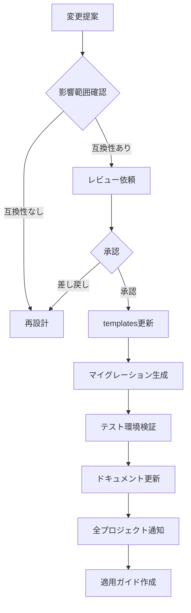
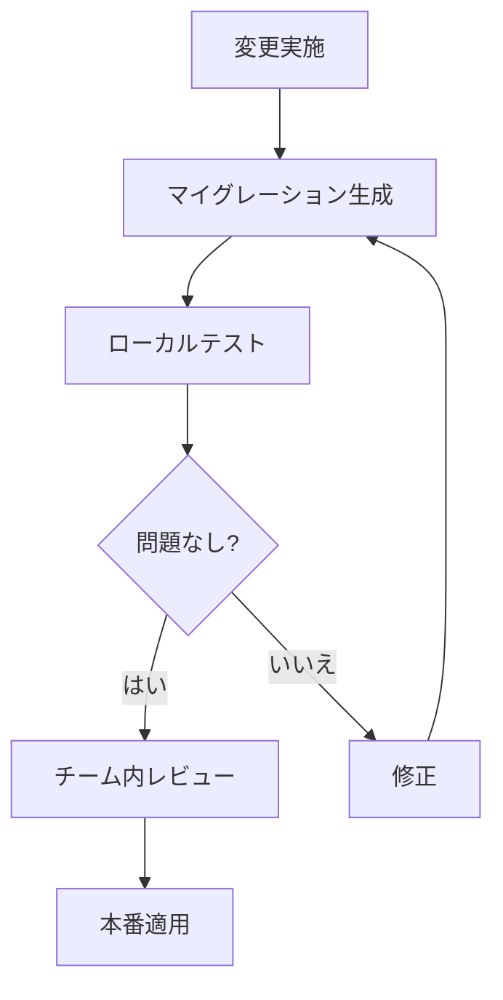

# データベーススキーマ分離ガイドライン

## 📋 目次
- [基本方針](#基本方針)
- [スキーマ構造](#スキーマ構造)
- [モデル分類ルール](#モデル分類ルール)
- [マイグレーション管理](#マイグレーション管理)
- [互換性確認](#互換性確認)
- [ベストプラクティス](#ベストプラクティス)

---

## 🗄️ 基本方針

### なぜコメントベース分離か

Prismaは現在、単一`schema.prisma`ファイルを使用する設計です。
複数ファイルへの分割は実験的機能であり、安定性に欠けます。

そのため、業界標準の**コメントブロックによる論理的分離**を採用します。

**メリット**:
- ✅ Prismaの標準機能のみ使用（安定性）
- ✅ 視覚的に明確な分離
- ✅ ツールによる自動処理が容易
- ✅ 既存プロジェクトへの適用が簡単

---

## 📋 スキーマ構造

### 推奨構造

```prisma
// ============================================
// Prisma Configuration
// ============================================
generator client {
  provider = "prisma-client-js"
}

datasource db {
  provider = "postgresql"
  url      = env("DATABASE_URL")
}

// ============================================
// 🔒 CORE MODELS (共通コア - 変更禁止)
// ============================================
// システム基盤となるモデル。全プロジェクトで共有。
// 変更は共通ライブラリ更新として扱う。
//
// 変更時の影響範囲: 全プロジェクト
// 変更手続き: レビュー・承認必須

// --- Authentication & Authorization ---
model users {
  id                    Int       @id @default(autoincrement())
  username              String    @unique
  email                 String    @unique
  password              String
  name                  String
  companyId             Int
  primaryDepartmentId   Int?
  employeeCode          String?
  joinDate              DateTime?
  leaveDate             DateTime?
  role                  UserRole  @default(USER)
  isActive              Boolean   @default(true)
  lastLoginAt           DateTime?
  isFirstLogin          Boolean   @default(true)
  passwordResetToken    String?
  passwordResetExpiry   DateTime?
  createdAt             DateTime  @default(now())
  updatedAt             DateTime

  // Relations
  companies             companies @relation(fields: [companyId], references: [id])
  departments           departments? @relation("PrimaryDepartment", fields: [primaryDepartmentId], references: [id])

  @@index([companyId])
  @@index([username])
  @@index([email])
}

model companies {
  id          Int       @id @default(autoincrement())
  name        String
  code        String    @unique
  address     String?
  phone       String?
  email       String?
  isActive    Boolean   @default(true)
  createdAt   DateTime  @default(now())
  updatedAt   DateTime

  // Relations
  users       users[]
  departments departments[]
}

// --- Audit & Logging ---
model audit_logs {
  id             Int       @id @default(autoincrement())
  userId         Int
  action         String
  targetType     String
  targetId       Int
  featureId      Int?
  oldPermissions Json?
  newPermissions Json?
  reason         String?
  ipAddress      String?
  userAgent      String?
  createdAt      DateTime  @default(now())

  users          users     @relation(fields: [userId], references: [id])
  features       features? @relation(fields: [featureId], references: [id])

  @@index([userId])
  @@index([action])
  @@index([createdAt(sort: Desc)])
}

model logs {
  id          Int       @id @default(autoincrement())
  timestamp   DateTime  @default(now())
  level       Int
  category    String
  source      String
  message     String
  userId      Int?
  companyId   Int?
  environment String    @default("development")
  metadata    Json?
  stackTrace  String?
  createdAt   DateTime  @default(now())

  users       users?    @relation(fields: [userId], references: [id])

  @@index([timestamp(sort: Desc)])
  @@index([level])
  @@index([category])
  @@index([userId])
}

// ============================================
// 🔌 EXTENSION MODELS (拡張可能)
// ============================================
// 企業がカスタマイズ可能なモデル。
// カラム追加・リレーション追加は許可。
// 既存カラムの変更・削除は禁止。
//
// 変更時の影響範囲: 個別プロジェクトのみ
// 変更手続き: プロジェクト内で自由

// 拡張モデルの例（コメントアウト）
// --- Extended User Profiles ---
// model ext_user_profiles {
//   id                Int       @id @default(autoincrement())
//   userId            Int       @unique
//   birthDate         DateTime?
//   phoneNumber       String?
//   emergencyContact  String?
//   skills            String[]
//   certifications    Json?
//   createdAt         DateTime  @default(now())
//   updatedAt         DateTime
//
//   users             users     @relation(fields: [userId], references: [id])
// }

// ============================================
// 🏢 CUSTOM MODELS (企業固有)
// ============================================
// 完全に企業独自のモデル。自由に追加・変更可能。
//
// 変更時の影響範囲: 個別プロジェクトのみ
// 変更手続き: プロジェクト内で自由

// --- Workflow Management ---
model workflow_types {
  id                    Int       @id @default(autoincrement())
  companyId             Int
  code                  String
  name                  String
  description           String?
  category              String
  formSchema            Json?
  validationRules       Json?
  autoApproveRules      Json?
  escalationRules       Json?
  notificationSettings  Json?
  maxAmount             Decimal?  @db.Decimal(15, 2)
  requireAttachment     Boolean   @default(false)
  allowBulk             Boolean   @default(false)
  isActive              Boolean   @default(true)
  displayOrder          Int       @default(0)
  createdAt             DateTime  @default(now())
  updatedAt             DateTime
  createdBy             Int?
  updatedBy             Int?

  companies             companies @relation(fields: [companyId], references: [id])

  @@unique([companyId, code])
  @@index([companyId])
  @@index([category])
}

model workflow_requests {
  id                Int       @id @default(autoincrement())
  companyId         Int
  workflowTypeId    Int
  requesterId       Int
  requestNumber     String    @unique
  title             String
  description       String?
  formData          Json?
  status            String    @default("DRAFT")
  priority          String    @default("MEDIUM")
  currentStepNumber Int       @default(1)
  dueDate           DateTime?
  submittedAt       DateTime?
  completedAt       DateTime?
  cancelledAt       DateTime?
  cancelReason      String?
  createdAt         DateTime  @default(now())
  updatedAt         DateTime

  companies         companies @relation(fields: [companyId], references: [id])
  workflow_types    workflow_types @relation(fields: [workflowTypeId], references: [id])
  requester         users     @relation("WorkflowRequester", fields: [requesterId], references: [id])

  @@index([companyId])
  @@index([workflowTypeId])
  @@index([requesterId])
  @@index([status])
  @@index([createdAt(sort: Desc)])
}

// --- Business Specific Models ---
// 企業固有の業務モデルをここに追加
// 例:
// - 営業管理: sales_orders, sales_items, customers
// - 在庫管理: inventory_items, warehouses, stock_movements
// - 顧客管理: customers, customer_contacts, customer_notes
```

---

## 🏷️ モデル分類ルール

### 🔒 共通コアモデル（CORE MODELS）

**識別方法**: コメント区画 `// 🔒 CORE MODELS` 内に配置

**対象テーブル**:

| カテゴリ | テーブル |
|---------|---------|
| 認証・権限 | users, companies, departments, user_departments, user_sessions |
| 権限管理 | features, department_permissions, permission_templates, permission_template_features, permission_inheritance_rules |
| 監査 | audit_logs |
| ログ監視 | logs, log_statistics, alert_rules |
| 通知 | notifications |

**変更ルール**:

| 操作 | 可否 | 説明 |
|-----|------|------|
| カラム削除 | ❌ 禁止 | 既存機能が動作しなくなる |
| カラム型変更 | ❌ 禁止 | データ互換性が失われる |
| リレーション削除 | ❌ 禁止 | 既存機能が動作しなくなる |
| NOT NULL追加 | ❌ 禁止 | 既存データに影響 |
| カラム追加（Optional） | ✅ 許可 | 既存機能に影響なし |
| インデックス追加 | ✅ 許可 | パフォーマンス改善 |
| コメント追加 | ✅ 許可 | ドキュメント改善 |

**変更手続き**:
1. 提案 → チームレビュー → 承認
2. `templates/backend/prisma/schema.prisma` 更新
3. マイグレーション生成・テスト
4. ドキュメント更新
5. 全プロジェクトへの通知・適用ガイド作成

### 🔌 拡張可能モデル（EXTENSION MODELS）

**識別方法**: コメント区画 `// 🔌 EXTENSION MODELS` 内に配置

**推奨プレフィックス**: `ext_` （任意だが推奨）

**変更ルール**:
- ✅ 新規モデル追加自由
- ✅ カラム追加自由
- ✅ 共通コアモデルへのリレーション追加可能
- ❌ 共通コアモデルの既存カラム変更禁止

**使用例**:
```prisma
// ユーザープロフィール拡張
model ext_user_profiles {
  id                Int       @id @default(autoincrement())
  userId            Int       @unique
  birthDate         DateTime?
  skills            String[]
  users             users     @relation(fields: [userId], references: [id])
}

// 部署拡張
model ext_department_budgets {
  id                Int       @id @default(autoincrement())
  departmentId      Int       @unique
  annualBudget      Decimal   @db.Decimal(15, 2)
  departments       departments @relation(fields: [departmentId], references: [id])
}
```

### 🏢 企業固有モデル（CUSTOM MODELS）

**識別方法**: コメント区画 `// 🏢 CUSTOM MODELS` 内に配置

**変更ルール**:
- ✅ 完全に自由
- ✅ モデル追加・削除・変更すべて可能
- ✅ 命名規則も企業の自由（ただしPrisma規約は推奨）

**使用例**:
```prisma
// ワークフロー管理
model workflow_types { ... }
model workflow_requests { ... }
model approval_routes { ... }

// 営業管理
model sales_orders { ... }
model sales_items { ... }
model customers { ... }
```

---

## 🔄 マイグレーション管理

### 共通コアモデル変更時

```bash
# 1. templates ディレクトリで実施
cd /path/to/websys/backend
npx prisma migrate dev --name core_update_users_add_column

# 2. 変更内容をドキュメント化
echo "Added optional 'nickname' column to users table" >> CHANGELOG.md

# 3. 各プロジェクトに適用手順を通知
# マイグレーションファイルをコピーするか、以下を実行
cd /path/to/project/backend
npx prisma migrate deploy
```

### 企業固有モデル変更時

```bash
# プロジェクトディレクトリで直接実施
cd /path/to/project/backend
npx prisma migrate dev --name custom_add_workflow_feature

# チーム内レビュー後にデプロイ
npx prisma migrate deploy
```

### マイグレーション命名規則

| 変更タイプ | プレフィックス | 例 |
|----------|--------------|---|
| 共通コア | `core_` | `core_add_users_nickname` |
| 拡張 | `ext_` | `ext_add_user_profiles` |
| 企業固有 | `custom_` | `custom_add_workflow_types` |
| バグ修正 | `fix_` | `fix_users_email_constraint` |

---

## 🔍 互換性確認

### 共通ライブラリ更新時のチェックリスト

#### 必須チェック項目

- [ ] **カラム削除チェック**: 既存カラムが削除されていないか
  ```bash
  git diff HEAD^ HEAD -- prisma/schema.prisma | grep "^-" | grep -v "^---"
  ```

- [ ] **型変更チェック**: 既存カラムの型が変更されていないか
  ```bash
  git diff HEAD^ HEAD -- prisma/schema.prisma | grep -E "^\+.*: .* @|^-.*: .* @"
  ```

- [ ] **リレーション削除チェック**: 既存リレーションが削除されていないか

- [ ] **NOT NULL制約チェック**: 既存データに影響するNOT NULL制約が追加されていないか
  ```bash
  git diff HEAD^ HEAD -- prisma/schema.prisma | grep "^\+" | grep -v "?" | grep -v "@default"
  ```

- [ ] **ユニーク制約チェック**: 既存データに影響するユニーク制約が追加されていないか

- [ ] **デフォルト値チェック**: 既存カラムのデフォルト値が変更されていないか

#### 推奨チェック項目

- [ ] **インデックス追加**: パフォーマンス改善のインデックスが適切か
- [ ] **マイグレーションテスト**: ローカル環境で正常に動作するか
- [ ] **ロールバックテスト**: マイグレーションのロールバックが可能か
- [ ] **ドキュメント更新**: 変更内容がドキュメントに反映されているか

### 自動チェックスクリプト

```bash
#!/bin/bash
# schema-compatibility-check.sh

echo "=== Prisma Schema 互換性チェック ==="

# カラム削除チェック
DELETED_COLUMNS=$(git diff HEAD^ HEAD -- prisma/schema.prisma | grep "^-" | grep -v "^---" | grep -v "^-//" | wc -l)
if [ $DELETED_COLUMNS -gt 0 ]; then
  echo "⚠️  警告: カラムまたはモデルの削除が検出されました"
  git diff HEAD^ HEAD -- prisma/schema.prisma | grep "^-" | grep -v "^---" | grep -v "^-//"
fi

# NOT NULL制約チェック
NOT_NULL_ADDITIONS=$(git diff HEAD^ HEAD -- prisma/schema.prisma | grep "^\+" | grep -v "?" | grep -v "@default" | grep -v "^+++" | grep -v "^+//" | wc -l)
if [ $NOT_NULL_ADDITIONS -gt 0 ]; then
  echo "⚠️  警告: NOT NULL制約の追加が検出されました"
fi

echo "✅ チェック完了"
```

---

## 🛡️ ベストプラクティス

### ✅ 推奨

1. **明確なコメント区画**
   ```prisma
   // ============================================
   // 🔒 CORE MODELS (共通コア - 変更禁止)
   // ============================================
   ```

2. **説明コメント**
   ```prisma
   // ユーザーアカウント情報を管理
   // 全システムの認証基盤となるテーブル
   model users {
     // ...
   }
   ```

3. **命名規則統一**
   - テーブル名: 複数形・小文字・スネークケース（`users`, `workflow_types`）
   - カラム名: キャメルケース（`firstName`, `createdAt`）
   - リレーション名: 明示的に指定（`@relation("WorkflowRequester")`）

4. **インデックス設計**
   ```prisma
   model users {
     // ...
     @@index([companyId])          // 企業別検索
     @@index([email])              // メールアドレス検索
     @@index([createdAt(sort: Desc)]) // 最新順ソート
   }
   ```

### ❌ 避けるべき

1. **セクション区画を無視した配置**
   ```prisma
   // 🔒 CORE MODELS
   model users { ... }

   model sales_orders { ... }  // ❌ 企業固有モデルが混在

   model companies { ... }
   ```

2. **未使用モデルの放置**
   ```prisma
   // ❌ 使用していないモデルは削除すべき
   model deprecated_old_users { ... }
   ```

3. **リレーション名の省略**
   ```prisma
   // ❌ 避けるべき
   model workflow_requests {
     requesterId Int
     users       users @relation(fields: [requesterId], references: [id])
   }

   // ✅ 推奨
   model workflow_requests {
     requesterId Int
     requester   users @relation("WorkflowRequester", fields: [requesterId], references: [id])
   }
   ```

---

## 📖 実例

### 良い例: 企業固有モデルの追加

```prisma
// ============================================
// 🏢 CUSTOM MODELS (企業固有)
// ============================================

// --- Sales Management ---
// 営業案件管理
model sales_opportunities {
  id                Int       @id @default(autoincrement())
  companyId         Int
  salesRepId        Int       // 担当営業
  customerName      String
  estimatedAmount   Decimal   @db.Decimal(15, 2)
  probability       Int       // 成約確度 (0-100%)
  stage             String    // 商談ステージ
  expectedCloseDate DateTime?
  actualCloseDate   DateTime?
  status            String    @default("OPEN")
  createdAt         DateTime  @default(now())
  updatedAt         DateTime

  // Relations
  companies         companies @relation(fields: [companyId], references: [id])
  salesRep          users     @relation("SalesRepresentative", fields: [salesRepId], references: [id])

  @@index([companyId])
  @@index([salesRepId])
  @@index([status])
  @@index([expectedCloseDate])
}
```

**良い点**:
- ✅ 適切なセクション（CUSTOM MODELS）に配置
- ✅ 説明コメントあり
- ✅ 明示的なリレーション名（`"SalesRepresentative"`）
- ✅ 適切なインデックス設計
- ✅ 共通コアモデル（companies, users）を活用

### 悪い例: 共通コアモデルの破壊的変更

```prisma
// ============================================
// 🔒 CORE MODELS (共通コア - 変更禁止)
// ============================================

model users {
  id        Int      @id @default(autoincrement())
  username  String   // ❌ @unique を削除 → 既存機能に影響
  email     String   // ❌ @unique を削除 → データ整合性が崩れる
  name      String   // ❌ String → String? に変更 → 既存コードでエラー
  role      UserRole // ❌ 型を削除
  // ❌ password カラムを削除 → 認証機能が動作しなくなる
}
```

**問題点**:
- ❌ 既存カラムのユニーク制約を削除
- ❌ 既存カラムをオプショナルに変更
- ❌ 必須カラムを削除
- ❌ 型定義を削除

---

## 📝 変更管理フロー

### 共通コアモデル変更フロー



### 企業固有モデル変更フロー



---

## 🔗 関連リンク

- [Prisma公式ドキュメント](https://www.prisma.io/docs)
- [Prismaマイグレーションガイド](https://www.prisma.io/docs/concepts/components/prisma-migrate)
- [PostgreSQL命名規則](https://www.postgresql.org/docs/current/sql-syntax-lexical.html#SQL-SYNTAX-IDENTIFIERS)

---

## 📊 実施状況

### workspace/backend/prisma/schema.prisma

**実施日**: 2025-10-03

**実施内容**:
- ✅ 31モデルを3層に分類・整理完了
- ✅ コメントブロックによる論理的分離実装
- ✅ Prisma検証完了（`npx prisma validate`）

**分類結果**:

| 層 | モデル数 | 主要モデル |
|---|---------|----------|
| 🔒 CORE MODELS | 22モデル | users, companies, departments, features, audit_logs, logs, refresh_tokens |
| 🔌 EXTENSION MODELS | 0モデル | （今後の拡張用プレースホルダー） |
| 🏢 CUSTOM MODELS | 9モデル | workflow_types, workflow_requests, approval_routes, approval_history |

**セクション構成**:

```
🔒 CORE MODELS
├── Authentication & Authorization (5モデル)
│   └── users, companies, departments, user_departments, user_sessions
├── Permission Management (RBAC) (6モデル)
│   └── features, department_feature_permissions, permission_templates, etc.
├── Audit & Logging (4モデル)
│   └── audit_logs, logs, log_categories, log_statistics, alert_rules
├── Messaging & Notifications (2モデル)
│   └── message_definitions, system_messages
└── Security (4モデル)
    └── refresh_tokens, security_events, login_attempts, security_settings

🔌 EXTENSION MODELS
└── （空 - 今後の拡張用）

🏢 CUSTOM MODELS
└── Workflow Management (9モデル)
    └── workflow_types, workflow_requests, approval_routes, approval_history,
        approval_delegates, workflow_notifications, workflow_attachments,
        auto_approval_rules, auto_approval_logs
```

**効果**:
- ✅ スキーマの可読性向上
- ✅ 共通機能と企業固有機能の明確な分離
- ✅ 将来の拡張性確保
- ✅ チーム間での理解統一

---

*最終更新: 2025-10-03*
