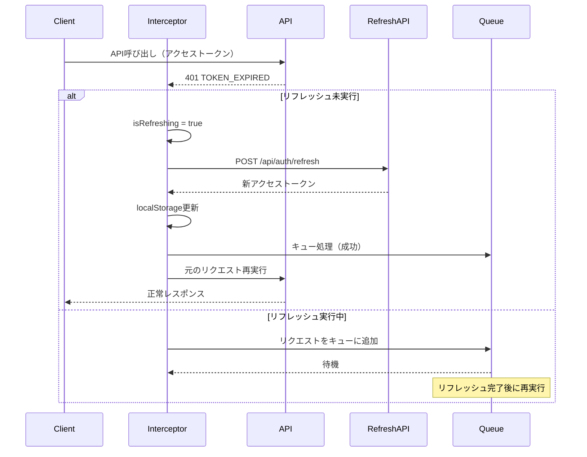
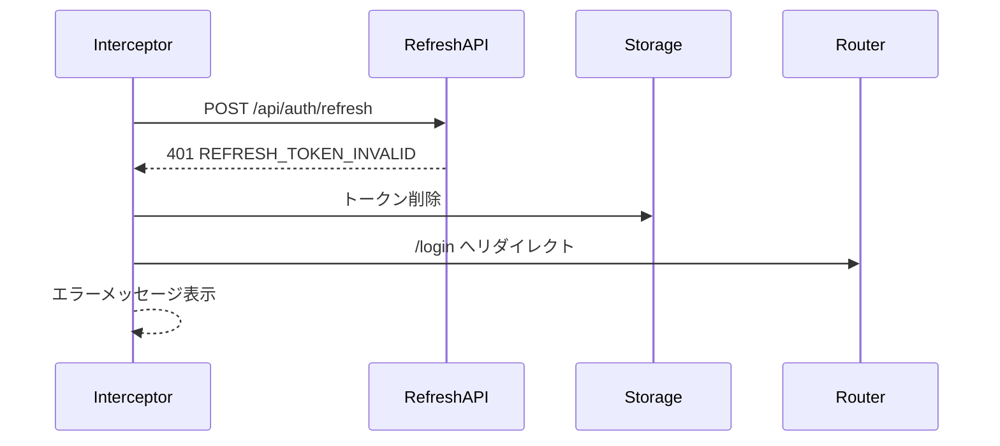

# トークンリフレッシュ機能仕様書

## 📋 機能概要

### 目的
- アクセストークン期限切れ時の自動更新によるシームレスなユーザー体験
- セキュリティを維持しながら長時間のセッション継続を実現
- ユーザーの頻繁な再ログインを不要にする

### 対象システム
- フロントエンド: Vue 3 + Axios インターセプター
- バックエンド: Express + JWT + Prisma

## 🏗️ アーキテクチャ

### トークン戦略

```
┌─────────────────────────────────────────────────┐
│ 二重トークン戦略 (Dual Token Strategy)          │
├─────────────────────────────────────────────────┤
│                                                 │
│ ✅ アクセストークン (Access Token)              │
│   - 有効期限: 15分                              │
│   - 用途: API認証                               │
│   - 保存場所: localStorage                      │
│   - 自動リフレッシュ: 期限切れ時                │
│                                                 │
│ ✅ リフレッシュトークン (Refresh Token)         │
│   - 有効期限: 7日                               │
│   - 用途: アクセストークン更新                  │
│   - 保存場所: localStorage + DB                 │
│   - ローテーション: リフレッシュ時に無効化      │
│                                                 │
└─────────────────────────────────────────────────┘
```

## 🔄 処理フロー

### 1. 自動リフレッシュフロー



### 2. リフレッシュ失敗時のフロー



## 🔧 実装詳細

### フロントエンド実装

**ファイル**: `workspace/frontend/src/core/api/index.ts`

#### 1. リフレッシュ状態管理

```typescript
// トークンリフレッシュ中フラグ（重複リクエスト防止）
let isRefreshing = false
let failedQueue: Array<{
  resolve: (value?: any) => void
  reject: (reason?: any) => void
}> = []

const processQueue = (error: any, token: string | null = null) => {
  failedQueue.forEach(prom => {
    if (error) {
      prom.reject(error)
    } else {
      prom.resolve(token)
    }
  })
  failedQueue = []
}
```

#### 2. Axiosレスポンスインターセプター

```typescript
api.interceptors.response.use(
  (response) => response,
  async (error) => {
    const originalRequest = error.config

    if (error.response?.status === 401) {
      const errorCode = error.response.data?.error?.code

      // TOKEN_EXPIRED エラーのみ自動リフレッシュ
      if (errorCode === 'TOKEN_EXPIRED' && !originalRequest._retry) {

        // 既にリフレッシュ中の場合はキューに追加
        if (isRefreshing) {
          return new Promise((resolve, reject) => {
            failedQueue.push({ resolve, reject })
          }).then(token => {
            originalRequest.headers.Authorization = `Bearer ${token}`
            return api(originalRequest)
          })
        }

        originalRequest._retry = true
        isRefreshing = true

        const refreshToken = localStorage.getItem('refreshToken')

        if (!refreshToken) {
          // リフレッシュトークンがない→ログアウト
          isRefreshing = false
          processQueue(new Error('No refresh token'), null)
          // ログイン画面へリダイレクト
          return Promise.reject(error)
        }

        try {
          // リフレッシュAPIコール
          const response = await axios.post(
            '/api/auth/refresh',
            { refreshToken }
          )

          if (response.data.success) {
            const newAccessToken = response.data.data.accessToken
            localStorage.setItem('token', newAccessToken)

            // キューの処理
            processQueue(null, newAccessToken)

            // 元のリクエスト再実行
            originalRequest.headers.Authorization = `Bearer ${newAccessToken}`
            isRefreshing = false
            return api(originalRequest)
          }
        } catch (refreshError) {
          // リフレッシュ失敗→ログアウト
          isRefreshing = false
          processQueue(refreshError, null)
          // 認証情報削除・ログイン画面へ
          return Promise.reject(refreshError)
        }
      }
    }

    return Promise.reject(error)
  }
)
```

### バックエンド実装

**ファイル**: `workspace/backend/src/core/routes/auth.ts`

#### リフレッシュトークンエンドポイント

```typescript
router.post('/refresh', async (req, res) => {
  try {
    const { refreshToken } = req.body

    if (!refreshToken) {
      return res.status(400).json({
        success: false,
        error: {
          code: 'REFRESH_TOKEN_MISSING',
          message: 'リフレッシュトークンが必要です'
        }
      })
    }

    const clientInfo = getClientInfo(req)
    const result = await securityService.refreshAccessToken(
      refreshToken,
      clientInfo.ipAddress
    )

    if (result.isValid && result.newAccessToken) {
      res.json({
        success: true,
        data: {
          accessToken: result.newAccessToken,
          expiresIn: 15 * 60 // 15分
        }
      })

      log.info(LogCategory.AUTH, 'Token refresh successful', {
        userId: result.payload?.userId,
        ipAddress: clientInfo.ipAddress
      })
    } else {
      res.status(401).json({
        success: false,
        error: {
          code: 'REFRESH_TOKEN_INVALID',
          message: result.error || 'リフレッシュトークンが無効です'
        }
      })
    }
  } catch (error) {
    res.status(500).json({
      success: false,
      error: {
        code: 'SYS_001',
        message: 'システムエラーが発生しました'
      }
    })
  }
})
```

**ファイル**: `workspace/backend/src/core/services/SecurityService.ts`

#### リフレッシュトークン検証ロジック

```typescript
async refreshAccessToken(
  refreshToken: string,
  ipAddress: string
): Promise<TokenValidation & { newAccessToken?: string }> {
  try {
    // JWT検証
    const payload = jwt.verify(
      refreshToken,
      this.refreshTokenSecret
    ) as TokenPayload

    if (payload.type !== 'refresh') {
      return {
        isValid: false,
        error: 'Invalid refresh token type',
        errorCode: 'INVALID'
      }
    }

    // データベースで有効性確認
    const storedToken = await prisma.refresh_tokens.findFirst({
      where: {
        userId: payload.userId,
        jti: payload.jti,
        isActive: true
      }
    })

    if (!storedToken) {
      return {
        isValid: false,
        error: 'Refresh token not found',
        errorCode: 'INVALID'
      }
    }

    // ユーザー確認
    const user = await prisma.users.findUnique({
      where: { id: payload.userId }
    })

    if (!user || !user.isActive) {
      return {
        isValid: false,
        error: 'User not found or inactive',
        errorCode: 'INVALID'
      }
    }

    // 新しいアクセストークン生成
    const newJti = this.generateJTI()
    const newAccessToken = jwt.sign(
      {
        userId: user.id,
        username: user.username,
        role: user.role,
        companyId: user.companyId,
        departmentId: user.primaryDepartmentId,
        type: 'access',
        jti: newJti
      },
      this.accessTokenSecret,
      { expiresIn: this.accessTokenExpiry }
    )

    // セキュリティイベントログ
    await this.logSecurityEvent({
      type: 'TOKEN_REFRESH',
      userId: user.id,
      ipAddress,
      details: { jti: payload.jti, newJti },
      timestamp: new Date()
    })

    return {
      isValid: true,
      payload,
      newAccessToken
    }
  } catch (error) {
    if (error instanceof jwt.TokenExpiredError) {
      return {
        isValid: false,
        error: 'Refresh token expired',
        errorCode: 'EXPIRED'
      }
    }

    return {
      isValid: false,
      error: 'Invalid refresh token',
      errorCode: 'MALFORMED'
    }
  }
}
```

## 🔒 セキュリティ対策

### 1. リフレッシュトークンローテーション

- リフレッシュトークン使用時に無効化（将来実装）
- 新しいリフレッシュトークンを発行
- 再利用攻撃を防止

### 2. データベース検証

- メモリ内JWTだけでなくDB保存トークンと照合
- 強制ログアウト（管理者操作）時の即座無効化
- セキュリティイベントの完全追跡

### 3. エラーハンドリング

| エラーコード | 説明 | 対応 |
|------------|------|------|
| `REFRESH_TOKEN_MISSING` | リフレッシュトークン未送信 | 400エラー・ログアウト |
| `REFRESH_TOKEN_INVALID` | トークン検証失敗・DB未登録 | 401エラー・ログアウト |
| `REFRESH_TOKEN_EXPIRED` | トークン期限切れ | 401エラー・ログアウト |
| `USER_NOT_FOUND` | ユーザー削除済み | 401エラー・ログアウト |
| `USER_INACTIVE` | ユーザー無効化 | 401エラー・ログアウト |

## 📊 性能・監視

### パフォーマンス指標

- **リフレッシュ処理時間**: 平均 < 200ms
- **キューイング遅延**: 平均 < 50ms
- **同時リフレッシュリクエスト**: キューで統合（1回のみ実行）

### 監視項目

```typescript
// ログ監視
{
  category: 'AUTH',
  event: 'TOKEN_REFRESH',
  userId: number,
  ipAddress: string,
  duration: number, // ミリ秒
  success: boolean
}
```

## 🧪 テストケース

### 正常系

1. ✅ アクセストークン期限切れ時の自動リフレッシュ
2. ✅ 複数同時リクエスト時のキューイング
3. ✅ リフレッシュ成功後の元リクエスト再実行

### 異常系

1. ✅ リフレッシュトークン未送信
2. ✅ リフレッシュトークン期限切れ
3. ✅ リフレッシュトークンDB未登録
4. ✅ ユーザー無効化・削除済み
5. ✅ ネットワークエラー時のハンドリング

## 📈 将来の拡張

### Phase 4: リフレッシュトークンローテーション

```typescript
// リフレッシュ時に新しいリフレッシュトークンも発行
{
  accessToken: "新アクセストークン",
  refreshToken: "新リフレッシュトークン", // 追加
  expiresIn: 900,
  refreshExpiresIn: 604800
}
```

### Phase 5: Sliding Expiration

- アクティブユーザーの自動期限延長
- 非アクティブ時の短期間での期限切れ

---

**作成日**: 2025年10月5日
**最終更新**: 2025年10月5日
**作成者**: Claude
**関連ドキュメント**:
- [認証機能設計書](./認証機能設計書.md)
- [セキュリティ仕様書](../../99_システム基盤/セキュリティ仕様書.md)
