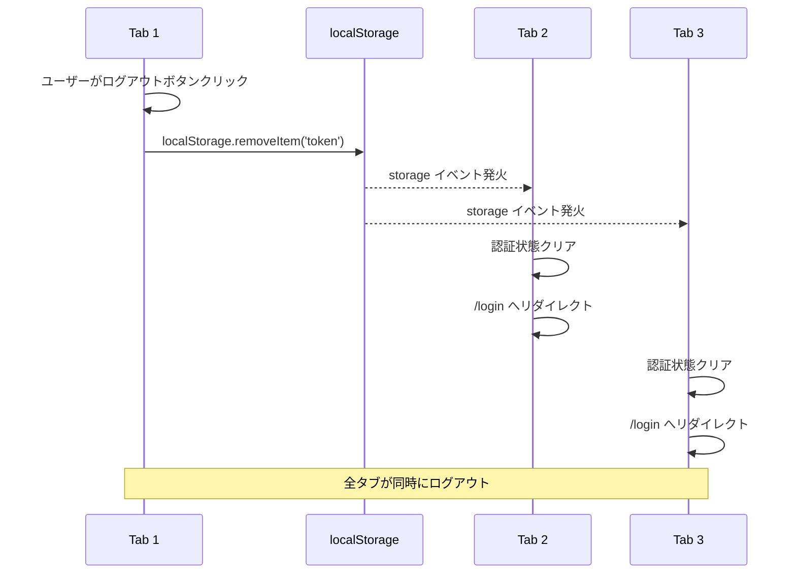
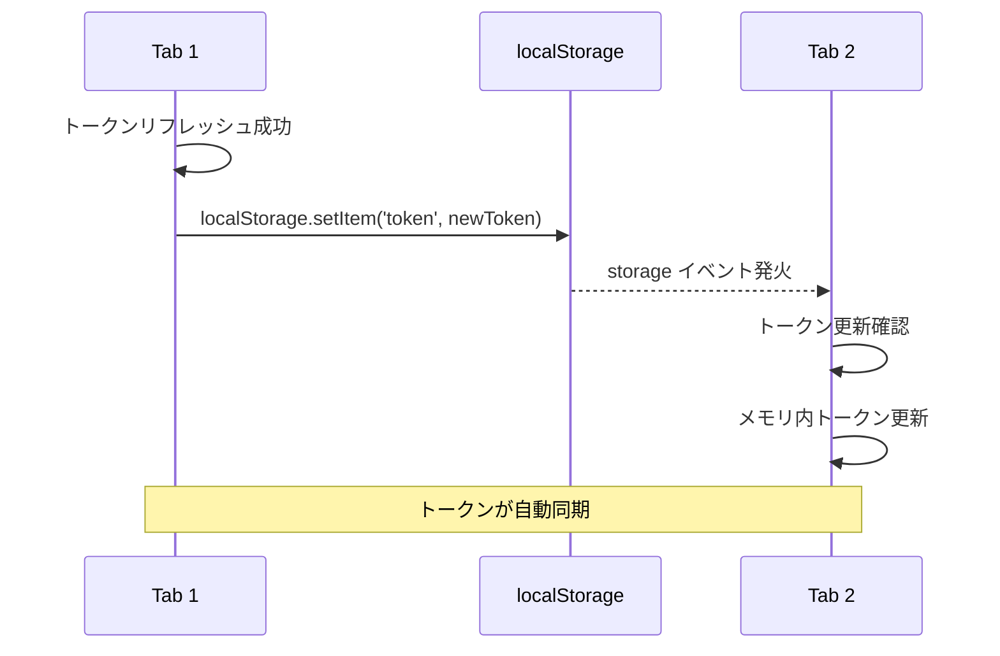
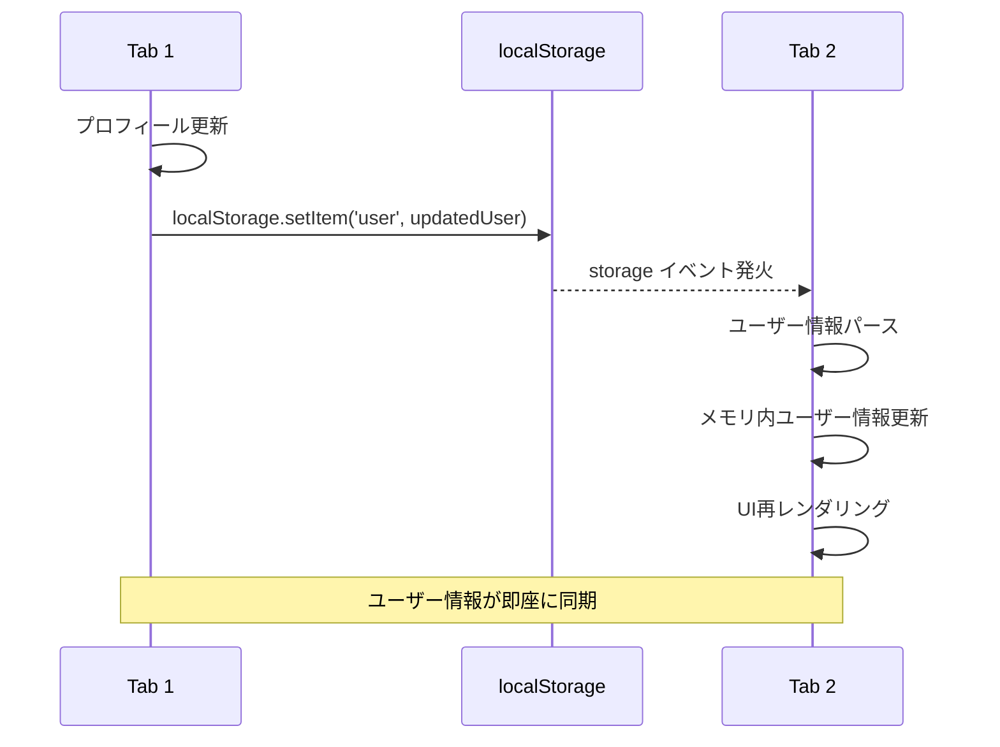

# 複数タブ認証同期機能仕様書

## 📋 機能概要

### 目的
- 複数タブ・ウィンドウ間での認証状態のリアルタイム同期
- 片方のタブでログアウト時の全タブ一括ログアウト
- トークン更新時の自動同期によるシームレスな体験

### 対象範囲
- 同一ブラウザ内の複数タブ・ウィンドウ
- localStorageイベントを活用した同期

## 🏗️ アーキテクチャ

### Storage Event活用

```
┌─────────────┐     ┌──────────────────┐     ┌─────────────┐
│   Tab 1     │────>│  localStorage    │────>│   Tab 2     │
│             │     │                  │     │             │
│ ログアウト   │     │  トークン削除     │     │ イベント受信 │
│             │     │                  │     │ ログアウト   │
└─────────────┘     └──────────────────┘     └─────────────┘
                            │
                            v
                    ┌──────────────────┐
                    │   Tab 3, 4, 5... │
                    │                  │
                    │  一括ログアウト   │
                    └──────────────────┘
```

### 同期対象データ

| 項目 | localStorage キー | 同期タイミング |
|------|------------------|---------------|
| アクセストークン | `token` | ログイン・リフレッシュ・ログアウト |
| リフレッシュトークン | `refreshToken` | ログイン・ログアウト |
| ユーザー情報 | `user` | ログイン・更新・ログアウト |

## 🔄 処理フロー

### 1. ログアウト同期フロー



### 2. トークン更新同期フロー



### 3. ユーザー情報更新同期フロー



## 🔧 実装詳細

### フロントエンド実装

**ファイル**: `workspace/frontend/src/custom/stores/auth.ts`

#### Storage Event監視

```typescript
const initializeAuth = async (): Promise<void> => {
  // ... 認証初期化処理 ...

  // 複数タブ間での認証状態同期（localStorageイベント）
  window.addEventListener('storage', (event) => {
    // 他のタブでトークンが削除された場合
    if (event.key === 'token' && event.newValue === null) {
      console.log('Token removed in another tab, logging out...')
      clearAuth()
      ElMessage.warning('他のタブでログアウトされました')
      window.location.href = '/login'
    }

    // 他のタブでトークンが更新された場合
    if (event.key === 'token' && event.newValue && event.newValue !== token.value) {
      console.log('Token updated in another tab, syncing...')
      token.value = event.newValue
    }

    // 他のタブでリフレッシュトークンが更新された場合
    if (event.key === 'refreshToken' && event.newValue && event.newValue !== refreshToken.value) {
      console.log('Refresh token updated in another tab, syncing...')
      refreshToken.value = event.newValue
    }

    // 他のタブでユーザー情報が更新された場合
    if (event.key === 'user' && event.newValue) {
      try {
        const newUser = JSON.parse(event.newValue)
        if (JSON.stringify(newUser) !== JSON.stringify(user.value)) {
          console.log('User info updated in another tab, syncing...')
          user.value = newUser
        }
      } catch (error) {
        console.error('Failed to parse user data from storage event:', error)
      }
    }
  })
}
```

### イベントリスナー登録タイミング

```typescript
// authStore初期化時に自動登録
export const useAuthStore = defineStore('auth', () => {
  // ... 状態定義 ...

  const initializeAuth = async (): Promise<void> => {
    // トークン検証
    // ...

    // イベントリスナー登録（1回のみ）
    setupStorageListener()
  }

  return {
    initializeAuth,
    // ... その他のメソッド ...
  }
})
```

## 🎯 同期動作仕様

### 1. ログアウト時の動作

**Tab 1（ログアウト実行タブ）**:
1. `logout()` メソッド呼び出し
2. localStorage から全トークン削除
3. `/login` へリダイレクト

**Tab 2, 3...（その他のタブ）**:
1. `storage` イベント受信
2. 認証状態クリア（メモリ内）
3. 警告メッセージ表示: "他のタブでログアウトされました"
4. `/login` へ強制リダイレクト

### 2. トークンリフレッシュ時の動作

**Tab 1（リフレッシュ実行タブ）**:
1. 401エラー検知
2. リフレッシュトークンでAPI呼び出し
3. 新しいアクセストークンを localStorage に保存

**Tab 2, 3...（その他のタブ）**:
1. `storage` イベント受信
2. 新しいトークンをメモリに反映
3. 次回API呼び出し時に自動適用

### 3. ユーザー情報更新時の動作

**Tab 1（更新実行タブ）**:
1. プロフィール更新APIコール
2. 更新されたユーザー情報を localStorage に保存

**Tab 2, 3...（その他のタブ）**:
1. `storage` イベント受信
2. JSONパース・差分確認
3. ユーザー情報をメモリに反映
4. UIコンポーネント自動再レンダリング

## 🔒 セキュリティ考慮事項

### 1. 同一オリジン制限

- `storage` イベントは**同一オリジン**のタブ間のみ発火
- 異なるドメイン・ポートからはアクセス不可
- クロスサイトスクリプティング（XSS）対策

### 2. データ整合性

```typescript
// 不正なデータの検証
if (event.key === 'user' && event.newValue) {
  try {
    const newUser = JSON.parse(event.newValue)

    // 必須フィールド検証
    if (!newUser.id || !newUser.username) {
      console.error('Invalid user data in storage event')
      return
    }

    // 型検証
    if (typeof newUser.id !== 'number') {
      console.error('Invalid user ID type')
      return
    }

    user.value = newUser
  } catch (error) {
    console.error('Failed to parse user data:', error)
  }
}
```

### 3. 無限ループ防止

```typescript
// 自タブでの変更は無視（イベント発火しない）
if (event.key === 'token' && event.newValue && event.newValue !== token.value) {
  // 既に同じ値の場合は処理スキップ
  token.value = event.newValue
}
```

## 🧪 テストケース

### 正常系

| No | シナリオ | 期待結果 |
|----|---------|---------|
| 1 | Tab 1でログアウト | 全タブがログイン画面へ遷移 |
| 2 | Tab 1でトークンリフレッシュ | 全タブのトークンが更新 |
| 3 | Tab 1でプロフィール更新 | 全タブのユーザー情報が更新 |
| 4 | Tab 1を閉じる | 他タブは影響なし |
| 5 | 全タブを閉じて再オープン | 認証状態維持（localStorage残存） |

### 異常系

| No | シナリオ | 期待結果 |
|----|---------|---------|
| 1 | 不正なユーザーデータ受信 | エラーログ・処理スキップ |
| 2 | ネットワークエラー中のログアウト | localStorage削除・全タブログアウト |
| 3 | 同時ログアウト（複数タブ） | 競合なくログアウト完了 |

### ブラウザ互換性テスト

| ブラウザ | バージョン | 動作確認 |
|---------|-----------|---------|
| Chrome | 最新版 | ✅ |
| Firefox | 最新版 | ✅ |
| Safari | 最新版 | ✅ |
| Edge | 最新版 | ✅ |

## 📊 パフォーマンス

### イベント処理時間

- **storage イベント発火**: < 10ms
- **データパース・検証**: < 5ms
- **メモリ更新**: < 1ms
- **UI再レンダリング**: < 50ms（Vue reactivity）

### メモリ使用量

- イベントリスナー: 約1KB
- 状態管理: 約5KB（ユーザー情報含む）

## 📈 将来の拡張

### Phase 4: Broadcast Channel API活用

```typescript
// より高速な同期（IE未対応）
const authChannel = new BroadcastChannel('auth-sync')

authChannel.postMessage({
  type: 'LOGOUT',
  timestamp: Date.now()
})

authChannel.onmessage = (event) => {
  if (event.data.type === 'LOGOUT') {
    clearAuth()
    router.push('/login')
  }
}
```

### Phase 5: ServiceWorker連携

- オフライン時の同期キュー
- バックグラウンド認証更新

---

**作成日**: 2025年10月5日
**最終更新**: 2025年10月5日
**作成者**: Claude
**関連ドキュメント**:
- [認証機能設計書](./認証機能設計書.md)
- [トークンリフレッシュ機能仕様書](./トークンリフレッシュ機能仕様書.md)
