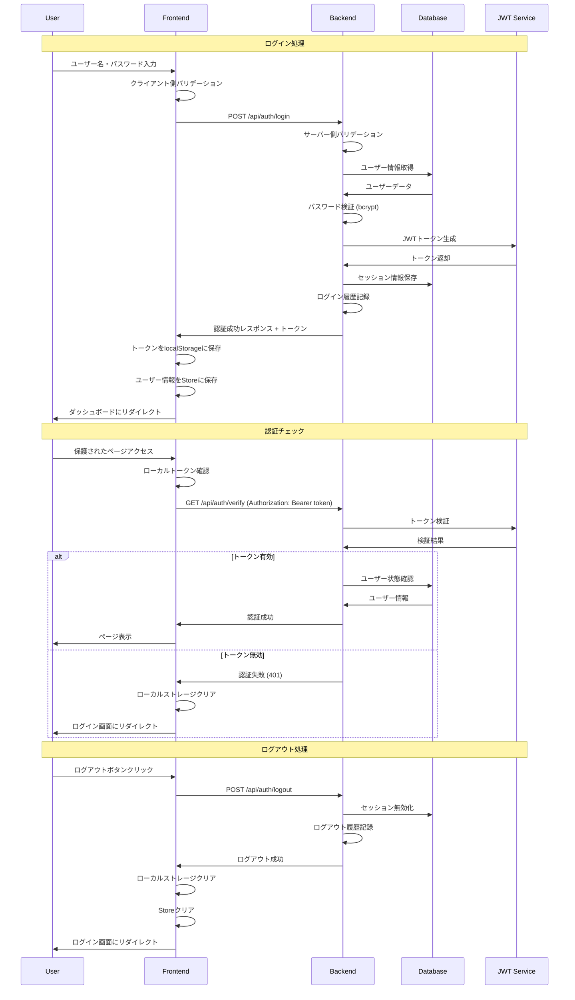

# 認証機能詳細設計書

## 1. システムアーキテクチャ

### 1.1 全体構成
```
┌─────────────────────────────────────────────────────────┐
│                     Frontend (Vue.js)                     │
│  ┌──────────────┐  ┌──────────────┐  ┌──────────────┐  │
│  │  Login.vue   │  │  AuthStore   │  │  Router      │  │
│  │              │  │  (Pinia)     │  │  Guards      │  │
│  └──────────────┘  └──────────────┘  └──────────────┘  │
└─────────────────────────────────────────────────────────┘
                              ↓ HTTP/JSON
┌─────────────────────────────────────────────────────────┐
│                   Backend (Express)                       │
│  ┌──────────────┐  ┌──────────────┐  ┌──────────────┐  │
│  │ AuthRouter   │  │ AuthService  │  │ AuthMiddle   │  │
│  │              │  │              │  │ ware         │  │
│  └──────────────┘  └──────────────┘  └──────────────┘  │
│  ┌──────────────┐  ┌──────────────┐  ┌──────────────┐  │
│  │ UserModel    │  │ TokenService │  │ ValidationMW │  │
│  └──────────────┘  └──────────────┘  └──────────────┘  │
└─────────────────────────────────────────────────────────┘
                              ↓ SQL
┌─────────────────────────────────────────────────────────┐
│                   Database (PostgreSQL)                   │
│  ┌──────────────┐  ┌──────────────┐  ┌──────────────┐  │
│  │ User         │  │ UserSession  │  │ AuditLog     │  │
│  └──────────────┘  └──────────────┘  └──────────────┘  │
└─────────────────────────────────────────────────────────┘
```

### 1.2 認証フロー


## 2. フロントエンド設計

### 2.1 認証ストア (Pinia)

#### AuthStore 詳細設計
```typescript
interface AuthState {
  user: User | null;
  token: string | null;
  isAuthenticated: boolean;
  isLoading: boolean;
  lastActivity: Date | null;
  sessionExpiry: Date | null;
}

interface User {
  id: number;
  username: string;
  name: string;
  email: string;
  role: UserRole;
  companyId: number;
  departmentId: number;
  lastLoginAt: Date;
}

type UserRole = 'ADMIN' | 'MANAGER' | 'USER' | 'GUEST';

export const useAuthStore = defineStore('auth', {
  state: (): AuthState => ({
    user: null,
    token: localStorage.getItem('auth_token'),
    isAuthenticated: false,
    isLoading: false,
    lastActivity: null,
    sessionExpiry: null
  }),

  getters: {
    isAdmin: (state) => state.user?.role === 'ADMIN',
    isManager: (state) => ['ADMIN', 'MANAGER'].includes(state.user?.role || ''),
    userDisplayName: (state) => state.user?.name || state.user?.username || '',
    sessionTimeRemaining: (state) => {
      if (!state.sessionExpiry) return 0;
      return Math.max(0, state.sessionExpiry.getTime() - Date.now());
    },
    isSessionExpiringSoon: (state) => {
      const remaining = state.sessionTimeRemaining;
      return remaining > 0 && remaining < 30 * 60 * 1000; // 30分以内
    }
  },

  actions: {
    async login(credentials: LoginCredentials): Promise<LoginResult> {
      this.isLoading = true;
      try {
        const response = await authApi.login(credentials);

        if (response.success) {
          this.setAuthData(response.data);
          this.updateLastActivity();
          return { success: true };
        } else {
          return {
            success: false,
            error: response.error || 'ログインに失敗しました'
          };
        }
      } catch (error) {
        return {
          success: false,
          error: 'ネットワークエラーが発生しました'
        };
      } finally {
        this.isLoading = false;
      }
    },

    async logout(): Promise<void> {
      this.isLoading = true;
      try {
        if (this.token) {
          await authApi.logout();
        }
      } catch (error) {
        console.error('Logout API error:', error);
      } finally {
        this.clearAuthData();
        this.isLoading = false;
        router.push('/login');
      }
    },

    async verifyToken(): Promise<boolean> {
      if (!this.token) {
        return false;
      }

      try {
        const response = await authApi.verify();
        if (response.success) {
          this.user = response.data.user;
          this.isAuthenticated = true;
          this.updateSessionExpiry(response.data.expiresIn);
          return true;
        } else {
          this.clearAuthData();
          return false;
        }
      } catch (error) {
        this.clearAuthData();
        return false;
      }
    },

    setAuthData(authData: AuthData): void {
      this.user = authData.user;
      this.token = authData.token;
      this.isAuthenticated = true;

      // localStorage に保存
      localStorage.setItem('auth_token', authData.token);
      localStorage.setItem('user_data', JSON.stringify(authData.user));

      // セッション期限設定
      this.updateSessionExpiry(authData.expiresIn);
    },

    clearAuthData(): void {
      this.user = null;
      this.token = null;
      this.isAuthenticated = false;
      this.lastActivity = null;
      this.sessionExpiry = null;

      // localStorage クリア
      localStorage.removeItem('auth_token');
      localStorage.removeItem('user_data');
    },

    updateLastActivity(): void {
      this.lastActivity = new Date();
    },

    updateSessionExpiry(expiresIn: number): void {
      this.sessionExpiry = new Date(Date.now() + expiresIn * 1000);
    },

    async refreshToken(): Promise<boolean> {
      try {
        const response = await authApi.refreshToken();
        if (response.success) {
          this.setAuthData(response.data);
          return true;
        }
        return false;
      } catch (error) {
        return false;
      }
    }
  }
});
```

### 2.2 ルーターガード

#### Navigation Guards 設計
```typescript
// router/guards.ts
import { useAuthStore } from '@/stores/auth';

export const authGuard = async (to: RouteLocationNormalized) => {
  const authStore = useAuthStore();

  // 認証不要なページ
  const publicPages = ['/login', '/forgot-password', '/reset-password'];
  const isPublicPage = publicPages.includes(to.path);

  if (isPublicPage) {
    // 既にログイン済みの場合はダッシュボードにリダイレクト
    if (authStore.isAuthenticated) {
      return '/dashboard';
    }
    return true;
  }

  // 認証必要なページ
  if (!authStore.token) {
    return '/login';
  }

  // トークン検証
  const isValid = await authStore.verifyToken();
  if (!isValid) {
    return '/login';
  }

  // 権限チェック
  if (to.meta.requiresAdmin && !authStore.isAdmin) {
    return '/unauthorized';
  }

  if (to.meta.requiresManager && !authStore.isManager) {
    return '/unauthorized';
  }

  return true;
};

// セッション監視
export const sessionMonitor = () => {
  const authStore = useAuthStore();

  // 定期的なトークン検証（30分間隔）
  setInterval(async () => {
    if (authStore.isAuthenticated) {
      const isValid = await authStore.verifyToken();
      if (!isValid) {
        authStore.logout();
      }
    }
  }, 30 * 60 * 1000);

  // アクティビティ監視
  const activityEvents = ['mousedown', 'mousemove', 'keypress', 'scroll', 'touchstart'];
  const updateActivity = () => {
    if (authStore.isAuthenticated) {
      authStore.updateLastActivity();
    }
  };

  activityEvents.forEach(event => {
    document.addEventListener(event, updateActivity, true);
  });

  // 非アクティブ時間監視（2時間）
  setInterval(() => {
    if (authStore.isAuthenticated && authStore.lastActivity) {
      const inactiveTime = Date.now() - authStore.lastActivity.getTime();
      const maxInactiveTime = 2 * 60 * 60 * 1000; // 2時間

      if (inactiveTime > maxInactiveTime) {
        authStore.logout();
        ElMessage.warning('長時間操作がないため、自動的にログアウトしました');
      }
    }
  }, 60 * 1000); // 1分間隔でチェック
};
```

### 2.3 API クライアント

#### Auth API Service
```typescript
// api/auth.ts
interface LoginCredentials {
  username: string;
  password: string;
}

interface AuthResponse {
  success: boolean;
  data?: {
    user: User;
    token: string;
    expiresIn: number;
  };
  error?: string;
}

class AuthApiService {
  private baseURL = '/api/auth';

  async login(credentials: LoginCredentials): Promise<AuthResponse> {
    try {
      const response = await fetch(`${this.baseURL}/login`, {
        method: 'POST',
        headers: {
          'Content-Type': 'application/json'
        },
        body: JSON.stringify(credentials)
      });

      const data = await response.json();

      if (!response.ok) {
        return {
          success: false,
          error: data.error || 'ログインに失敗しました'
        };
      }

      return {
        success: true,
        data: data.data
      };
    } catch (error) {
      return {
        success: false,
        error: 'ネットワークエラーが発生しました'
      };
    }
  }

  async logout(): Promise<void> {
    const token = localStorage.getItem('auth_token');
    if (!token) return;

    try {
      await fetch(`${this.baseURL}/logout`, {
        method: 'POST',
        headers: {
          'Authorization': `Bearer ${token}`,
          'Content-Type': 'application/json'
        }
      });
    } catch (error) {
      console.error('Logout error:', error);
    }
  }

  async verify(): Promise<AuthResponse> {
    const token = localStorage.getItem('auth_token');
    if (!token) {
      return { success: false, error: 'No token found' };
    }

    try {
      const response = await fetch(`${this.baseURL}/verify`, {
        method: 'GET',
        headers: {
          'Authorization': `Bearer ${token}`
        }
      });

      const data = await response.json();

      if (!response.ok) {
        return { success: false, error: data.error };
      }

      return { success: true, data: data.data };
    } catch (error) {
      return { success: false, error: 'Verification failed' };
    }
  }

  async refreshToken(): Promise<AuthResponse> {
    const token = localStorage.getItem('auth_token');
    if (!token) {
      return { success: false, error: 'No token found' };
    }

    try {
      const response = await fetch(`${this.baseURL}/refresh`, {
        method: 'POST',
        headers: {
          'Authorization': `Bearer ${token}`,
          'Content-Type': 'application/json'
        }
      });

      const data = await response.json();

      if (!response.ok) {
        return { success: false, error: data.error };
      }

      return { success: true, data: data.data };
    } catch (error) {
      return { success: false, error: 'Token refresh failed' };
    }
  }
}

export const authApi = new AuthApiService();
```

## 3. バックエンド設計

### 3.1 認証サービス

#### AuthService クラス設計
```typescript
// services/AuthService.ts
import bcrypt from 'bcrypt';
import jwt from 'jsonwebtoken';
import { PrismaClient } from '@prisma/client';

interface LoginRequest {
  username: string;
  password: string;
}

interface LoginResult {
  success: boolean;
  user?: User;
  token?: string;
  expiresIn?: number;
  error?: string;
}

export class AuthService {
  private prisma: PrismaClient;
  private saltRounds = 12;
  private tokenSecret = process.env.JWT_SECRET!;
  private tokenExpiry = '8h';

  constructor() {
    this.prisma = new PrismaClient();
  }

  async login(request: LoginRequest, clientInfo: ClientInfo): Promise<LoginResult> {
    try {
      // 入力バリデーション
      const validation = this.validateLoginInput(request);
      if (!validation.isValid) {
        await this.logFailedAttempt(request.username, clientInfo, 'INVALID_INPUT');
        return { success: false, error: validation.error };
      }

      // ユーザー存在確認
      const user = await this.findUserByUsername(request.username);
      if (!user) {
        await this.logFailedAttempt(request.username, clientInfo, 'USER_NOT_FOUND');
        return { success: false, error: 'ユーザー名またはパスワードが正しくありません' };
      }

      // アカウントロック確認
      const lockStatus = await this.checkAccountLock(user.id);
      if (lockStatus.isLocked) {
        await this.logFailedAttempt(request.username, clientInfo, 'ACCOUNT_LOCKED');
        return {
          success: false,
          error: `アカウントがロックされています。${lockStatus.unlockAt}まで待機してください`
        };
      }

      // パスワード検証
      const isPasswordValid = await bcrypt.compare(request.password, user.password);
      if (!isPasswordValid) {
        await this.recordFailedAttempt(user.id, clientInfo);
        await this.logFailedAttempt(request.username, clientInfo, 'WRONG_PASSWORD');
        return { success: false, error: 'ユーザー名またはパスワードが正しくありません' };
      }

      // アクティブユーザー確認
      if (!user.isActive) {
        await this.logFailedAttempt(request.username, clientInfo, 'INACTIVE_USER');
        return { success: false, error: 'アカウントが無効になっています' };
      }

      // 同時セッション数チェック
      const sessionCount = await this.getActiveSessionCount(user.id);
      const maxSessions = this.getMaxSessionsForRole(user.role);
      if (sessionCount >= maxSessions) {
        await this.cleanupOldestSession(user.id);
      }

      // JWTトークン生成
      const tokenPayload = {
        userId: user.id,
        username: user.username,
        role: user.role,
        companyId: user.companyId,
        departmentId: user.primaryDepartmentId
      };

      const token = jwt.sign(tokenPayload, this.tokenSecret, {
        expiresIn: this.tokenExpiry
      });

      // セッション保存
      const session = await this.createSession(user.id, token, clientInfo);

      // ログイン履歴記録
      await this.logSuccessfulLogin(user.id, clientInfo);

      // 失敗回数リセット
      await this.resetFailedAttempts(user.id);

      // 最終ログイン時刻更新
      await this.updateLastLogin(user.id);

      return {
        success: true,
        user: this.sanitizeUser(user),
        token,
        expiresIn: 8 * 60 * 60 // 8時間（秒）
      };

    } catch (error) {
      console.error('Login error:', error);
      return { success: false, error: 'システムエラーが発生しました' };
    }
  }

  async logout(token: string): Promise<void> {
    try {
      // トークンから情報を抽出
      const decoded = jwt.decode(token) as any;
      if (!decoded?.userId) return;

      // セッション無効化
      await this.invalidateSession(token);

      // ログアウト履歴記録
      await this.logLogout(decoded.userId);

    } catch (error) {
      console.error('Logout error:', error);
    }
  }

  async verifyToken(token: string): Promise<TokenVerificationResult> {
    try {
      // JWT検証
      const decoded = jwt.verify(token, this.tokenSecret) as any;

      // セッション存在確認
      const session = await this.findSessionByToken(token);
      if (!session || !session.isActive) {
        return { isValid: false, error: 'セッションが無効です' };
      }

      // セッション期限確認
      if (session.expiresAt < new Date()) {
        await this.invalidateSession(token);
        return { isValid: false, error: 'セッションが期限切れです' };
      }

      // ユーザー存在・アクティブ確認
      const user = await this.findUserById(decoded.userId);
      if (!user || !user.isActive) {
        await this.invalidateSession(token);
        return { isValid: false, error: 'ユーザーが無効です' };
      }

      // 最終アクティビティ更新
      await this.updateSessionActivity(session.id);

      return {
        isValid: true,
        user: this.sanitizeUser(user),
        expiresIn: Math.floor((session.expiresAt.getTime() - Date.now()) / 1000)
      };

    } catch (error) {
      if (error instanceof jwt.TokenExpiredError) {
        return { isValid: false, error: 'トークンが期限切れです' };
      } else if (error instanceof jwt.JsonWebTokenError) {
        return { isValid: false, error: 'トークンが無効です' };
      }

      console.error('Token verification error:', error);
      return { isValid: false, error: 'トークン検証エラー' };
    }
  }

  private validateLoginInput(request: LoginRequest): ValidationResult {
    if (!request.username || !request.password) {
      return { isValid: false, error: 'ユーザー名とパスワードを入力してください' };
    }

    if (request.username.length > 50) {
      return { isValid: false, error: 'ユーザー名が長すぎます' };
    }

    if (request.password.length > 128) {
      return { isValid: false, error: 'パスワードが長すぎます' };
    }

    return { isValid: true };
  }

  private async checkAccountLock(userId: number): Promise<LockStatus> {
    const failedAttempts = await this.getFailedAttemptCount(userId);

    if (failedAttempts >= 5) {
      const lastAttempt = await this.getLastFailedAttempt(userId);
      const lockDuration = 30 * 60 * 1000; // 30分
      const unlockAt = new Date(lastAttempt.getTime() + lockDuration);

      if (new Date() < unlockAt) {
        return { isLocked: true, unlockAt: unlockAt.toLocaleString() };
      } else {
        // ロック期間終了、失敗回数リセット
        await this.resetFailedAttempts(userId);
      }
    }

    return { isLocked: false };
  }

  private async createSession(
    userId: number,
    token: string,
    clientInfo: ClientInfo
  ): Promise<UserSession> {
    const expiresAt = new Date(Date.now() + 8 * 60 * 60 * 1000); // 8時間後

    return this.prisma.userSession.create({
      data: {
        userId,
        sessionToken: token,
        ipAddress: clientInfo.ipAddress,
        userAgent: clientInfo.userAgent,
        expiresAt,
        lastActivity: new Date(),
        isActive: true
      }
    });
  }

  private getMaxSessionsForRole(role: string): number {
    switch (role) {
      case 'ADMIN': return 5;
      case 'MANAGER': return 4;
      case 'USER': return 3;
      case 'GUEST': return 2;
      default: return 3;
    }
  }

  private sanitizeUser(user: any): User {
    return {
      id: user.id,
      username: user.username,
      name: user.name,
      email: user.email,
      role: user.role,
      companyId: user.companyId,
      departmentId: user.primaryDepartmentId,
      lastLoginAt: user.lastLoginAt
    };
  }
}
```

### 3.2 認証ミドルウェア

#### Authentication Middleware
```typescript
// middleware/auth.ts
import { Request, Response, NextFunction } from 'express';
import { AuthService } from '../services/AuthService';

interface AuthenticatedRequest extends Request {
  user?: User;
  token?: string;
}

export const authMiddleware = async (
  req: AuthenticatedRequest,
  res: Response,
  next: NextFunction
) => {
  try {
    const authHeader = req.headers.authorization;

    if (!authHeader || !authHeader.startsWith('Bearer ')) {
      return res.status(401).json({
        success: false,
        error: 'Authorization header missing'
      });
    }

    const token = authHeader.substring(7);
    const authService = new AuthService();

    const verificationResult = await authService.verifyToken(token);

    if (!verificationResult.isValid) {
      return res.status(401).json({
        success: false,
        error: verificationResult.error
      });
    }

    req.user = verificationResult.user;
    req.token = token;

    next();
  } catch (error) {
    console.error('Auth middleware error:', error);
    return res.status(500).json({
      success: false,
      error: 'Internal server error'
    });
  }
};

export const requireRole = (allowedRoles: string[]) => {
  return (req: AuthenticatedRequest, res: Response, next: NextFunction) => {
    if (!req.user) {
      return res.status(401).json({
        success: false,
        error: 'Authentication required'
      });
    }

    if (!allowedRoles.includes(req.user.role)) {
      return res.status(403).json({
        success: false,
        error: 'Insufficient permissions'
      });
    }

    next();
  };
};

export const requireAdmin = requireRole(['ADMIN']);
export const requireManager = requireRole(['ADMIN', 'MANAGER']);
```

## 4. セキュリティ設計

### 4.1 パスワードセキュリティ
```typescript
// utils/password.ts
import bcrypt from 'bcrypt';

export class PasswordService {
  private saltRounds = 12;

  async hashPassword(password: string): Promise<string> {
    return bcrypt.hash(password, this.saltRounds);
  }

  async verifyPassword(password: string, hash: string): Promise<boolean> {
    return bcrypt.compare(password, hash);
  }

  validatePasswordStrength(password: string): ValidationResult {
    const errors: string[] = [];

    if (password.length < 6) {
      errors.push('パスワードは6文字以上である必要があります');
    }

    if (password.length > 128) {
      errors.push('パスワードは128文字以下である必要があります');
    }

    if (!/[a-zA-Z]/.test(password)) {
      errors.push('英字を含める必要があります');
    }

    if (!/[0-9]/.test(password)) {
      errors.push('数字を含める必要があります');
    }

    // 推奨要件（警告レベル）
    const warnings: string[] = [];

    if (!/[A-Z]/.test(password)) {
      warnings.push('大文字を含めることを推奨します');
    }

    if (!/[!@#$%^&*(),.?":{}|<>]/.test(password)) {
      warnings.push('記号を含めることを推奨します');
    }

    return {
      isValid: errors.length === 0,
      errors,
      warnings
    };
  }

  generateSecurePassword(length: number = 12): string {
    const charset = 'abcdefghijklmnopqrstuvwxyzABCDEFGHIJKLMNOPQRSTUVWXYZ0123456789!@#$%^&*';
    let password = '';

    // 必須文字種を最低1つずつ含める
    password += this.getRandomChar('abcdefghijklmnopqrstuvwxyz'); // 小文字
    password += this.getRandomChar('ABCDEFGHIJKLMNOPQRSTUVWXYZ'); // 大文字
    password += this.getRandomChar('0123456789'); // 数字
    password += this.getRandomChar('!@#$%^&*'); // 記号

    // 残りの文字をランダム生成
    for (let i = password.length; i < length; i++) {
      password += this.getRandomChar(charset);
    }

    // シャッフル
    return password.split('').sort(() => Math.random() - 0.5).join('');
  }

  private getRandomChar(charset: string): string {
    return charset.charAt(Math.floor(Math.random() * charset.length));
  }
}
```

### 4.2 レート制限
```typescript
// middleware/rateLimit.ts
import rateLimit from 'express-rate-limit';
import { Request } from 'express';

// ログイン試行制限
export const loginRateLimit = rateLimit({
  windowMs: 15 * 60 * 1000, // 15分
  max: 5, // 最大5回の試行
  message: {
    success: false,
    error: 'ログイン試行回数が上限に達しました。15分後に再試行してください。'
  },
  standardHeaders: true,
  legacyHeaders: false,
  keyGenerator: (req: Request) => {
    // IPアドレスとユーザー名の組み合わせでレート制限
    const ip = req.ip;
    const username = req.body.username || 'unknown';
    return `${ip}:${username}`;
  }
});

// API全般の制限
export const apiRateLimit = rateLimit({
  windowMs: 1 * 60 * 1000, // 1分
  max: 100, // 最大100リクエスト
  message: {
    success: false,
    error: 'リクエスト回数が上限に達しました。しばらく待ってから再試行してください。'
  }
});
```

## 5. ログ・監査設計

### 5.1 認証ログ
```typescript
// services/AuditService.ts
export class AuditService {
  private prisma: PrismaClient;

  constructor() {
    this.prisma = new PrismaClient();
  }

  async logLoginAttempt(
    username: string,
    success: boolean,
    clientInfo: ClientInfo,
    failureReason?: string
  ): Promise<void> {
    await this.prisma.auditLog.create({
      data: {
        action: success ? 'LOGIN_SUCCESS' : 'LOGIN_FAILED',
        targetType: 'USER',
        targetId: 0, // username ベースなので ID は不明の場合がある
        reason: failureReason || undefined,
        ipAddress: clientInfo.ipAddress,
        userAgent: clientInfo.userAgent,
        createdAt: new Date(),
        context: {
          username,
          timestamp: new Date().toISOString(),
          success
        }
      }
    });
  }

  async logPasswordChange(userId: number, clientInfo: ClientInfo): Promise<void> {
    await this.prisma.auditLog.create({
      data: {
        userId,
        action: 'PASSWORD_CHANGE',
        targetType: 'USER',
        targetId: userId,
        ipAddress: clientInfo.ipAddress,
        userAgent: clientInfo.userAgent,
        createdAt: new Date()
      }
    });
  }

  async logSessionActivity(
    userId: number,
    action: 'CREATE' | 'INVALIDATE' | 'EXPIRE',
    sessionId: number
  ): Promise<void> {
    await this.prisma.auditLog.create({
      data: {
        userId,
        action: `SESSION_${action}`,
        targetType: 'SESSION',
        targetId: sessionId,
        createdAt: new Date()
      }
    });
  }
}
```

## 6. エラーハンドリング

### 6.1 エラーレスポンス標準化
```typescript
// utils/errorHandler.ts
export enum AuthErrorCode {
  INVALID_CREDENTIALS = 'AUTH_001',
  ACCOUNT_LOCKED = 'AUTH_002',
  SESSION_EXPIRED = 'AUTH_003',
  INSUFFICIENT_PERMISSIONS = 'AUTH_004',
  INVALID_TOKEN = 'AUTH_005',
  RATE_LIMITED = 'AUTH_006'
}

export interface AuthError {
  code: AuthErrorCode;
  message: string;
  details?: any;
}

export class AuthErrorHandler {
  static handleLoginError(error: any): AuthError {
    if (error.type === 'INVALID_CREDENTIALS') {
      return {
        code: AuthErrorCode.INVALID_CREDENTIALS,
        message: 'ユーザー名またはパスワードが正しくありません'
      };
    }

    if (error.type === 'ACCOUNT_LOCKED') {
      return {
        code: AuthErrorCode.ACCOUNT_LOCKED,
        message: 'アカウントがロックされています',
        details: { unlockAt: error.unlockAt }
      };
    }

    return {
      code: AuthErrorCode.INVALID_CREDENTIALS,
      message: 'ログインに失敗しました'
    };
  }

  static handleTokenError(error: any): AuthError {
    if (error instanceof jwt.TokenExpiredError) {
      return {
        code: AuthErrorCode.SESSION_EXPIRED,
        message: 'セッションが期限切れです'
      };
    }

    if (error instanceof jwt.JsonWebTokenError) {
      return {
        code: AuthErrorCode.INVALID_TOKEN,
        message: '認証トークンが無効です'
      };
    }

    return {
      code: AuthErrorCode.INVALID_TOKEN,
      message: '認証に失敗しました'
    };
  }
}
```

## 7. テスト設計

### 7.1 単体テスト
```typescript
// tests/auth/AuthService.test.ts
describe('AuthService', () => {
  let authService: AuthService;
  let mockPrisma: jest.Mocked<PrismaClient>;

  beforeEach(() => {
    mockPrisma = createMockPrismaClient();
    authService = new AuthService(mockPrisma);
  });

  describe('login', () => {
    it('should login successfully with valid credentials', async () => {
      // Arrange
      const credentials = {
        username: 'testuser',
        password: 'password123'
      };

      const mockUser = {
        id: 1,
        username: 'testuser',
        password: await bcrypt.hash('password123', 12),
        isActive: true,
        role: 'USER'
      };

      mockPrisma.user.findUnique.mockResolvedValue(mockUser);

      // Act
      const result = await authService.login(credentials, mockClientInfo);

      // Assert
      expect(result.success).toBe(true);
      expect(result.token).toBeDefined();
      expect(result.user?.username).toBe('testuser');
    });

    it('should fail with invalid credentials', async () => {
      // Arrange
      const credentials = {
        username: 'testuser',
        password: 'wrongpassword'
      };

      mockPrisma.user.findUnique.mockResolvedValue(null);

      // Act
      const result = await authService.login(credentials, mockClientInfo);

      // Assert
      expect(result.success).toBe(false);
      expect(result.error).toBe('ユーザー名またはパスワードが正しくありません');
    });

    it('should lock account after 5 failed attempts', async () => {
      // テスト実装
    });
  });

  describe('verifyToken', () => {
    it('should verify valid token', async () => {
      // テスト実装
    });

    it('should reject expired token', async () => {
      // テスト実装
    });
  });
});
```

## 8. パフォーマンス最適化

### 8.1 セッション管理最適化
```typescript
// services/SessionCache.ts
import Redis from 'redis';

export class SessionCache {
  private redis: Redis;

  constructor() {
    this.redis = Redis.createClient({
      host: process.env.REDIS_HOST || 'localhost',
      port: parseInt(process.env.REDIS_PORT || '6379')
    });
  }

  async cacheSession(sessionId: string, sessionData: any): Promise<void> {
    const key = `session:${sessionId}`;
    const ttl = 8 * 60 * 60; // 8時間

    await this.redis.setex(key, ttl, JSON.stringify(sessionData));
  }

  async getSession(sessionId: string): Promise<any | null> {
    const key = `session:${sessionId}`;
    const data = await this.redis.get(key);

    return data ? JSON.parse(data) : null;
  }

  async invalidateSession(sessionId: string): Promise<void> {
    const key = `session:${sessionId}`;
    await this.redis.del(key);
  }

  async extendSession(sessionId: string): Promise<void> {
    const key = `session:${sessionId}`;
    const ttl = 8 * 60 * 60; // 8時間

    await this.redis.expire(key, ttl);
  }
}
```

---

**作成者**: Claude
**作成日**: 2025年9月22日
**最終更新**: 2025年9月22日
**承認者**: 未定