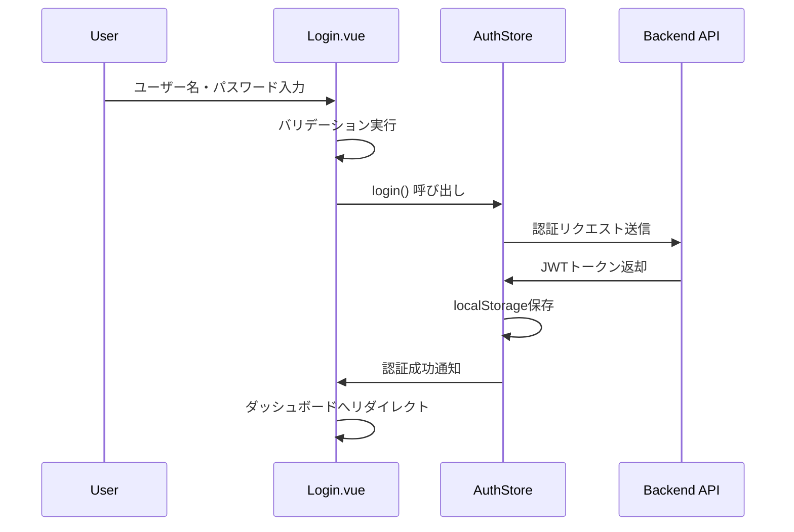
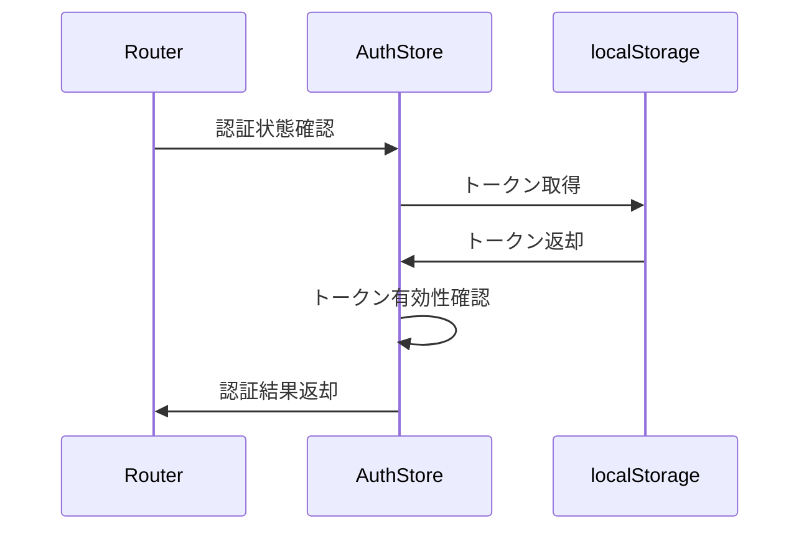
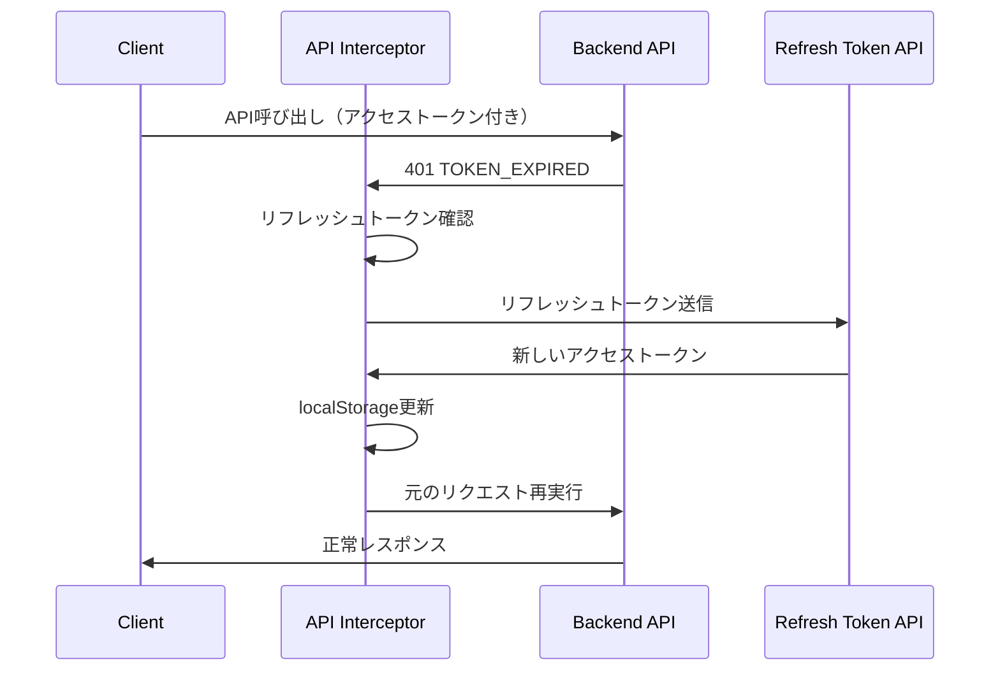
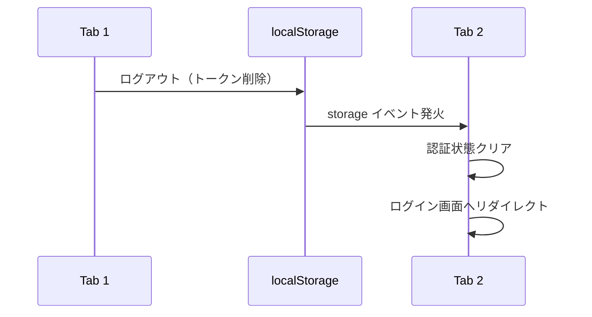

# 認証機能設計書

## 📋 機能概要

### 目的
- 社内システムへの安全なユーザー認証
- セッション管理による状態維持
- 権限に基づくアクセス制御

### 対象画面
- Login.vue (ログイン画面)
- Layout.vue (認証状態管理)

## 🏗️ システム構成

### 技術スタック
- **フロントエンド**: Vue 3 + TypeScript
- **状態管理**: Pinia
- **認証方式**: JWT (JSON Web Token) - アクセストークン + リフレッシュトークン
- **ストレージ**: localStorage (トークン・ユーザー情報)
- **セキュリティ**: トークンブラックリスト・自動リフレッシュ

### アーキテクチャ
```
[Login.vue] → [useAuthStore] → [API Interceptor] → [Backend API]
                    ↓              ↓ (401エラー時)
              [localStorage] ← [Token Refresh] → [新トークン取得]
                    ↓
             [Router Guard] → [アクセス制御]
```

## 🔐 認証フロー

### 1. ログイン処理


### 2. セッション確認


### 3. トークンリフレッシュ（自動更新）


### 4. 複数タブ間の認証状態同期


## 📝 機能仕様

### 入力項目
| 項目名 | 必須 | 形式 | バリデーション |
|--------|------|------|---------------|
| ユーザー名 | ○ | 文字列 | 1文字以上 |
| パスワード | ○ | 文字列 | 6文字以上 |

### 画面要素
- ユーザー名入力フィールド
- パスワード入力フィールド（マスク表示）
- ログインボタン
- エラーメッセージ表示エリア
- ローディング表示

### 状態管理 (AuthStore)
```typescript
interface AuthState {
  user: User | null              // ユーザー情報
  token: string | null           // アクセストークン（短期: 15分）
  refreshToken: string | null    // リフレッシュトークン（長期: 7日）
  isAuthenticated: boolean       // 認証状態
  menuPermissions: MenuPermission[] // メニュー権限
}

interface User {
  id: number
  username: string
  name: string
  role: 'ADMIN' | 'MANAGER' | 'USER' | 'GUEST'
  companyId?: number
  primaryDepartmentId?: number
}

interface MenuPermission {
  path: string
  hasAccess: boolean
}
```

## 🎨 UI設計

### レイアウト
- 中央配置カードレイアウト
- レスポンシブ対応（モバイル・PC）
- BIZ UDゴシックフォント適用

### カラー・デザイン
- プライマリカラー: Element Plus準拠
- グラデーション背景
- カードシャドウ効果

## 🔒 セキュリティ要件

### 認証セキュリティ
- **二重トークン戦略**
  - アクセストークン: 15分有効（短期）
  - リフレッシュトークン: 7日有効（長期）
- **トークンブラックリスト管理**: ログアウト時にトークン無効化
- **自動トークンリフレッシュ**: 期限切れ時に自動更新
- **セッション管理**: データベースでアクティブセッション追跡
- **パスワードハッシュ化**: bcrypt（saltRounds: 12）
- **HTTPS通信必須**（本番環境）

### 複数タブ・セッション管理
- **localStorage イベント監視**: 他タブでのログアウトを即座に検知
- **認証状態同期**: トークン・ユーザー情報の自動同期
- **同時セッション制限**:
  - ADMIN: 最大5セッション
  - MANAGER: 最大4セッション
  - USER: 最大3セッション
  - GUEST: 最大2セッション

### エラーハンドリング
- **詳細なエラーコード体系**:
  - TOKEN_EXPIRED, TOKEN_INVALID, TOKEN_MALFORMED
  - SESSION_EXPIRED, SESSION_INVALID
  - USER_NOT_FOUND, USER_INACTIVE
- **エラーメッセージ重複抑制**: 3秒以内の同じエラーは非表示
- **自動リトライ**: 401エラー時にトークンリフレッシュ後リトライ

### 入力検証
- XSS対策: 入力値エスケープ
- CSRF対策: トークンベース認証
- 入力長制限: ユーザー名50文字、パスワード128文字
- レート制限: 15分間で100回のログイン試行

## 🧪 テスト仕様

### 単体テスト
- [ ] ログインフォームバリデーション
- [ ] AuthStore状態管理
- [ ] ローカルストレージ操作

### 結合テスト
- [ ] ログイン成功フロー
- [ ] ログイン失敗フロー
- [ ] セッション期限切れ

### E2Eテスト
- [ ] ログイン〜ダッシュボード遷移
- [ ] 未認証時リダイレクト
- [ ] ログアウト機能

## 🚀 実装状況

### ✅ Phase 1: 基本認証機能（完了）
- ✅ ログイン画面UI
- ✅ フォームバリデーション
- ✅ AuthStore実装
- ✅ 本番API連携
- ✅ ローカルストレージ保存
- ✅ ルーターガード実装

### ✅ Phase 2: セキュリティ強化（完了 - 2025-10-05）
- ✅ **トークンリフレッシュ機能**
  - 実装箇所: [index.ts:60-152](workspace/frontend/src/core/api/index.ts#L60-L152)
  - バックエンドAPI: [auth.ts:118-174](workspace/backend/src/core/routes/auth.ts#L118-L174)
  - 自動リフレッシュ・リトライ機能
- ✅ **複数タブ間の認証状態同期**
  - 実装箇所: [auth.ts:162-196](workspace/frontend/src/custom/stores/auth.ts#L162-L196)
  - localStorage イベント監視
- ✅ **エラーハンドリング最適化**
  - 実装箇所: [index.ts:20-48](workspace/frontend/src/core/api/index.ts#L20-L48)
  - 重複メッセージ抑制（3秒間）
- ✅ **セッション管理強化**
  - トークンブラックリスト
  - 同時セッション制限
  - セキュリティイベントログ

### ✅ Phase 3: パスワード管理（完了）
- ✅ パスワード変更機能
- ✅ パスワードリセット機能（メール認証）
- ✅ 初回ログイン時のパスワード変更強制

### 📋 今後の拡張計画
- ⚠️ 多要素認証（MFA/2FA）対応
- ⚠️ OAuth 2.0 / OpenID Connect 対応
- ⚠️ 生体認証対応（WebAuthn）
- ⚠️ SSO（シングルサインオン）対応

## 📋 関連ドキュメント

- [ユーザー管理機能設計書](../02_ユーザー管理機能/)
- [共通コンポーネント設計書](../04_共通コンポーネント/)
- [システム基盤設計書](../99_システム基盤/)

## 📊 API仕様

### 認証関連エンドポイント

| メソッド | エンドポイント | 説明 | 認証 |
|---------|--------------|------|------|
| POST | `/api/auth/login` | ログイン | 不要 |
| POST | `/api/auth/logout` | ログアウト | 必要 |
| POST | `/api/auth/refresh` | トークンリフレッシュ | 不要 |
| GET | `/api/auth/verify` | トークン検証 | 不要 |
| POST | `/api/auth/change-password` | パスワード変更 | 必要 |
| POST | `/api/auth/request-password-reset` | パスワードリセット要求 | 不要 |
| POST | `/api/auth/reset-password` | パスワードリセット実行 | 不要 |

### レスポンス形式

#### ログイン成功
```json
{
  "success": true,
  "data": {
    "accessToken": "eyJhbGci...",
    "refreshToken": "eyJhbGci...",
    "user": {
      "id": 1,
      "username": "admin",
      "name": "管理者",
      "role": "ADMIN"
    },
    "accessExpiresIn": 900,
    "refreshExpiresIn": 604800
  }
}
```

#### トークンリフレッシュ成功
```json
{
  "success": true,
  "data": {
    "accessToken": "eyJhbGci...",
    "expiresIn": 900
  }
}
```

#### エラーレスポンス
```json
{
  "success": false,
  "error": {
    "code": "TOKEN_EXPIRED",
    "message": "セッションが期限切れです。再度ログインしてください"
  }
}
```

## 🔧 実装技術詳細

### フロントエンド

**主要ファイル**:
- `workspace/frontend/src/core/api/index.ts` - Axios インターセプター・自動リフレッシュ
- `workspace/frontend/src/custom/stores/auth.ts` - 認証状態管理
- `workspace/frontend/src/router/index.ts` - ルーターガード

**トークン管理**:
```typescript
// localStorage構造
{
  "token": "アクセストークン（15分有効）",
  "refreshToken": "リフレッシュトークン（7日有効）",
  "user": "{...ユーザー情報JSON...}"
}
```

### バックエンド

**主要ファイル**:
- `workspace/backend/src/core/services/AuthService.ts` - 認証ビジネスロジック
- `workspace/backend/src/core/services/SecurityService.ts` - トークン生成・検証
- `workspace/backend/src/core/routes/auth.ts` - 認証APIエンドポイント
- `workspace/backend/src/core/middleware/auth.ts` - 認証ミドルウェア

**データベーステーブル**:
- `users` - ユーザー情報
- `user_sessions` - アクティブセッション管理
- `refresh_tokens` - リフレッシュトークン管理
- `security_events` - セキュリティイベントログ

---

**作成日**: 2025年1月20日
**最終更新**: 2025年10月5日
**作成者**: Claude
**レビュー者**: -
**変更履歴**:
- 2025-10-05: トークンリフレッシュ機能・複数タブ同期・エラーハンドリング最適化を追加