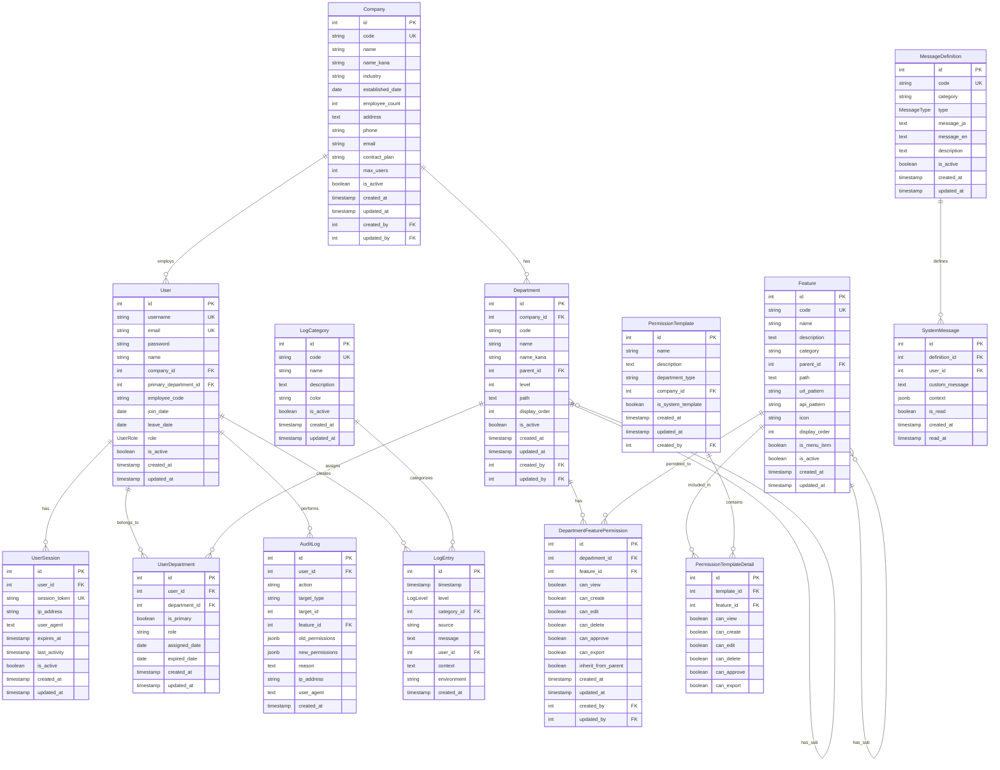

# 統合データベース設計書

## 1. 概要

### 1.1 データベース基本情報
- **DBMS**: PostgreSQL 15-Alpine
- **データベース名**: websys_db
- **文字コード**: UTF-8
- **タイムゾーン**: Asia/Tokyo
- **接続情報**: localhost:5433 (開発環境)

### 1.2 設計方針
- **正規化**: 第3正規形まで適用
- **命名規則**: PascalCase (テーブル名、カラム名)
- **主キー**: 自動増分ID (Integer)
- **外部キー**: 参照整合性制約を設定
- **インデックス**: パフォーマンス要件に基づき設定
- **タイムスタンプ**: createdAt, updatedAt を全テーブルに設定

## 2. 全体ER図



## 3. テーブル詳細設計

### 3.1 ユーザー管理系テーブル

#### User テーブル
```sql
CREATE TYPE "UserRole" AS ENUM ('ADMIN', 'MANAGER', 'USER', 'GUEST');

CREATE TABLE "User" (
    id SERIAL PRIMARY KEY,
    username TEXT NOT NULL UNIQUE,
    email TEXT NOT NULL UNIQUE,
    password TEXT NOT NULL,
    name TEXT NOT NULL,
    company_id INTEGER REFERENCES "Company"(id),
    primary_department_id INTEGER REFERENCES "Department"(id),
    employee_code VARCHAR(50),
    join_date DATE,
    leave_date DATE,
    role "UserRole" NOT NULL DEFAULT 'USER',
    is_active BOOLEAN NOT NULL DEFAULT true,
    created_at TIMESTAMP(3) NOT NULL DEFAULT CURRENT_TIMESTAMP,
    updated_at TIMESTAMP(3) NOT NULL DEFAULT CURRENT_TIMESTAMP
);

CREATE INDEX idx_user_company ON "User"(company_id);
CREATE INDEX idx_user_primary_dept ON "User"(primary_department_id);
CREATE INDEX idx_user_role ON "User"(role);
CREATE INDEX idx_user_employee_code ON "User"(employee_code);
```

#### UserSession テーブル
```sql
CREATE TABLE "UserSession" (
    id SERIAL PRIMARY KEY,
    user_id INTEGER NOT NULL REFERENCES "User"(id) ON DELETE CASCADE,
    session_token TEXT NOT NULL UNIQUE,
    ip_address VARCHAR(45),
    user_agent TEXT,
    expires_at TIMESTAMP(3) NOT NULL,
    last_activity TIMESTAMP(3) NOT NULL DEFAULT CURRENT_TIMESTAMP,
    is_active BOOLEAN NOT NULL DEFAULT true,
    created_at TIMESTAMP(3) NOT NULL DEFAULT CURRENT_TIMESTAMP,
    updated_at TIMESTAMP(3) NOT NULL DEFAULT CURRENT_TIMESTAMP
);

CREATE INDEX idx_session_user ON "UserSession"(user_id);
CREATE INDEX idx_session_token ON "UserSession"(session_token);
CREATE INDEX idx_session_expires ON "UserSession"(expires_at);
```

### 3.2 組織管理系テーブル

#### Company テーブル
```sql
CREATE TABLE "Company" (
    id SERIAL PRIMARY KEY,
    code VARCHAR(20) UNIQUE NOT NULL,
    name VARCHAR(100) NOT NULL,
    name_kana VARCHAR(100),
    industry VARCHAR(50),
    established_date DATE,
    employee_count INTEGER,
    address TEXT,
    phone VARCHAR(20),
    email VARCHAR(100),
    contract_plan VARCHAR(50) DEFAULT 'STANDARD',
    max_users INTEGER DEFAULT 100,
    is_active BOOLEAN DEFAULT true,
    created_at TIMESTAMP(3) DEFAULT CURRENT_TIMESTAMP,
    updated_at TIMESTAMP(3) DEFAULT CURRENT_TIMESTAMP,
    created_by INTEGER REFERENCES "User"(id),
    updated_by INTEGER REFERENCES "User"(id)
);

CREATE INDEX idx_company_code ON "Company"(code);
CREATE INDEX idx_company_active ON "Company"(is_active);
```

#### Department テーブル
```sql
CREATE TABLE "Department" (
    id SERIAL PRIMARY KEY,
    company_id INTEGER NOT NULL REFERENCES "Company"(id) ON DELETE CASCADE,
    code VARCHAR(20) NOT NULL,
    name VARCHAR(100) NOT NULL,
    name_kana VARCHAR(100),
    parent_id INTEGER REFERENCES "Department"(id),
    level INTEGER NOT NULL DEFAULT 1,
    path TEXT,
    display_order INTEGER DEFAULT 0,
    is_active BOOLEAN DEFAULT true,
    created_at TIMESTAMP(3) DEFAULT CURRENT_TIMESTAMP,
    updated_at TIMESTAMP(3) DEFAULT CURRENT_TIMESTAMP,
    created_by INTEGER REFERENCES "User"(id),
    updated_by INTEGER REFERENCES "User"(id),
    UNIQUE(company_id, code),
    CHECK (id != parent_id)
);

CREATE INDEX idx_dept_company ON "Department"(company_id);
CREATE INDEX idx_dept_parent ON "Department"(parent_id);
CREATE INDEX idx_dept_path ON "Department"(path);
CREATE INDEX idx_dept_active ON "Department"(is_active);
```

#### UserDepartment テーブル
```sql
CREATE TABLE "UserDepartment" (
    id SERIAL PRIMARY KEY,
    user_id INTEGER NOT NULL REFERENCES "User"(id) ON DELETE CASCADE,
    department_id INTEGER NOT NULL REFERENCES "Department"(id) ON DELETE CASCADE,
    is_primary BOOLEAN DEFAULT false,
    role VARCHAR(50) DEFAULT 'MEMBER',
    assigned_date DATE NOT NULL DEFAULT CURRENT_DATE,
    expired_date DATE,
    created_at TIMESTAMP(3) DEFAULT CURRENT_TIMESTAMP,
    updated_at TIMESTAMP(3) DEFAULT CURRENT_TIMESTAMP,
    UNIQUE(user_id, department_id),
    CHECK (expired_date IS NULL OR expired_date > assigned_date)
);

CREATE INDEX idx_user_dept_user ON "UserDepartment"(user_id);
CREATE INDEX idx_user_dept_dept ON "UserDepartment"(department_id);
CREATE INDEX idx_user_dept_primary ON "UserDepartment"(is_primary);
```

### 3.3 権限管理系テーブル

#### Feature テーブル
```sql
CREATE TABLE "Feature" (
    id SERIAL PRIMARY KEY,
    code VARCHAR(50) UNIQUE NOT NULL,
    name VARCHAR(100) NOT NULL,
    description TEXT,
    category VARCHAR(50) NOT NULL,
    parent_id INTEGER REFERENCES "Feature"(id),
    path TEXT,
    url_pattern VARCHAR(200),
    api_pattern VARCHAR(200),
    icon VARCHAR(50),
    display_order INTEGER DEFAULT 0,
    is_menu_item BOOLEAN DEFAULT true,
    is_active BOOLEAN DEFAULT true,
    created_at TIMESTAMP(3) DEFAULT CURRENT_TIMESTAMP,
    updated_at TIMESTAMP(3) DEFAULT CURRENT_TIMESTAMP
);

CREATE INDEX idx_feature_code ON "Feature"(code);
CREATE INDEX idx_feature_category ON "Feature"(category);
CREATE INDEX idx_feature_parent ON "Feature"(parent_id);
CREATE INDEX idx_feature_active ON "Feature"(is_active);
```

#### DepartmentFeaturePermission テーブル
```sql
CREATE TABLE "DepartmentFeaturePermission" (
    id SERIAL PRIMARY KEY,
    department_id INTEGER NOT NULL REFERENCES "Department"(id) ON DELETE CASCADE,
    feature_id INTEGER NOT NULL REFERENCES "Feature"(id) ON DELETE CASCADE,
    can_view BOOLEAN DEFAULT false,
    can_create BOOLEAN DEFAULT false,
    can_edit BOOLEAN DEFAULT false,
    can_delete BOOLEAN DEFAULT false,
    can_approve BOOLEAN DEFAULT false,
    can_export BOOLEAN DEFAULT false,
    inherit_from_parent BOOLEAN DEFAULT true,
    created_at TIMESTAMP(3) DEFAULT CURRENT_TIMESTAMP,
    updated_at TIMESTAMP(3) DEFAULT CURRENT_TIMESTAMP,
    created_by INTEGER REFERENCES "User"(id),
    updated_by INTEGER REFERENCES "User"(id),
    UNIQUE(department_id, feature_id),
    CHECK (
        can_view = true OR
        (can_create = false AND can_edit = false AND can_delete = false AND can_approve = false AND can_export = false)
    )
);

CREATE INDEX idx_dept_perm_dept ON "DepartmentFeaturePermission"(department_id);
CREATE INDEX idx_dept_perm_feature ON "DepartmentFeaturePermission"(feature_id);
CREATE INDEX idx_dept_perm_lookup ON "DepartmentFeaturePermission"(department_id, feature_id)
    INCLUDE (can_view, can_create, can_edit, can_delete, can_approve, can_export);
```

#### permission_templates テーブル（権限テンプレート）
```sql
CREATE TABLE permission_templates (
    id SERIAL PRIMARY KEY,
    company_id INTEGER NOT NULL REFERENCES companies(id) ON DELETE CASCADE,
    name VARCHAR(100) NOT NULL,
    description TEXT,
    category VARCHAR(50) DEFAULT 'CUSTOM',
    is_preset BOOLEAN DEFAULT false,
    is_active BOOLEAN DEFAULT true,
    display_order INTEGER DEFAULT 0,
    created_at TIMESTAMP(3) DEFAULT CURRENT_TIMESTAMP,
    updated_at TIMESTAMP(3) DEFAULT CURRENT_TIMESTAMP,
    created_by INTEGER REFERENCES users(id),
    updated_by INTEGER REFERENCES users(id),

    CONSTRAINT uq_permission_template_company_name UNIQUE(company_id, name, is_active),
    CONSTRAINT chk_permission_template_category CHECK (category IN ('CUSTOM', 'ADMIN', 'GENERAL', 'READONLY'))
);

CREATE INDEX idx_permission_templates_company ON permission_templates(company_id);
CREATE INDEX idx_permission_templates_category ON permission_templates(category);
CREATE INDEX idx_permission_templates_preset ON permission_templates(is_preset);
CREATE INDEX idx_permission_templates_active ON permission_templates(is_active);

COMMENT ON TABLE permission_templates IS '権限テンプレート - 部署に適用可能な権限設定のひな形';
COMMENT ON COLUMN permission_templates.category IS 'テンプレートカテゴリ: CUSTOM(カスタム), ADMIN(管理者), GENERAL(一般), READONLY(閲覧のみ)';
COMMENT ON COLUMN permission_templates.is_preset IS 'プリセットフラグ - trueの場合は編集・削除不可';
COMMENT ON COLUMN permission_templates.display_order IS '表示順序 - 小さい値が先に表示される';
```

#### permission_template_features テーブル（権限テンプレート機能設定）
```sql
CREATE TABLE permission_template_features (
    id SERIAL PRIMARY KEY,
    template_id INTEGER NOT NULL REFERENCES permission_templates(id) ON DELETE CASCADE,
    feature_id INTEGER NOT NULL REFERENCES features(id) ON DELETE CASCADE,
    can_view BOOLEAN DEFAULT false,
    can_create BOOLEAN DEFAULT false,
    can_edit BOOLEAN DEFAULT false,
    can_delete BOOLEAN DEFAULT false,
    can_approve BOOLEAN DEFAULT false,
    can_export BOOLEAN DEFAULT false,
    created_at TIMESTAMP(3) DEFAULT CURRENT_TIMESTAMP,
    updated_at TIMESTAMP(3) DEFAULT CURRENT_TIMESTAMP,

    CONSTRAINT uq_permission_template_feature UNIQUE(template_id, feature_id),
    CONSTRAINT chk_permission_template_feature_view CHECK (
        can_view = true OR
        (can_create = false AND can_edit = false AND can_delete = false AND can_approve = false AND can_export = false)
    )
);

CREATE INDEX idx_permission_template_features_template ON permission_template_features(template_id);
CREATE INDEX idx_permission_template_features_feature ON permission_template_features(feature_id);
CREATE INDEX idx_permission_template_features_lookup ON permission_template_features(template_id, feature_id)
    INCLUDE (can_view, can_create, can_edit, can_delete, can_approve, can_export);

COMMENT ON TABLE permission_template_features IS '権限テンプレート機能設定 - 各テンプレートに含まれる機能権限の詳細';
COMMENT ON CONSTRAINT chk_permission_template_feature_view ON permission_template_features IS '閲覧権限がない場合は他の権限も付与できない';
```

#### 権限テンプレート機能の説明

**概要:**
権限テンプレート機能は、部署への権限設定を効率化するための機能です。よく使用される権限設定をテンプレートとして保存し、複数の部署に一括適用できます。

**主要機能:**
1. **テンプレート管理**: カスタムテンプレートの作成・編集・削除
2. **プリセット保護**: システム提供のプリセットテンプレート(ADMIN/GENERAL/READONLY)は編集不可
3. **一括適用**: 複数部署への権限テンプレート適用
4. **監査ログ**: 権限変更履歴の完全記録

**テンプレートカテゴリ:**
- `CUSTOM`: ユーザー作成のカスタムテンプレート（編集・削除可能）
- `ADMIN`: 管理者権限テンプレート（プリセット・編集不可）
- `GENERAL`: 一般ユーザー権限テンプレート（プリセット・編集不可）
- `READONLY`: 閲覧専用権限テンプレート（プリセット・編集不可）

**ビジネスルール:**
1. 同一会社内でテンプレート名は重複不可（is_active=trueのみ）
2. プリセットテンプレート（is_preset=true）は編集・削除不可
3. テンプレート削除は論理削除（is_active=false）
4. 機能権限は閲覧権限が必須（閲覧権限なしで他権限は付与不可）

**使用例:**
```sql
-- 営業部向けテンプレート作成
INSERT INTO permission_templates (company_id, name, description, category, created_by)
VALUES (1, '営業部権限', '営業部向けの標準権限設定', 'CUSTOM', 1);

-- テンプレートに機能権限を追加
INSERT INTO permission_template_features (template_id, feature_id, can_view, can_create, can_edit)
VALUES
    (5, 1, true, true, false),  -- ユーザー管理: 閲覧・作成可能
    (5, 2, true, true, true);   -- 顧客管理: 閲覧・作成・編集可能

-- テンプレートを部署に適用（別途アプリケーションロジックで実装）
-- department_feature_permissions テーブルに権限設定をコピー
```

### 3.4 ログ管理系テーブル

#### LogCategory テーブル
```sql
CREATE TABLE "LogCategory" (
    id SERIAL PRIMARY KEY,
    code VARCHAR(20) UNIQUE NOT NULL,
    name VARCHAR(50) NOT NULL,
    description TEXT,
    color VARCHAR(7) DEFAULT '#666666',
    is_active BOOLEAN DEFAULT true,
    created_at TIMESTAMP(3) DEFAULT CURRENT_TIMESTAMP,
    updated_at TIMESTAMP(3) DEFAULT CURRENT_TIMESTAMP
);

CREATE INDEX idx_log_category_code ON "LogCategory"(code);
```

#### LogEntry テーブル
```sql
CREATE TYPE "LogLevel" AS ENUM ('TRACE', 'DEBUG', 'INFO', 'WARN', 'ERROR', 'FATAL');

CREATE TABLE "LogEntry" (
    id SERIAL PRIMARY KEY,
    timestamp TIMESTAMP(3) NOT NULL DEFAULT CURRENT_TIMESTAMP,
    level "LogLevel" NOT NULL,
    category_id INTEGER REFERENCES "LogCategory"(id),
    source VARCHAR(50) NOT NULL,
    message TEXT NOT NULL,
    user_id INTEGER REFERENCES "User"(id),
    context JSONB,
    environment VARCHAR(20) DEFAULT 'development',
    created_at TIMESTAMP(3) DEFAULT CURRENT_TIMESTAMP
);

CREATE INDEX idx_log_timestamp ON "LogEntry"(timestamp DESC);
CREATE INDEX idx_log_level ON "LogEntry"(level);
CREATE INDEX idx_log_category ON "LogEntry"(category_id);
CREATE INDEX idx_log_user ON "LogEntry"(user_id);
CREATE INDEX idx_log_source ON "LogEntry"(source);
CREATE INDEX idx_log_environment ON "LogEntry"(environment);

-- パーティショニング（月単位）
CREATE TABLE "LogEntry_2024_01" PARTITION OF "LogEntry"
FOR VALUES FROM ('2024-01-01') TO ('2024-02-01');
```

### 3.5 監査ログテーブル

#### AuditLog テーブル
```sql
CREATE TABLE "AuditLog" (
    id SERIAL PRIMARY KEY,
    user_id INTEGER NOT NULL REFERENCES "User"(id),
    action VARCHAR(50) NOT NULL,
    target_type VARCHAR(50) NOT NULL,
    target_id INTEGER NOT NULL,
    feature_id INTEGER REFERENCES "Feature"(id),
    old_permissions JSONB,
    new_permissions JSONB,
    reason TEXT,
    ip_address VARCHAR(45),
    user_agent TEXT,
    created_at TIMESTAMP(3) DEFAULT CURRENT_TIMESTAMP
);

CREATE INDEX idx_audit_user ON "AuditLog"(user_id);
CREATE INDEX idx_audit_action ON "AuditLog"(action);
CREATE INDEX idx_audit_target ON "AuditLog"(target_type, target_id);
CREATE INDEX idx_audit_created ON "AuditLog"(created_at DESC);
CREATE INDEX idx_audit_feature ON "AuditLog"(feature_id);
```

### 3.6 メッセージ管理系テーブル

#### MessageDefinition テーブル
```sql
CREATE TYPE "MessageType" AS ENUM ('INFO', 'SUCCESS', 'WARNING', 'ERROR');

CREATE TABLE "MessageDefinition" (
    id SERIAL PRIMARY KEY,
    code VARCHAR(50) UNIQUE NOT NULL,
    category VARCHAR(30) NOT NULL,
    type "MessageType" NOT NULL,
    message_ja TEXT NOT NULL,
    message_en TEXT,
    description TEXT,
    is_active BOOLEAN DEFAULT true,
    created_at TIMESTAMP(3) DEFAULT CURRENT_TIMESTAMP,
    updated_at TIMESTAMP(3) DEFAULT CURRENT_TIMESTAMP
);

CREATE INDEX idx_msg_def_code ON "MessageDefinition"(code);
CREATE INDEX idx_msg_def_category ON "MessageDefinition"(category);
CREATE INDEX idx_msg_def_type ON "MessageDefinition"(type);
```

#### SystemMessage テーブル
```sql
CREATE TABLE "SystemMessage" (
    id SERIAL PRIMARY KEY,
    definition_id INTEGER NOT NULL REFERENCES "MessageDefinition"(id),
    user_id INTEGER REFERENCES "User"(id),
    custom_message TEXT,
    context JSONB,
    is_read BOOLEAN DEFAULT false,
    created_at TIMESTAMP(3) DEFAULT CURRENT_TIMESTAMP,
    read_at TIMESTAMP(3)
);

CREATE INDEX idx_sys_msg_definition ON "SystemMessage"(definition_id);
CREATE INDEX idx_sys_msg_user ON "SystemMessage"(user_id);
CREATE INDEX idx_sys_msg_read ON "SystemMessage"(is_read);
CREATE INDEX idx_sys_msg_created ON "SystemMessage"(created_at DESC);
```

## 4. 初期データ設計

### 4.1 システム管理者
```sql
-- デフォルト会社
INSERT INTO "Company" (code, name, is_active) VALUES
('DEFAULT', 'システム管理会社', true);

-- デフォルト部署
INSERT INTO "Department" (company_id, code, name, level, path) VALUES
(1, 'SYSTEM', 'システム管理部', 1, '/1');

-- システム管理者
INSERT INTO "User" (username, email, password, name, company_id, primary_department_id, role) VALUES
('admin', 'admin@websys.local', '$2a$12$hashed_password', 'システム管理者', 1, 1, 'ADMIN');
```

### 4.2 基本機能マスタ
```sql
-- 機能カテゴリ
INSERT INTO "Feature" (code, name, description, category, display_order) VALUES
('USER_MGMT', 'ユーザー管理', 'ユーザーの登録・編集・削除', 'SYSTEM', 10),
('DEPT_MGMT', '部署管理', '部署の登録・編集・削除', 'SYSTEM', 20),
('COMPANY_MGMT', '会社管理', '会社情報の管理', 'SYSTEM', 30),
('PERMISSION_MGMT', '権限管理', '権限の設定・管理', 'SYSTEM', 40),
('LOG_MGMT', 'ログ管理', 'システムログの閲覧・管理', 'SYSTEM', 50),
('DASHBOARD', 'ダッシュボード', 'システム状況の確認', 'GENERAL', 60);
```

### 4.3 ログカテゴリ
```sql
INSERT INTO "LogCategory" (code, name, description, color) VALUES
('AUTH', '認証', '認証関連のログ', '#ff6b6b'),
('API', 'API', 'API呼び出しログ', '#4ecdc4'),
('DB', 'データベース', 'データベース操作ログ', '#45b7d1'),
('SEC', 'セキュリティ', 'セキュリティ関連ログ', '#f9ca24'),
('SYS', 'システム', 'システム動作ログ', '#6c5ce7'),
('USER', 'ユーザー操作', 'ユーザー操作ログ', '#a29bfe');
```

### 4.4 メッセージ定義
```sql
INSERT INTO "MessageDefinition" (code, category, type, message_ja, message_en) VALUES
('AUTH_001', 'authentication', 'ERROR', 'ユーザー名またはパスワードが正しくありません', 'Invalid username or password'),
('AUTH_002', 'authentication', 'INFO', 'ログインしました', 'Logged in successfully'),
('USER_001', 'user', 'SUCCESS', 'ユーザーを作成しました', 'User created successfully'),
('USER_002', 'user', 'ERROR', 'ユーザー名が既に使用されています', 'Username already exists'),
('PERM_001', 'permission', 'ERROR', 'この操作を実行する権限がありません', 'Permission denied'),
('SYS_001', 'system', 'ERROR', 'システムエラーが発生しました', 'System error occurred');
```

## 5. パフォーマンス最適化

### 5.1 インデックス戦略
- **複合インデックス**: 検索頻度の高い組み合わせ
- **部分インデックス**: 条件付きインデックス
- **包含インデックス**: INCLUDE句の活用

### 5.2 パーティショニング
- **LogEntry**: 月単位のパーティション
- **AuditLog**: 四半期単位のパーティション
- **SystemMessage**: 年単位のパーティション

### 5.3 アーカイブ戦略
```sql
-- 古いログの自動削除関数
CREATE OR REPLACE FUNCTION cleanup_old_logs()
RETURNS void AS $$
BEGIN
    -- 1年以上前のログエントリを削除
    DELETE FROM "LogEntry"
    WHERE timestamp < CURRENT_DATE - INTERVAL '1 year';

    -- 2年以上前の監査ログを削除
    DELETE FROM "AuditLog"
    WHERE created_at < CURRENT_DATE - INTERVAL '2 years';

    -- 6ヶ月以上前の読み済みシステムメッセージを削除
    DELETE FROM "SystemMessage"
    WHERE is_read = true
    AND read_at < CURRENT_DATE - INTERVAL '6 months';
END;
$$ LANGUAGE plpgsql;
```

## 6. セキュリティ設計

### 6.1 データ暗号化
- **パスワード**: bcrypt (saltRounds=12)
- **セッション**: 暗号化トークン
- **機密データ**: 必要に応じて列レベル暗号化

### 6.2 アクセス制御
```sql
-- 読み取り専用ユーザー
CREATE ROLE readonly_user;
GRANT CONNECT ON DATABASE websys_db TO readonly_user;
GRANT USAGE ON SCHEMA public TO readonly_user;
GRANT SELECT ON ALL TABLES IN SCHEMA public TO readonly_user;

-- アプリケーションユーザー
CREATE ROLE app_user;
GRANT CONNECT ON DATABASE websys_db TO app_user;
GRANT USAGE ON SCHEMA public TO app_user;
GRANT SELECT, INSERT, UPDATE ON ALL TABLES IN SCHEMA public TO app_user;
GRANT USAGE ON ALL SEQUENCES IN SCHEMA public TO app_user;
```

### 6.3 行レベルセキュリティ
```sql
-- 会社データの分離
ALTER TABLE "User" ENABLE ROW LEVEL SECURITY;

CREATE POLICY user_company_policy ON "User"
    FOR ALL TO app_user
    USING (company_id = current_setting('app.current_company_id')::int);
```

## 7. 運用・保守

### 7.1 バックアップ設計
```bash
# 日次フルバックアップ
pg_dump -h localhost -p 5433 -U admin websys_db | gzip > backup_$(date +%Y%m%d).sql.gz

# 差分バックアップ（WALファイル）
pg_receivewal -h localhost -p 5433 -U replication -D /backup/wal/
```

### 7.2 監視項目
- **接続数**: 最大接続数の80%で警告
- **レスポンス時間**: 1秒以上で警告
- **ディスク使用量**: 90%で警告
- **スロークエリ**: 5秒以上で記録

### 7.3 定期メンテナンス
```sql
-- 統計情報の更新
ANALYZE;

-- 不要な領域の回収
VACUUM;

-- インデックスの再構築
REINDEX INDEX CONCURRENTLY idx_user_email;
```

## 8. 移行計画

### 8.1 現行システムからの移行
1. **データマッピング**: 既存データの構造分析
2. **移行スクリプト**: ETLツールの作成
3. **データ検証**: 移行後のデータ整合性確認

### 8.2 段階的移行
- **フェーズ1**: ユーザー・組織データ
- **フェーズ2**: 権限・機能データ
- **フェーズ3**: ログ・履歴データ

---

**作成者**: Claude
**作成日**: 2025年9月22日
**最終更新**: 2025年9月22日
**承認者**: 未定