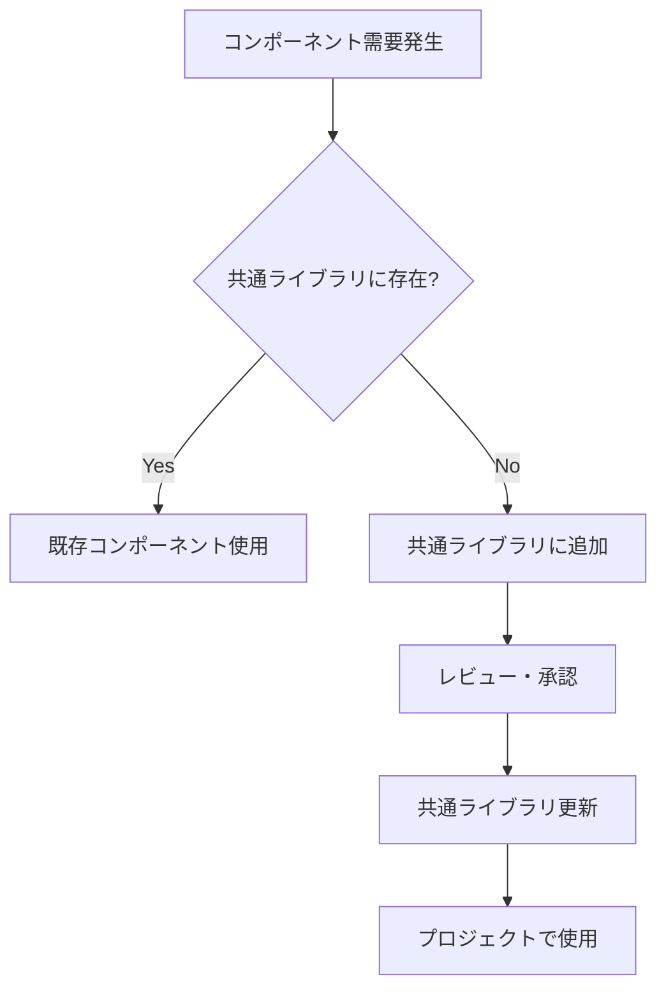
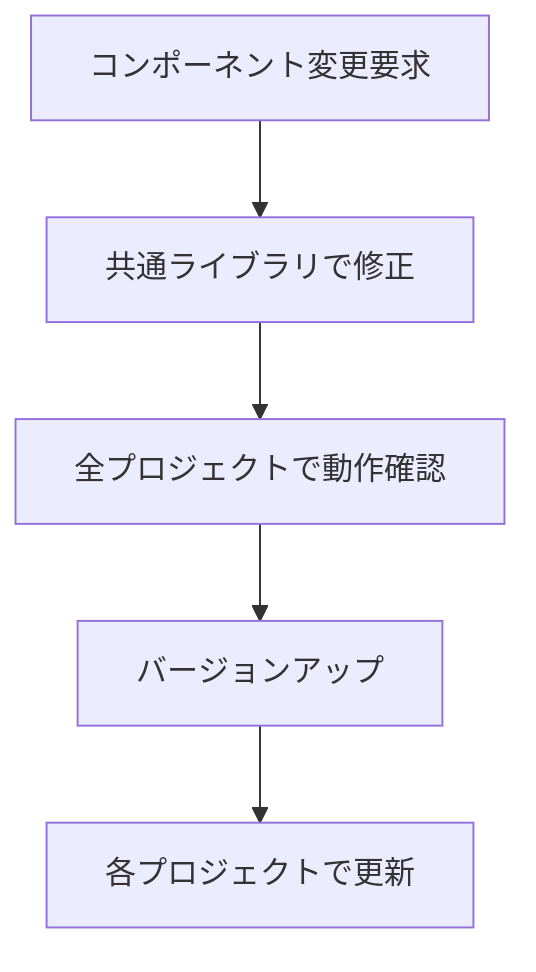

# 開発ガイドライン

## 概要

このドキュメントは企業システム開発における統一的な開発ガイドラインを定義します。
特に**共通コンポーネントの強制使用**、**モバイルファースト設計**、**品質管理**に重点を置いています。

## 基本原則

### 1. モバイルファースト設計の原則
- **すべての開発は320pxから開始する**
- PC・スマートフォン・タブレット全デバイス対応を必須とする
- タッチフレンドリーなUI設計を優先する
- レスポンシブデザインの実装を必須とする

### 2. 共通コンポーネント優先の原則
- **全てのUIコンポーネントは共通ライブラリから使用する**
- 独自実装は原則禁止
- 新規コンポーネントが必要な場合は共通ライブラリに追加
- レスポンシブ対応済みコンポーネントを必ず使用する

### 3. 統一性の原則
- デザインシステムの一貫性を保つ
- 同じ機能は同じコンポーネントで実装
- カスタマイズは props/slots の範囲内
- 全デバイスで統一されたUX提供

### 4. 品質管理の原則
- 自動チェックによる品質保証
- コードレビューでの強制チェック
- 継続的な改善とメンテナンス
- マルチデバイステストの実施

## 使用可能コンポーネント一覧

### Element Plus 直接使用禁止コンポーネント

以下のコンポーネントは**直接使用禁止**です。必ず共通ライブラリのラッパーを使用してください。

#### フォーム関連
```typescript
// ❌ 禁止
import { ElButton, ElInput, ElSelect } from 'element-plus'

// ✅ 推奨
import { CommonButton, CommonInput, CommonSelect } from '@company/shared-components'
```

#### データ表示
```typescript
// ❌ 禁止
import { ElTable, ElCard, ElTag } from 'element-plus'

// ✅ 推奨
import { CommonTable, CommonCard, CommonTag } from '@company/shared-components'
```

#### ナビゲーション
```typescript
// ❌ 禁止
import { ElMenu, ElBreadcrumb, ElTabs } from 'element-plus'

// ✅ 推奨
import { CommonMenu, CommonBreadcrumb, CommonTabs } from '@company/shared-components'
```

#### フィードバック
```typescript
// ❌ 禁止
import { ElMessage, ElDialog, ElDrawer } from 'element-plus'

// ✅ 推奨
import { CommonMessage, CommonDialog, CommonDrawer } from '@company/shared-components'
```

### 例外的に直接使用可能なコンポーネント

以下のコンポーネントのみ直接使用を許可します：

```typescript
// ✅ 直接使用OK（レイアウト系）
import { ElRow, ElCol, ElContainer, ElHeader, ElMain, ElFooter, ElAside } from 'element-plus'

// ✅ 直接使用OK（アイコン）
import { Plus, Delete, Edit } from '@element-plus/icons-vue'
```

## 共通コンポーネント使用ルール

### 1. 必須使用ルール

#### ボタンコンポーネント
```vue
<!-- ❌ 禁止 -->
<el-button type="primary" @click="submit">送信</el-button>

<!-- ✅ 推奨 -->
<CommonButton variant="primary" @click="submit">送信</CommonButton>
```

#### テーブルコンポーネント
```vue
<!-- ❌ 禁止 -->
<el-table :data="tableData">
  <el-table-column prop="name" label="名前" />
</el-table>

<!-- ✅ 推奨 -->
<CommonTable :data="tableData" :columns="tableColumns" />
```

#### フォームコンポーネント
```vue
<!-- ❌ 禁止 -->
<el-form :model="form">
  <el-form-item label="名前">
    <el-input v-model="form.name" />
  </el-form-item>
</el-form>

<!-- ✅ 推奨 -->
<CommonForm :model="form" :schema="formSchema" />
```

### 2. プロップス統一ルール

共通コンポーネントは以下の命名規則に従います：

```typescript
// ✅ 統一されたプロップス名
interface CommonButtonProps {
  variant: 'primary' | 'secondary' | 'danger'  // type ではなく variant
  size: 'small' | 'medium' | 'large'           // 統一されたサイズ
  loading: boolean                             // ローディング状態
  disabled: boolean                            // 無効状態
}
```

### 3. イベント統一ルール

```typescript
// ✅ 統一されたイベント名
interface CommonComponentEvents {
  'on-click': (event: MouseEvent) => void      // click ではなく on-click
  'on-change': (value: any) => void           // change ではなく on-change
  'on-submit': (data: any) => void            // submit ではなく on-submit
}
```

## レスポンシブ開発フロー

### 開発手順

1. **モバイル設計から開始（320px）**
   ```scss
   // 1. モバイル用スタイルを基本として定義
   .component {
     padding: 12px;
     font-size: 14px;
     min-height: 44px; // タッチ対応
   }

   // 2. タブレット用の調整
   @media (min-width: 768px) {
     .component {
       padding: 16px;
       font-size: 16px;
     }
   }

   // 3. デスクトップ用の調整
   @media (min-width: 992px) {
     .component {
       padding: 20px;
       min-height: 36px; // マウス操作では小さくてもOK
     }
   }
   ```

2. **レスポンシブテスト実施**
   ```bash
   # 必須テストビューポート
   npm run test:mobile    # 375px, 414px
   npm run test:tablet    # 768px, 1024px
   npm run test:desktop   # 1200px, 1920px
   ```

3. **タッチインタラクション確認**
   - タップ領域の最小サイズ（44×44px）
   - スワイプ操作の対応
   - ピンチズーム対応

### 必須リソース

開発前に以下のドキュメントを必ず確認：
- [レスポンシブデザインガイドライン](./11-02_レスポンシブデザインガイドライン.md)
- [共通コンポーネント仕様](02_設計/06_共通コンポーネント仕様.md)

## チェック機能の実装

### 1. ESLint ルール

```javascript
// .eslintrc.js
module.exports = {
  rules: {
    // Element Plus 直接使用を禁止
    'no-restricted-imports': [
      'error',
      {
        'paths': [
          {
            'name': 'element-plus',
            'importNames': [
              'ElButton', 'ElInput', 'ElSelect', 'ElTable',
              'ElCard', 'ElTag', 'ElMenu', 'ElBreadcrumb',
              'ElTabs', 'ElMessage', 'ElDialog', 'ElDrawer'
            ],
            'message': '共通コンポーネント(@company/shared-components)を使用してください'
          }
        ]
      }
    ],

    // 共通コンポーネント使用強制
    '@company/require-common-components': 'error'
  }
}
```

### 2. カスタム ESLint ルール

```javascript
// eslint-plugin-company/rules/require-common-components.js
module.exports = {
  meta: {
    type: 'problem',
    docs: {
      description: '共通コンポーネントの使用を強制する',
    },
  },
  create(context) {
    return {
      ImportDeclaration(node) {
        if (node.source.value === 'element-plus') {
          const forbiddenImports = [
            'ElButton', 'ElInput', 'ElSelect', 'ElTable'
          ]

          node.specifiers.forEach(spec => {
            if (forbiddenImports.includes(spec.imported.name)) {
              context.report({
                node: spec,
                message: `${spec.imported.name} は禁止されています。@company/shared-components の Common${spec.imported.name.slice(2)} を使用してください。`
              })
            }
          })
        }
      }
    }
  }
}
```

### 3. プリコミット チェック

```bash
#!/bin/bash
# .husky/pre-commit

echo "🔍 共通コンポーネント使用チェック実行中..."

# 禁止されたコンポーネントの使用をチェック
FORBIDDEN_USAGE=$(grep -r "el-button\|el-input\|el-select\|el-table" src/ --include="*.vue" || true)

if [ ! -z "$FORBIDDEN_USAGE" ]; then
    echo "❌ 禁止されたコンポーネントの使用が検出されました:"
    echo "$FORBIDDEN_USAGE"
    echo ""
    echo "共通コンポーネント(@company/shared-components)を使用してください。"
    exit 1
fi

echo "✅ 共通コンポーネント使用チェック完了"
```

### 4. CI/CD パイプラインチェック

```yaml
# .github/workflows/component-check.yml
name: Component Usage Check

on: [push, pull_request]

jobs:
  component-check:
    runs-on: ubuntu-latest
    steps:
      - uses: actions/checkout@v3

      - name: Component Usage Check
        run: |
          # 禁止コンポーネントの使用チェック
          if grep -r "import.*El[A-Z]" src/ --include="*.vue" --include="*.ts"; then
            echo "❌ Element Plus コンポーネントの直接使用が検出されました"
            exit 1
          fi

          # 共通コンポーネントの使用率チェック
          TOTAL_COMPONENTS=$(grep -r "import.*from.*element-plus" src/ | wc -l)
          COMMON_COMPONENTS=$(grep -r "import.*from.*@company/shared-components" src/ | wc -l)

          if [ $TOTAL_COMPONENTS -gt 0 ]; then
            USAGE_RATE=$((COMMON_COMPONENTS * 100 / TOTAL_COMPONENTS))
            echo "共通コンポーネント使用率: ${USAGE_RATE}%"

            if [ $USAGE_RATE -lt 80 ]; then
              echo "❌ 共通コンポーネント使用率が80%未満です"
              exit 1
            fi
          fi
```

## 開発フロー

### 1. 新規コンポーネント開発



### 2. コンポーネント更新フロー



## 品質指標

### 1. 共通コンポーネント使用率

```typescript
// 使用率測定スクリプト
interface ComponentUsageMetrics {
  totalComponents: number        // 総コンポーネント数
  commonComponents: number       // 共通コンポーネント数
  usageRate: number             // 使用率 (%)
  violations: string[]          // 違反箇所
  responsiveCompliance: number  // レスポンシブ対応率
  mobileOptimization: number    // モバイル最適化率
}

// 目標値
const TARGET_USAGE_RATE = 95         // 95%以上
const TARGET_RESPONSIVE_RATE = 100   // 100% (必須)
const TARGET_MOBILE_OPTIMIZATION = 95 // 95%以上
```

### 2. 品質指標ダッシュボード

```typescript
// 品質レポート
interface QualityReport {
  timestamp: Date
  projectName: string
  metrics: {
    commonComponentUsage: number      // 共通コンポーネント使用率
    designSystemCompliance: number   // デザインシステム準拠率
    responsiveCompliance: number     // レスポンシブ対応率
    mobileOptimization: number       // モバイル最適化率
    accessibilityScore: number       // アクセシビリティスコア
    performanceScore: number         // パフォーマンススコア
    codeQualityScore: number         // コード品質スコア
    violations: ComponentViolation[] // 違反一覧
  }
}
```

## 例外申請プロセス

### 1. 例外申請が必要なケース

- 共通コンポーネントで実現不可能な特殊要件
- パフォーマンス上の制約
- 外部ライブラリとの互換性問題

### 2. 申請フォーマット

```markdown
## 例外申請

**プロジェクト名:** [プロジェクト名]
**申請者:** [氏名]
**申請日:** [日付]

**使用したいコンポーネント:**
- ElCustomComponent

**理由:**
[詳細な理由を記載]

**代替案検討:**
[共通コンポーネントでの実現可能性を検討した結果]

**影響範囲:**
[この例外が他のプロジェクトに与える影響]

**承認者:** [ ] アーキテクト [ ] テックリード
```

## ユニバーサルデザイン要件

### フォント要件
- **必須フォント**: BIZ UDPゴシック（UDゴシック）を最優先使用
- **最小フォントサイズ**: 16px以上（アクセシビリティ考慮）
- **推奨フォントサイズ**: 18px以上（高齢者・視覚障害者配慮）
- **行間**: 1.5以上（WCAG準拠）
- **字間**: 日本語テキストは0.025em以上

### 共通テーマライブラリ
```scss
// 共通テーマの使用
@import '@company/shared-theme';

// UDゴシック設定の適用
.component {
  font-family: var(--font-family-primary); // BIZ UDPゴシック優先
  font-size: var(--font-size-accessible-min); // 18px以上
  line-height: var(--line-height-normal); // 1.5
  letter-spacing: var(--letter-spacing-wide); // 0.025em
}
```

### カラーアクセシビリティ
- **コントラスト比**: WCAG AA準拠（4.5:1以上）
- **色覚対応**: 色のみに依存しない情報伝達
- **ダークモード**: 自動対応必須

### 実装チェックポイント
- [ ] UDゴシックフォントの使用確認
- [ ] フォントサイズ16px以上の確保
- [ ] コントラスト比4.5:1以上の確保
- [ ] キーボード操作対応
- [ ] スクリーンリーダー対応

### レスポンシブ対応チェックリスト

開発完了前に以下を必ず確認：

- [ ] **320px**から表示可能
- [ ] タッチ領域**44×44px以上**確保
- [ ] 横スクロールが発生しない
- [ ] フォントサイズがモバイルで読みやすい（最小14px）
- [ ] モバイル・タブレット・デスクトップで適切な表示
- [ ] タッチ操作とマウス操作の両方に対応
- [ ] 画像がデバイスに適したサイズで配信
- [ ] ページ読み込み時間が3秒以内（モバイル）
- [ ] 実機での動作確認完了

## まとめ

このガイドラインにより以下を実現します：

1. **統一性**: 全プロジェクトで一貫したUI/UX
2. **効率性**: 共通コンポーネントによる開発速度向上
3. **品質**: 自動チェックによる品質保証
4. **保守性**: 一元管理による保守コスト削減
5. **アクセシビリティ**: ユニバーサルデザイン対応による幅広い利用者サポート
6. **レスポンシブ対応**: あらゆるデバイスでの最適な表示と操作性

**重要**:
- このガイドラインは強制力を持ちます。違反した場合はコードレビューで必ず指摘し、修正を求めてください
- **モバイルファースト**は必須要件です。PC専用設計は一切認められません
- 開発前に [レスポンシブデザインガイドライン](./11-02_レスポンシブデザインガイドライン.md) を必ず確認してください