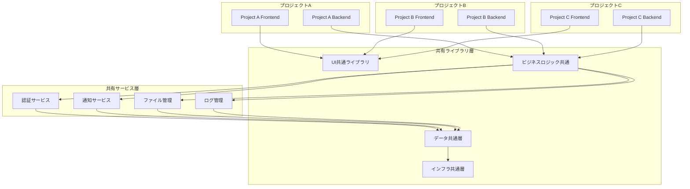

# 複数プロジェクト共有機能基本設計書

## 概要

本文書は、企業システム開発プラットフォームにおいて、複数のプロジェクト間で共有可能な機能群の基本設計を定義します。
共通化により開発効率の向上、品質の統一、保守コストの削減を実現します。

## 共有機能アーキテクチャ

### 全体構成



## 1. UI・フロントエンド共通機能

### 1.1 共通コンポーネントライブラリ

**パッケージ名:** `@company/shared-components`

```typescript
// 提供機能
interface UISharedFeatures {
  components: {
    basic: ['CommonButton', 'CommonInput', 'CommonSelect', 'CommonTable']
    layout: ['CommonHeader', 'CommonSidebar', 'CommonFooter', 'CommonBreadcrumb']
    form: ['CommonForm', 'CommonFormField', 'CommonValidator']
    data: ['CommonDataTable', 'CommonChart', 'CommonPagination']
    feedback: ['CommonDialog', 'CommonMessage', 'CommonNotification']
  }

  theming: {
    colors: ColorPalette
    typography: TypographyScale
    spacing: SpacingScale
    breakpoints: ResponsiveBreakpoints
  }

  utilities: {
    validators: ValidationRules
    formatters: DataFormatters
    helpers: UIHelpers
  }
}
```

**配置場所:** `/packages/shared-components/`

**主要機能:**
- Element Plus ベースの企業向けコンポーネント
- テーマシステム（ライト/ダーク対応）
- レスポンシブデザイン対応
- アクセシビリティ対応
- TypeScript 完全対応

### 1.2 状態管理共通パターン

**パッケージ名:** `@company/shared-stores`

```typescript
// 共通ストア定義
interface SharedStores {
  auth: AuthStore           // 認証状態管理
  user: UserProfileStore    // ユーザープロファイル
  app: AppConfigStore      // アプリケーション設定
  notification: NotificationStore // 通知管理
  theme: ThemeStore        // テーマ設定
}

// 使用例
import { useAuthStore, useUserStore } from '@company/shared-stores'
```

### 1.3 多言語対応（i18n）

**パッケージ名:** `@company/shared-i18n`

```typescript
interface I18nResources {
  common: {
    ja: CommonJaTranslations
    en: CommonEnTranslations
  }

  validation: {
    ja: ValidationJaMessages
    en: ValidationEnMessages
  }

  business: {
    ja: BusinessJaTerms
    en: BusinessEnTerms
  }
}
```

**対応言語:** 日本語（デフォルト）、英語

## 2. バックエンド・ビジネスロジック共通機能

### 2.1 認証・認可システム

**パッケージ名:** `@company/shared-auth`

```typescript
interface AuthSharedFeatures {
  authentication: {
    jwt: JWTAuthProvider
    oauth: OAuthProvider
    session: SessionManager
    mfa: MultifactorAuth
  }

  authorization: {
    rbac: RoleBasedAccessControl
    abac: AttributeBasedAccessControl
    permissions: PermissionManager
  }

  middleware: {
    authenticateToken: AuthMiddleware
    requireRole: RoleMiddleware
    requirePermission: PermissionMiddleware
  }
}

// 使用例
import { authenticateToken, requireRole } from '@company/shared-auth'

app.use('/api/admin', authenticateToken, requireRole('admin'))
```

**主要機能:**
- JWT ベースの認証
- ロールベースアクセス制御（RBAC）
- リソースベース権限管理
- セッション管理
- 多要素認証（MFA）対応

### 2.2 ユーザー管理システム

**パッケージ名:** `@company/shared-user`

```typescript
interface UserManagementFeatures {
  models: {
    User: UserModel
    Role: RoleModel
    Permission: PermissionModel
    UserProfile: UserProfileModel
  }

  services: {
    userService: UserCRUDService
    profileService: ProfileManagementService
    roleService: RoleManagementService
  }

  validation: {
    userValidation: UserValidationRules
    passwordPolicy: PasswordPolicyRules
  }
}
```

**データベーススキーマ:**
```sql
-- 共通ユーザーテーブル
CREATE TABLE users (
  id UUID PRIMARY KEY DEFAULT gen_random_uuid(),
  username VARCHAR(50) UNIQUE NOT NULL,
  email VARCHAR(255) UNIQUE NOT NULL,
  password_hash VARCHAR(255) NOT NULL,
  is_active BOOLEAN DEFAULT true,
  created_at TIMESTAMP DEFAULT CURRENT_TIMESTAMP,
  updated_at TIMESTAMP DEFAULT CURRENT_TIMESTAMP
);

CREATE TABLE roles (
  id UUID PRIMARY KEY DEFAULT gen_random_uuid(),
  name VARCHAR(50) UNIQUE NOT NULL,
  description TEXT,
  created_at TIMESTAMP DEFAULT CURRENT_TIMESTAMP
);

CREATE TABLE permissions (
  id UUID PRIMARY KEY DEFAULT gen_random_uuid(),
  resource VARCHAR(100) NOT NULL,
  action VARCHAR(50) NOT NULL,
  description TEXT,
  UNIQUE(resource, action)
);
```

### 2.3 監査ログシステム

**パッケージ名:** `@company/shared-audit`

```typescript
interface AuditLogFeatures {
  logger: {
    logAction: (action: AuditAction) => Promise<void>
    logDataChange: (changes: DataChange) => Promise<void>
    logSecurityEvent: (event: SecurityEvent) => Promise<void>
  }

  query: {
    getAuditLogs: (filters: AuditFilters) => Promise<AuditLog[]>
    exportAuditReport: (period: DateRange) => Promise<Report>
  }

  middleware: {
    auditMiddleware: ExpressMiddleware
    dataChangeTracker: PrismaMiddleware
  }
}

// 使用例
import { auditMiddleware, logAction } from '@company/shared-audit'

app.use(auditMiddleware)
await logAction({
  userId: user.id,
  action: 'USER_CREATED',
  resource: 'users',
  details: { userId: newUser.id }
})
```

### 2.4 通知システム

**パッケージ名:** `@company/shared-notification`

```typescript
interface NotificationFeatures {
  channels: {
    email: EmailNotificationService
    inApp: InAppNotificationService
    push: PushNotificationService
    sms: SMSNotificationService
  }

  templates: {
    welcome: NotificationTemplate
    passwordReset: NotificationTemplate
    systemAlert: NotificationTemplate
  }

  queue: {
    sendNotification: (notification: Notification) => Promise<void>
    scheduleNotification: (notification: Notification, schedule: Schedule) => Promise<void>
  }
}
```

### 2.5 ファイル管理システム

**パッケージ名:** `@company/shared-files`

```typescript
interface FileManagementFeatures {
  storage: {
    local: LocalStorageProvider
    s3: S3StorageProvider
    azure: AzureStorageProvider
  }

  processing: {
    imageResize: ImageProcessor
    documentConverter: DocumentProcessor
    virusScanner: SecurityScanner
  }

  api: {
    uploadFile: FileUploadHandler
    downloadFile: FileDownloadHandler
    deleteFile: FileDeleteHandler
  }
}
```

## 3. データベース・データ共通機能

### 3.1 共通データベーススキーマ

**パッケージ名:** `@company/shared-schema`

```sql
-- 共通テーブル群
CREATE SCHEMA shared;

-- ユーザー関連
CREATE TABLE shared.users (...);
CREATE TABLE shared.roles (...);
CREATE TABLE shared.permissions (...);
CREATE TABLE shared.user_roles (...);
CREATE TABLE shared.role_permissions (...);

-- システム関連
CREATE TABLE shared.audit_logs (...);
CREATE TABLE shared.notifications (...);
CREATE TABLE shared.system_settings (...);
CREATE TABLE shared.file_attachments (...);

-- 共通マスタ
CREATE TABLE shared.countries (...);
CREATE TABLE shared.timezones (...);
CREATE TABLE shared.currencies (...);
```

### 3.2 データアクセス共通層

**パッケージ名:** `@company/shared-data`

```typescript
interface DataAccessFeatures {
  repositories: {
    BaseRepository: BaseRepositoryClass
    UserRepository: UserRepositoryClass
    AuditRepository: AuditRepositoryClass
  }

  utilities: {
    pagination: PaginationUtility
    filtering: FilteringUtility
    sorting: SortingUtility
    validation: DataValidationUtility
  }

  migrations: {
    baseMigrations: PrismaMigration[]
    seedData: SeedDataScript[]
  }
}
```

## 4. インフラ・運用共通機能

### 4.1 Docker環境テンプレート

**提供内容:**
```
/infrastructure/templates/
├── docker-compose.base.yml      # 基本構成
├── docker-compose.monitoring.yml # 監視機能
├── docker-compose.cache.yml     # キャッシュ層
└── docker-compose.security.yml  # セキュリティ機能
```

### 4.2 CI/CDパイプラインテンプレート

**提供内容:**
```
/.github/workflows/
├── base-ci.yml          # 基本CI
├── security-scan.yml    # セキュリティスキャン
├── performance-test.yml # パフォーマンステスト
└── deploy-staging.yml   # ステージングデプロイ
```

### 4.3 モニタリング・ログ共通設定

**パッケージ名:** `@company/shared-monitoring`

```typescript
interface MonitoringFeatures {
  metrics: {
    prometheus: PrometheusConfig
    grafana: GrafanaDashboards
    alerts: AlertRules
  }

  logging: {
    winston: LoggerConfig
    elasticsearch: LogAggregation
    kibana: LogVisualization
  }

  tracing: {
    jaeger: TracingConfig
    opentelemetry: TracingSDK
  }
}
```

## 5. 開発支援共通機能

### 5.1 コード生成ツール

**ツール名:** `websys-cli`

```bash
# CRUD生成
websys-cli generate crud User --table=users

# API生成
websys-cli generate api UserManagement

# フロントエンド画面生成
websys-cli generate page UserList --crud

# 共通コンポーネント生成
websys-cli generate component CustomButton --shared
```

### 5.2 テストユーティリティ

**パッケージ名:** `@company/shared-testing`

```typescript
interface TestingUtilities {
  fixtures: {
    userFixtures: TestUserData
    roleFixtures: TestRoleData
    apiFixtures: TestAPIResponses
  }

  helpers: {
    authHelper: AuthTestHelper
    dbHelper: DatabaseTestHelper
    apiHelper: APITestHelper
  }

  mocks: {
    authMock: AuthServiceMock
    notificationMock: NotificationServiceMock
  }
}
```

## 実装優先順位

### フェーズ1（基盤構築）
1. **共通コンポーネントライブラリ** - 最優先
2. **認証・認可システム** - セキュリティ基盤
3. **共通データベーススキーマ** - データ基盤
4. **CI/CDパイプライン** - 開発基盤

### フェーズ2（機能拡張）
1. **ユーザー管理システム**
2. **監査ログシステム**
3. **ファイル管理システム**
4. **通知システム**

### フェーズ3（最適化）
1. **モニタリング・ログシステム**
2. **キャッシュシステム**
3. **パフォーマンス最適化**
4. **セキュリティ強化**

### フェーズ4（開発支援）
1. **コード生成ツール**
2. **テストユーティリティ**
3. **開発環境自動化**
4. **ドキュメント自動生成**

## プロジェクト間連携方式

### 1. パッケージベース連携
```json
{
  "dependencies": {
    "@company/shared-components": "^1.0.0",
    "@company/shared-auth": "^1.0.0",
    "@company/shared-user": "^1.0.0"
  }
}
```

### 2. サービスベース連携
```typescript
// 認証サービスとの連携
const authService = new AuthService({
  endpoint: process.env.AUTH_SERVICE_URL,
  apiKey: process.env.AUTH_API_KEY
})
```

### 3. データベース共有
```typescript
// 共通スキーマの利用
import { users, roles, permissions } from '@company/shared-schema'
```

## セキュリティ・ガバナンス

### バージョン管理
- セマンティックバージョニング適用
- 破壊的変更は Major バージョンアップ
- セキュリティ修正は Patch レベルで即座にリリース

### アクセス制御
- 共通機能への変更は承認制
- セキュリティレビュー必須
- 全変更の監査ログ記録

### 品質保証
- 共通機能は90%以上のテストカバレッジ
- パフォーマンステスト必須
- セキュリティスキャン自動化

## 運用・保守方針

### 1. 中央集権管理
- 共通機能チームによる管理
- バージョンアップの計画的実行
- 影響範囲分析の徹底

### 2. 段階的展開
- カナリアリリースによる検証
- 段階的なプロジェクト適用
- ロールバック計画の準備

### 3. 監視・メンテナンス
- 使用状況の継続監視
- パフォーマンス指標の追跡
- セキュリティ脆弱性の迅速対応

## まとめ

本設計により以下の効果を実現します：

### 開発効率向上
- コード重複の削減（推定70%削減）
- 開発時間の短縮（推定50%短縮）
- 新規プロジェクト立ち上げ時間の短縮（推定80%短縮）

### 品質向上
- 統一されたUI/UX
- 十分にテストされた共通機能
- セキュリティベストプラクティスの適用

### 保守性向上
- 中央集権的な管理
- 一元的なバージョン管理
- 影響範囲の明確化

この基本設計に基づいて、段階的に共通機能を実装していくことで、効率的で品質の高い企業システム開発プラットフォームを構築できます。