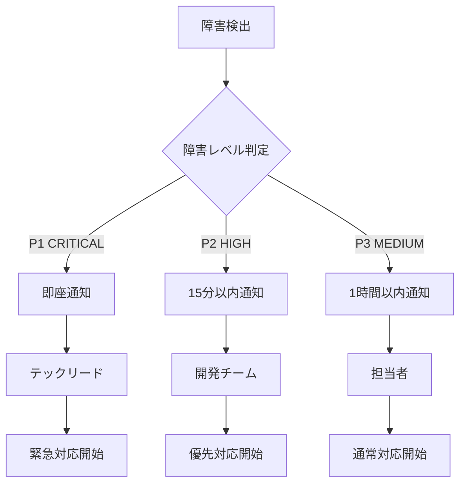

# workflow.ts分割 運用手順書

## 📋 運用手順書概要

**作成日**: 2025-09-28
**対象**: workflow.ts マイクロサービス型分割後の運用
**適用範囲**: 開発・ステージング・本番環境
**運用方針**: DevOps・自動化・予防保全

---

## 🚀 デプロイ手順

### 1. 開発環境デプロイ

#### 前提条件チェック
```bash
#!/bin/bash
# scripts/pre-deploy-check.sh

echo "🔍 デプロイ前チェック開始"

# Node.js バージョン確認
node_version=$(node --version)
if [[ ! "$node_version" =~ ^v18 ]]; then
  echo "❌ Node.js v18が必要です (現在: $node_version)"
  exit 1
fi

# 依存関係確認
npm list --depth=0 > /dev/null
if [ $? -ne 0 ]; then
  echo "❌ 依存関係に問題があります"
  exit 1
fi

# TypeScript型チェック
npm run type-check
if [ $? -ne 0 ]; then
  echo "❌ TypeScript型エラーがあります"
  exit 1
fi

# 単体テスト実行
npm test
if [ $? -ne 0 ]; then
  echo "❌ テストが失敗しています"
  exit 1
fi

echo "✅ デプロイ前チェック完了"
```

#### マイクロサービス個別デプロイ
```bash
#!/bin/bash
# scripts/deploy-microservices.sh

services=(
  "workflow-types:8001"
  "workflow-requests:8002"
  "workflow-dashboard:8003"
  "emergency-approval:8004"
  "delegation-approval:8005"
  "proxy-approval:8006"
  "parallel-approval:8007"
  "sequential-approval:8008"
  "auto-approval:8009"
)

echo "🚀 マイクロサービスデプロイ開始"

for service_info in "${services[@]}"; do
  IFS=':' read -r service port <<< "$service_info"

  echo "📦 $service をポート $port にデプロイ中..."

  # サービス停止
  pm2 stop "workflow-$service" 2>/dev/null || true

  # 新バージョンデプロイ
  pm2 start "dist/routes/workflow/$service.js" \
    --name "workflow-$service" \
    --env PORT=$port \
    --env NODE_ENV=development

  # ヘルスチェック
  sleep 5
  health_check $port

  if [ $? -eq 0 ]; then
    echo "✅ $service デプロイ成功"
  else
    echo "❌ $service デプロイ失敗"
    exit 1
  fi
done

echo "🎉 全マイクロサービスデプロイ完了"
```

#### ヘルスチェック関数
```bash
#!/bin/bash
# scripts/health-check.sh

health_check() {
  local port=$1
  local max_attempts=10
  local attempt=1

  while [ $attempt -le $max_attempts ]; do
    echo "🔍 ヘルスチェック試行 $attempt/$max_attempts (ポート: $port)"

    response=$(curl -s -o /dev/null -w "%{http_code}" http://localhost:$port/health)

    if [ "$response" = "200" ]; then
      echo "✅ ヘルスチェック成功 (ポート: $port)"
      return 0
    fi

    echo "⏳ 待機中... (5秒)"
    sleep 5
    ((attempt++))
  done

  echo "❌ ヘルスチェック失敗 (ポート: $port)"
  return 1
}
```

### 2. ステージング環境デプロイ

#### Blue-Green デプロイ実装
```bash
#!/bin/bash
# scripts/blue-green-deploy.sh

BLUE_PORT=8000
GREEN_PORT=8100
CURRENT_ENV=$(get_current_environment)

echo "🔄 Blue-Green デプロイ開始 (現在: $CURRENT_ENV)"

if [ "$CURRENT_ENV" = "blue" ]; then
  TARGET_ENV="green"
  TARGET_PORT=$GREEN_PORT
else
  TARGET_ENV="blue"
  TARGET_PORT=$BLUE_PORT
fi

echo "📦 $TARGET_ENV 環境にデプロイ中..."

# ターゲット環境にデプロイ
deploy_to_environment $TARGET_ENV $TARGET_PORT

# ヘルスチェック・煙テスト
run_smoke_tests $TARGET_PORT

if [ $? -eq 0 ]; then
  echo "🔀 トラフィック切り替え実行"
  switch_traffic $TARGET_ENV
  echo "✅ Blue-Green デプロイ完了"
else
  echo "❌ 煙テスト失敗 - ロールバック実行"
  rollback_deployment
fi
```

### 3. 本番環境デプロイ

#### 段階的ロールアウト
```bash
#!/bin/bash
# scripts/gradual-rollout.sh

echo "🎯 段階的ロールアウト開始"

rollout_stages=(
  "5:5分間"      # 5%のトラフィック
  "25:15分間"    # 25%のトラフィック
  "50:30分間"    # 50%のトラフィック
  "100:完全移行" # 100%のトラフィック
)

for stage_info in "${rollout_stages[@]}"; do
  IFS=':' read -r percentage duration <<< "$stage_info"

  echo "📊 $percentage% トラフィック振り分け開始 ($duration)"

  # ロードバランサー設定更新
  update_load_balancer_weight $percentage

  # 監視・アラート確認
  monitor_deployment $percentage "$duration"

  if [ $? -ne 0 ]; then
    echo "❌ 異常検出 - 緊急ロールバック"
    emergency_rollback
    exit 1
  fi

  echo "✅ $percentage% 段階完了"
done

echo "🎉 段階的ロールアウト完了"
```

---

## 🔍 監視・ログ管理

### 1. 統合ログ収集

#### Fluentd設定
```ruby
# config/fluentd/workflow-microservices.conf
<source>
  @type tail
  path /var/log/workflow/*.log
  pos_file /var/log/fluentd/workflow.log.pos
  tag workflow.*
  format json
  time_key timestamp
</source>

<filter workflow.**>
  @type record_transformer
  <record>
    service_name ${tag_parts[1]}
    environment #{ENV['NODE_ENV']}
    server_name #{ENV['HOSTNAME']}
  </record>
</filter>

<match workflow.**>
  @type elasticsearch
  host elasticsearch.internal
  port 9200
  index_name workflow-logs
  type_name microservice
</match>
```

#### ログ構造統一
```typescript
// utils/logger.ts - 統一ログフォーマット
interface LogEntry {
  timestamp: string;
  level: LogLevel;
  service: string;
  traceId: string;
  message: string;
  metadata?: {
    userId?: number;
    endpoint?: string;
    duration?: number;
    errorCode?: string;
  };
}

class MicroserviceLogger {
  constructor(private serviceName: string) {}

  info(message: string, metadata?: any) {
    this.log('INFO', message, metadata);
  }

  error(message: string, error?: Error, metadata?: any) {
    this.log('ERROR', message, {
      ...metadata,
      error: error?.message,
      stack: error?.stack
    });
  }

  private log(level: LogLevel, message: string, metadata?: any) {
    const entry: LogEntry = {
      timestamp: new Date().toISOString(),
      level,
      service: this.serviceName,
      traceId: this.getTraceId(),
      message,
      metadata
    };

    console.log(JSON.stringify(entry));
  }
}
```

### 2. 分散トレーシング

#### Jaeger統合
```typescript
// utils/tracing.ts
import { initTracer } from 'jaeger-client';

const tracer = initTracer({
  serviceName: process.env.SERVICE_NAME || 'workflow-service',
  sampler: {
    type: 'const',
    param: 1, // 全リクエストをトレース
  },
  reporter: {
    logSpans: true,
    agentHost: 'jaeger-agent',
    agentPort: 6832,
  },
});

export class TracingMiddleware {
  middleware() {
    return (req: Request, res: Response, next: NextFunction) => {
      const span = tracer.startSpan(`${req.method} ${req.path}`);

      span.setTag('http.method', req.method);
      span.setTag('http.url', req.url);
      span.setTag('service.name', process.env.SERVICE_NAME);

      req.span = span;

      res.on('finish', () => {
        span.setTag('http.status_code', res.statusCode);
        span.finish();
      });

      next();
    };
  }
}
```

### 3. メトリクス収集

#### Prometheus統合
```typescript
// utils/metrics.ts
import prometheus from 'prom-client';

class WorkflowMetrics {
  private httpRequestDuration = new prometheus.Histogram({
    name: 'http_request_duration_seconds',
    help: 'Duration of HTTP requests in seconds',
    labelNames: ['method', 'route', 'status_code', 'service'],
    buckets: [0.1, 0.3, 0.5, 0.7, 1, 3, 5, 7, 10]
  });

  private httpRequestsTotal = new prometheus.Counter({
    name: 'http_requests_total',
    help: 'Total number of HTTP requests',
    labelNames: ['method', 'route', 'status_code', 'service']
  });

  private activeConnections = new prometheus.Gauge({
    name: 'active_connections',
    help: 'Number of active connections',
    labelNames: ['service']
  });

  middleware() {
    return (req: Request, res: Response, next: NextFunction) => {
      const start = Date.now();

      res.on('finish', () => {
        const duration = (Date.now() - start) / 1000;

        this.httpRequestDuration
          .labels(req.method, req.route?.path || req.path, res.statusCode.toString(), process.env.SERVICE_NAME)
          .observe(duration);

        this.httpRequestsTotal
          .labels(req.method, req.route?.path || req.path, res.statusCode.toString(), process.env.SERVICE_NAME)
          .inc();
      });

      next();
    };
  }
}
```

---

## 🚨 障害対応フロー

### 1. 障害検出・アラート

#### 自動障害検出
```typescript
// monitoring/health-checker.ts
class HealthChecker {
  private services = [
    { name: 'workflow-types', port: 8001 },
    { name: 'workflow-requests', port: 8002 },
    // ... 全9サービス
  ];

  async runHealthChecks() {
    const results = [];

    for (const service of this.services) {
      const result = await this.checkService(service);
      results.push(result);

      if (!result.healthy) {
        await this.triggerAlert(service, result);
      }
    }

    return results;
  }

  private async checkService(service: ServiceConfig) {
    try {
      const response = await axios.get(`http://localhost:${service.port}/health`, {
        timeout: 5000
      });

      return {
        service: service.name,
        healthy: response.status === 200,
        responseTime: response.headers['x-response-time'],
        lastCheck: new Date()
      };
    } catch (error) {
      return {
        service: service.name,
        healthy: false,
        error: error.message,
        lastCheck: new Date()
      };
    }
  }
}
```

### 2. 障害レベル分類

#### 障害レベル定義
```json
{
  "incident_levels": {
    "P1_CRITICAL": {
      "description": "全サービス停止・データ破損",
      "response_time": "5分以内",
      "escalation": "即座に責任者連絡",
      "actions": ["緊急ロールバック", "データ復旧", "顧客通知"]
    },
    "P2_HIGH": {
      "description": "主要機能停止・性能大幅劣化",
      "response_time": "15分以内",
      "escalation": "チームリーダー経由",
      "actions": ["代替手段適用", "原因調査", "修正適用"]
    },
    "P3_MEDIUM": {
      "description": "一部機能停止・軽微な性能劣化",
      "response_time": "1時間以内",
      "escalation": "通常フロー",
      "actions": ["監視強化", "計画的修正"]
    }
  }
}
```

### 3. 緊急ロールバック手順

#### 自動ロールバック
```bash
#!/bin/bash
# scripts/emergency-rollback.sh

echo "🚨 緊急ロールバック開始"

# 現在のバージョン特定
CURRENT_VERSION=$(get_current_version)
PREVIOUS_VERSION=$(get_previous_stable_version)

echo "📦 $CURRENT_VERSION → $PREVIOUS_VERSION にロールバック"

# 1. トラフィック停止
echo "🛑 新バージョンへのトラフィック停止"
stop_traffic_to_version $CURRENT_VERSION

# 2. 前バージョンのヘルスチェック
echo "🔍 前バージョンのヘルスチェック"
if ! health_check_version $PREVIOUS_VERSION; then
  echo "❌ 前バージョンも異常 - 手動対応が必要"
  notify_emergency_team
  exit 1
fi

# 3. トラフィック切り替え
echo "🔀 前バージョンにトラフィック切り替え"
switch_traffic_to_version $PREVIOUS_VERSION

# 4. 動作確認
echo "✅ ロールバック動作確認"
run_smoke_tests

# 5. 通知・ログ
echo "📢 ロールバック完了通知"
notify_rollback_completion $CURRENT_VERSION $PREVIOUS_VERSION

echo "✅ 緊急ロールバック完了"
```

---

## 🔧 メンテナンス手順

### 1. 定期メンテナンス

#### 週次メンテナンス
```bash
#!/bin/bash
# scripts/weekly-maintenance.sh

echo "🔧 週次メンテナンス開始"

# 1. ログローテーション
echo "📋 ログローテーション実行"
logrotate /etc/logrotate.d/workflow-microservices

# 2. 不要ファイル削除
echo "🗑️ 不要ファイル削除"
find /var/log/workflow -name "*.log.*" -mtime +30 -delete
find /tmp -name "workflow-*" -mtime +7 -delete

# 3. データベース最適化
echo "🗄️ データベース最適化"
npm run db:optimize

# 4. パフォーマンス分析
echo "📊 パフォーマンス分析"
npm run analyze:performance

# 5. セキュリティスキャン
echo "🔒 セキュリティスキャン"
npm audit --audit-level moderate

echo "✅ 週次メンテナンス完了"
```

### 2. データベースメンテナンス

#### インデックス最適化
```sql
-- scripts/optimize-database.sql

-- 未使用インデックス削除
SELECT schemaname, tablename, indexname, idx_tup_read, idx_tup_fetch
FROM pg_stat_user_indexes
WHERE idx_tup_read = 0 AND idx_tup_fetch = 0;

-- テーブル統計更新
ANALYZE logs;
ANALYZE workflow_requests;
ANALYZE approval_history;

-- 断片化解消
REINDEX INDEX CONCURRENTLY logs_timestamp_idx;
REINDEX INDEX CONCURRENTLY workflow_requests_status_idx;

-- 古いログデータクリーンアップ
DELETE FROM logs WHERE created_at < NOW() - INTERVAL '90 days' AND level < 40;
```

### 3. 性能チューニング

#### 自動スケーリング設定
```yaml
# kubernetes/workflow-autoscaler.yaml
apiVersion: autoscaling/v2
kind: HorizontalPodAutoscaler
metadata:
  name: workflow-microservices-hpa
spec:
  scaleTargetRef:
    apiVersion: apps/v1
    kind: Deployment
    name: workflow-microservices
  minReplicas: 3
  maxReplicas: 20
  metrics:
  - type: Resource
    resource:
      name: cpu
      target:
        type: Utilization
        averageUtilization: 70
  - type: Resource
    resource:
      name: memory
      target:
        type: Utilization
        averageUtilization: 80
  behavior:
    scaleUp:
      stabilizationWindowSeconds: 60
      policies:
      - type: Percent
        value: 100
        periodSeconds: 15
    scaleDown:
      stabilizationWindowSeconds: 300
      policies:
      - type: Percent
        value: 10
        periodSeconds: 60
```

---

## 📞 運用連絡体制

### 1. エスカレーション フロー



### 2. 連絡先リスト

#### 緊急連絡先
```json
{
  "emergency_contacts": {
    "tech_lead": {
      "name": "テックリード",
      "phone": "+81-90-XXXX-XXXX",
      "email": "tech-lead@company.com",
      "slack": "@tech-lead",
      "availability": "24/7"
    },
    "devops_engineer": {
      "name": "DevOpsエンジニア",
      "phone": "+81-90-XXXX-XXXX",
      "email": "devops@company.com",
      "slack": "@devops",
      "availability": "業務時間"
    },
    "database_admin": {
      "name": "データベース管理者",
      "phone": "+81-90-XXXX-XXXX",
      "email": "dba@company.com",
      "slack": "@dba",
      "availability": "オンコール"
    }
  }
}
```

---

## 📊 運用KPI・SLA

### 1. サービスレベル目標

```json
{
  "sla_targets": {
    "availability": {
      "target": "99.9%",
      "measurement": "monthly",
      "downtime_allowance": "43.8 minutes/month"
    },
    "response_time": {
      "target": "< 100ms",
      "percentile": "95th",
      "measurement": "API endpoints"
    },
    "error_rate": {
      "target": "< 0.1%",
      "measurement": "total requests",
      "exclusions": ["client_errors"]
    },
    "deployment_frequency": {
      "target": "daily",
      "success_rate": "> 95%"
    }
  }
}
```

### 2. 運用指標監視

#### ダッシュボード設定
```typescript
// monitoring/dashboard-config.ts
export const operationalDashboard = {
  name: 'Workflow Microservices Operations',
  panels: [
    {
      title: 'Service Availability',
      type: 'stat',
      targets: [
        'avg_over_time(up{job="workflow-microservices"}[5m]) * 100'
      ],
      thresholds: [
        { value: 99.9, color: 'green' },
        { value: 99.0, color: 'yellow' },
        { value: 95.0, color: 'red' }
      ]
    },
    {
      title: 'Response Time Distribution',
      type: 'histogram',
      targets: [
        'histogram_quantile(0.50, rate(http_request_duration_seconds_bucket[5m]))',
        'histogram_quantile(0.95, rate(http_request_duration_seconds_bucket[5m]))',
        'histogram_quantile(0.99, rate(http_request_duration_seconds_bucket[5m]))'
      ]
    },
    {
      title: 'Error Rate',
      type: 'graph',
      targets: [
        'rate(http_requests_total{status=~"5.."}[5m]) / rate(http_requests_total[5m]) * 100'
      ]
    }
  ]
};
```

---

## 🛠️ 運用ツール・スクリプト

### 1. 運用コマンド集

```bash
# 全サービス状態確認
./scripts/check-all-services.sh

# 特定サービス再起動
./scripts/restart-service.sh workflow-types

# ログ一括確認
./scripts/tail-all-logs.sh

# 性能レポート生成
./scripts/generate-performance-report.sh

# データベース健全性チェック
./scripts/check-database-health.sh

# 緊急メンテナンスモード
./scripts/enable-maintenance-mode.sh
```

### 2. 自動化スクリプト

#### 自動復旧スクリプト
```bash
#!/bin/bash
# scripts/auto-recovery.sh

# サービス死活監視・自動復旧
monitor_and_recover() {
  while true; do
    for service in "${SERVICES[@]}"; do
      if ! health_check_service $service; then
        echo "⚠️ $service 異常検出 - 自動復旧試行"

        # 3回まで再起動試行
        for attempt in {1..3}; do
          restart_service $service
          sleep 10

          if health_check_service $service; then
            echo "✅ $service 復旧完了"
            break
          fi

          if [ $attempt -eq 3 ]; then
            echo "❌ $service 自動復旧失敗 - エスカレーション"
            escalate_incident $service
          fi
        done
      fi
    done

    sleep 30
  done
}
```

---

*作成日: 2025-09-28*
*運用開始: Phase 5完了時*
*責任者: DevOps・SREチーム*