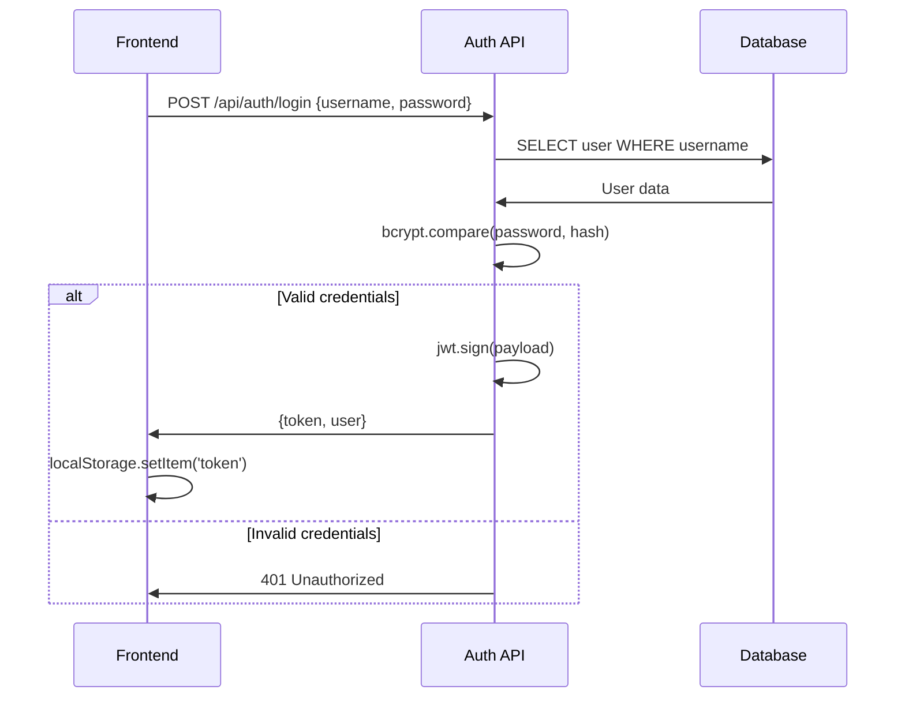

# 認証システム詳細設計書

**機能名**: JWT認証システム
**バージョン**: v1.2.0
**作成日**: 2025年9月21日
**更新日**: 2025年9月21日

---

## 📋 目次

1. [概要](#概要)
2. [機能詳細](#機能詳細)
3. [データ設計](#データ設計)
4. [API設計](#api設計)
5. [フロントエンド設計](#フロントエンド設計)
6. [セキュリティ設計](#セキュリティ設計)
7. [エラーハンドリング](#エラーハンドリング)
8. [テスト設計](#テスト設計)

---

## 概要

### 機能目的
- セキュアなユーザー認証・認可機能の提供
- JWT Bearer Tokenによるステートレス認証
- ロールベースアクセス制御（RBAC）実装
- セッション管理とトークン永続化

### 技術スタック
- **バックエンド**: Express.js + jsonwebtoken + bcrypt
- **フロントエンド**: Vue.js 3 + Pinia + Vue Router
- **セキュリティ**: bcrypt (Salt rounds: 10)
- **トークン**: JWT (有効期限: 7日間)

---

## 機能詳細

### F-AUTH-001: ユーザーログイン

#### 機能概要
ユーザー名・パスワードによる認証とJWTトークン発行

#### 処理フロー


#### 実装詳細
```typescript
// backend/src/routes/auth.ts
export const login = async (req: Request, res: Response) => {
  const { username, password } = req.body;

  try {
    // ユーザー検索
    const user = await prisma.user.findUnique({
      where: { username },
      select: {
        id: true,
        username: true,
        name: true,
        email: true,
        password: true,
        role: true,
        department: true,
        isActive: true
      }
    });

    if (!user || !user.isActive) {
      return res.status(401).json({
        error: 'Invalid credentials',
        message: 'ユーザー名またはパスワードが正しくありません'
      });
    }

    // パスワード検証
    const isValidPassword = await bcrypt.compare(password, user.password);
    if (!isValidPassword) {
      return res.status(401).json({
        error: 'Invalid credentials',
        message: 'ユーザー名またはパスワードが正しくありません'
      });
    }

    // JWTトークン生成
    const tokenPayload = {
      userId: user.id,
      username: user.username,
      role: user.role
    };

    const token = jwt.sign(tokenPayload, JWT_SECRET, {
      expiresIn: '7d',
      issuer: 'log-monitoring-system',
      audience: 'log-monitoring-users'
    });

    // ログイン履歴記録
    await createLog({
      level: 'INFO',
      category: 'AUTH',
      message: `User ${user.username} logged in`,
      userId: user.id,
      metadata: {
        userAgent: req.headers['user-agent'],
        ip: req.ip
      }
    });

    // レスポンス
    const { password: _, ...userWithoutPassword } = user;
    res.json({
      token,
      user: userWithoutPassword
    });

  } catch (error) {
    console.error('Login error:', error);
    res.status(500).json({
      error: 'Internal server error',
      message: 'ログイン処理中にエラーが発生しました'
    });
  }
};
```

### F-AUTH-002: トークン検証・認可

#### 認証ミドルウェア
```typescript
// backend/src/middleware/auth.ts
export const authenticateToken = (req: Request, res: Response, next: NextFunction) => {
  const authHeader = req.headers['authorization'];
  const token = authHeader && authHeader.split(' ')[1]; // Bearer TOKEN

  if (!token) {
    return res.status(401).json({
      error: 'Access token required',
      message: '認証トークンが必要です'
    });
  }

  try {
    const decoded = jwt.verify(token, JWT_SECRET) as JWTPayload;
    req.user = decoded;
    next();
  } catch (error) {
    if (error instanceof jwt.TokenExpiredError) {
      return res.status(401).json({
        error: 'Token expired',
        message: 'トークンの有効期限が切れています'
      });
    }

    return res.status(403).json({
      error: 'Invalid token',
      message: '無効なトークンです'
    });
  }
};
```

#### 認可ミドルウェア
```typescript
// backend/src/middleware/authorization.ts
export const requireRole = (allowedRoles: UserRole[]) => {
  return (req: Request, res: Response, next: NextFunction) => {
    if (!req.user) {
      return res.status(401).json({
        error: 'Authentication required',
        message: '認証が必要です'
      });
    }

    if (!allowedRoles.includes(req.user.role)) {
      return res.status(403).json({
        error: 'Insufficient permissions',
        message: '権限が不足しています'
      });
    }

    next();
  };
};

// 使用例
router.delete('/users/:id',
  authenticateToken,
  requireRole(['ADMIN']),
  deleteUser
);
```

### F-AUTH-003: 現在ユーザー情報取得

```typescript
// backend/src/routes/auth.ts
export const getCurrentUser = async (req: Request, res: Response) => {
  try {
    const userId = req.user.userId;

    const user = await prisma.user.findUnique({
      where: { id: userId },
      select: {
        id: true,
        username: true,
        name: true,
        email: true,
        role: true,
        department: true,
        isActive: true,
        createdAt: true,
        updatedAt: true
      }
    });

    if (!user || !user.isActive) {
      return res.status(404).json({
        error: 'User not found',
        message: 'ユーザーが見つかりません'
      });
    }

    res.json(user);
  } catch (error) {
    console.error('Get current user error:', error);
    res.status(500).json({
      error: 'Internal server error',
      message: 'ユーザー情報取得中にエラーが発生しました'
    });
  }
};
```

### F-AUTH-004: ログアウト

```typescript
// backend/src/routes/auth.ts
export const logout = async (req: Request, res: Response) => {
  try {
    const userId = req.user.userId;
    const username = req.user.username;

    // ログアウト履歴記録
    await createLog({
      level: 'INFO',
      category: 'AUTH',
      message: `User ${username} logged out`,
      userId,
      metadata: {
        userAgent: req.headers['user-agent'],
        ip: req.ip
      }
    });

    res.json({
      message: 'ログアウトしました'
    });

  } catch (error) {
    console.error('Logout error:', error);
    res.status(500).json({
      error: 'Internal server error',
      message: 'ログアウト処理中にエラーが発生しました'
    });
  }
};
```

---

## データ設計

### JWT Payload 構造
```typescript
interface JWTPayload {
  userId: number;        // ユーザーID
  username: string;      // ユーザー名
  role: UserRole;        // ロール (ADMIN/USER/GUEST)
  iat: number;          // 発行時刻 (issued at)
  exp: number;          // 有効期限 (expires at)
  iss: string;          // 発行者 (issuer)
  aud: string;          // 対象者 (audience)
}
```

### ユーザーロール定義
```typescript
enum UserRole {
  ADMIN = 'ADMIN',      // 管理者（全機能アクセス可能）
  USER = 'USER',        // 一般ユーザー（監視機能のみ）
  GUEST = 'GUEST'       // ゲスト（参照のみ）
}
```

---

## API設計

### エンドポイント一覧

| メソッド | エンドポイント | 説明 | 認証 | 権限 |
|---------|--------------|------|------|------|
| POST | `/api/auth/login` | ログイン | - | - |
| POST | `/api/auth/logout` | ログアウト | ✓ | - |
| GET | `/api/auth/me` | 現在ユーザー情報 | ✓ | - |

### リクエスト・レスポンス詳細

#### POST /api/auth/login

**Request:**
```json
{
  "username": "string",
  "password": "string"
}
```

**Response (Success - 200):**
```json
{
  "token": "eyJhbGciOiJIUzI1NiIsInR5cCI6IkpXVCJ9...",
  "user": {
    "id": 1,
    "username": "admin",
    "name": "管理者",
    "email": "admin@example.com",
    "role": "ADMIN",
    "department": "システム部",
    "isActive": true,
    "createdAt": "2025-01-01T00:00:00.000Z",
    "updatedAt": "2025-01-01T00:00:00.000Z"
  }
}
```

**Response (Error - 401):**
```json
{
  "error": "Invalid credentials",
  "message": "ユーザー名またはパスワードが正しくありません"
}
```

#### GET /api/auth/me

**Request Headers:**
```
Authorization: Bearer {token}
```

**Response (Success - 200):**
```json
{
  "id": 1,
  "username": "admin",
  "name": "管理者",
  "email": "admin@example.com",
  "role": "ADMIN",
  "department": "システム部",
  "isActive": true,
  "createdAt": "2025-01-01T00:00:00.000Z",
  "updatedAt": "2025-01-01T00:00:00.000Z"
}
```

---

## フロントエンド設計

### Auth Store (Pinia)

```typescript
// frontend/src/stores/auth.ts
interface AuthState {
  user: User | null;
  token: string | null;
  isAuthenticated: boolean;
  loading: boolean;
}

export const useAuthStore = defineStore('auth', {
  state: (): AuthState => ({
    user: null,
    token: localStorage.getItem('token'),
    isAuthenticated: false,
    loading: false
  }),

  getters: {
    isAdmin: (state) => state.user?.role === 'ADMIN',
    isUser: (state) => state.user?.role === 'USER',
    isGuest: (state) => state.user?.role === 'GUEST',
    currentUser: (state) => state.user,
    hasRole: (state) => (roles: UserRole[]) => {
      return state.user ? roles.includes(state.user.role) : false;
    }
  },

  actions: {
    async login(credentials: LoginRequest) {
      this.loading = true;
      try {
        const response = await authAPI.login(credentials);
        this.setToken(response.token);
        this.setUser(response.user);
        return response;
      } finally {
        this.loading = false;
      }
    },

    async logout() {
      try {
        if (this.token) {
          await authAPI.logout();
        }
      } catch (error) {
        console.error('Logout API error:', error);
      } finally {
        this.clearAuth();
      }
    },

    async fetchCurrentUser() {
      if (!this.token) return;

      try {
        const user = await authAPI.getCurrentUser();
        this.setUser(user);
        this.isAuthenticated = true;
      } catch (error) {
        console.error('Fetch current user error:', error);
        this.clearAuth();
      }
    },

    setToken(token: string) {
      this.token = token;
      this.isAuthenticated = true;
      localStorage.setItem('token', token);
    },

    setUser(user: User) {
      this.user = user;
    },

    clearAuth() {
      this.user = null;
      this.token = null;
      this.isAuthenticated = false;
      localStorage.removeItem('token');
    }
  }
});
```

### ログインコンポーネント

```vue
<!-- frontend/src/views/Login.vue -->
<script setup lang="ts">
import { reactive, ref } from 'vue'
import { useRouter } from 'vue-router'
import type { FormInstance, FormRules } from 'element-plus'
import { useAuthStore } from '@/stores/auth'
import { showSuccess, showApiError } from '@/utils/messages'

const router = useRouter()
const authStore = useAuthStore()

const loginFormRef = ref<FormInstance>()
const loading = ref(false)

const loginForm = reactive({
  username: 'admin',
  password: 'admin123'
})

const loginRules = reactive<FormRules>({
  username: [
    { required: true, message: 'ユーザー名を入力してください', trigger: 'blur' }
  ],
  password: [
    { required: true, message: 'パスワードを入力してください', trigger: 'blur' },
    { min: 6, message: 'パスワードは6文字以上で入力してください', trigger: 'blur' }
  ]
})

const handleLogin = async () => {
  if (!loginFormRef.value) return

  await loginFormRef.value.validate(async (valid) => {
    if (!valid) return

    loading.value = true

    try {
      await authStore.login({
        username: loginForm.username,
        password: loginForm.password
      })

      showSuccess('S-AUTH-001')
      router.push('/dashboard')
    } catch (error: any) {
      console.error('ログインエラー:', error)
      showApiError(error, 'E-AUTH-001')
    } finally {
      loading.value = false
    }
  })
}
</script>
```

### ルートガード

```typescript
// frontend/src/router/index.ts
import { createRouter, createWebHistory } from 'vue-router'
import { useAuthStore } from '@/stores/auth'

const router = createRouter({
  history: createWebHistory(),
  routes: [
    {
      path: '/login',
      name: 'Login',
      component: () => import('@/views/Login.vue'),
      meta: { requiresAuth: false }
    },
    {
      path: '/',
      component: () => import('@/views/Layout.vue'),
      meta: { requiresAuth: true },
      children: [
        {
          path: 'dashboard',
          name: 'Dashboard',
          component: () => import('@/views/Dashboard.vue')
        },
        {
          path: 'users',
          name: 'Users',
          component: () => import('@/views/Users.vue'),
          meta: { requiresRole: ['ADMIN'] }
        }
      ]
    }
  ]
})

// 認証ガード
router.beforeEach(async (to, from, next) => {
  const authStore = useAuthStore()

  // トークンがある場合、ユーザー情報を取得
  if (authStore.token && !authStore.user) {
    await authStore.fetchCurrentUser()
  }

  // 認証が必要なページの場合
  if (to.meta.requiresAuth && !authStore.isAuthenticated) {
    return next('/login')
  }

  // ロール権限チェック
  if (to.meta.requiresRole) {
    const requiredRoles = to.meta.requiresRole as UserRole[]
    if (!authStore.hasRole(requiredRoles)) {
      return next('/dashboard')
    }
  }

  // ログイン済みでログインページにアクセスする場合
  if (to.path === '/login' && authStore.isAuthenticated) {
    return next('/dashboard')
  }

  next()
})

export default router
```

---

## セキュリティ設計

### パスワード暗号化

```typescript
// backend/src/utils/password.ts
import bcrypt from 'bcrypt'

const SALT_ROUNDS = 10

export const hashPassword = async (password: string): Promise<string> => {
  try {
    const salt = await bcrypt.genSalt(SALT_ROUNDS)
    return await bcrypt.hash(password, salt)
  } catch (error) {
    throw new Error('Password hashing failed')
  }
}

export const verifyPassword = async (
  password: string,
  hash: string
): Promise<boolean> => {
  try {
    return await bcrypt.compare(password, hash)
  } catch (error) {
    throw new Error('Password verification failed')
  }
}
```

### JWT設定

```typescript
// backend/src/utils/jwt.ts
import jwt from 'jsonwebtoken'

const JWT_SECRET = process.env.JWT_SECRET!
const JWT_EXPIRES_IN = '7d'

export const generateToken = (payload: Omit<JWTPayload, 'iat' | 'exp' | 'iss' | 'aud'>): string => {
  return jwt.sign(payload, JWT_SECRET, {
    expiresIn: JWT_EXPIRES_IN,
    issuer: 'log-monitoring-system',
    audience: 'log-monitoring-users'
  })
}

export const verifyToken = (token: string): JWTPayload => {
  try {
    return jwt.verify(token, JWT_SECRET, {
      issuer: 'log-monitoring-system',
      audience: 'log-monitoring-users'
    }) as JWTPayload
  } catch (error) {
    throw error
  }
}
```

### セキュリティベストプラクティス

1. **トークン管理**
   - localStorage使用（XSS対策でhttpOnlyクッキーも検討）
   - 有効期限設定（7日間）
   - 適切なスコープ設定

2. **パスワードポリシー**
   - 最小文字数: 6文字
   - bcrypt使用（Salt rounds: 10）
   - パスワード履歴管理は未実装

3. **API保護**
   - CORS設定
   - レート制限（未実装）
   - リクエストサイズ制限

---

## エラーハンドリング

### エラーコード定義

| コード | 説明 | HTTPステータス |
|--------|------|---------------|
| E-AUTH-001 | ログイン失敗 | 401 |
| E-AUTH-002 | トークン無効 | 401 |
| E-AUTH-003 | トークン期限切れ | 401 |
| E-AUTH-004 | 権限不足 | 403 |
| E-AUTH-005 | ユーザー非アクティブ | 401 |

### エラーレスポンス形式

```typescript
interface ErrorResponse {
  error: string;          // エラー識別子
  message: string;        // ユーザー向けメッセージ
  code?: string;          // 内部エラーコード
  details?: any;          // 詳細情報（開発時のみ）
}
```

---

## テスト設計

### 単体テスト

#### 認証API テスト
```typescript
// backend/tests/auth.test.ts
describe('Authentication API', () => {
  describe('POST /api/auth/login', () => {
    it('正常なログイン', async () => {
      const response = await request(app)
        .post('/api/auth/login')
        .send({
          username: 'admin',
          password: 'admin123'
        })
        .expect(200)

      expect(response.body).toHaveProperty('token')
      expect(response.body).toHaveProperty('user')
      expect(response.body.user).not.toHaveProperty('password')
    })

    it('無効なパスワード', async () => {
      await request(app)
        .post('/api/auth/login')
        .send({
          username: 'admin',
          password: 'wrongpassword'
        })
        .expect(401)
    })

    it('存在しないユーザー', async () => {
      await request(app)
        .post('/api/auth/login')
        .send({
          username: 'nonexistent',
          password: 'password'
        })
        .expect(401)
    })
  })
})
```

#### フロントエンド テスト
```typescript
// frontend/tests/auth.test.ts
import { useAuthStore } from '@/stores/auth'

describe('Auth Store', () => {
  it('ログイン成功時の状態更新', async () => {
    const authStore = useAuthStore()

    const mockResponse = {
      token: 'mock-token',
      user: { id: 1, username: 'admin', role: 'ADMIN' }
    }

    // モックAPI設定
    vi.mocked(authAPI.login).mockResolvedValue(mockResponse)

    await authStore.login({ username: 'admin', password: 'password' })

    expect(authStore.token).toBe('mock-token')
    expect(authStore.user).toEqual(mockResponse.user)
    expect(authStore.isAuthenticated).toBe(true)
  })
})
```

### 統合テスト

#### 認証フロー全体テスト
```typescript
describe('認証フロー統合テスト', () => {
  it('ログイン → 認証必須画面アクセス → ログアウト', async () => {
    // 1. ログイン
    const loginResponse = await request(app)
      .post('/api/auth/login')
      .send({ username: 'admin', password: 'admin123' })
      .expect(200)

    const token = loginResponse.body.token

    // 2. 認証必須APIアクセス
    await request(app)
      .get('/api/auth/me')
      .set('Authorization', `Bearer ${token}`)
      .expect(200)

    // 3. ログアウト
    await request(app)
      .post('/api/auth/logout')
      .set('Authorization', `Bearer ${token}`)
      .expect(200)
  })
})
```

---

**ドキュメント作成日**: 2025年9月21日
**次回レビュー予定**: 2025年10月21日
**関連ドキュメント**:
- システム詳細設計書
- ユーザー管理機能設計書
- セキュリティ設計書