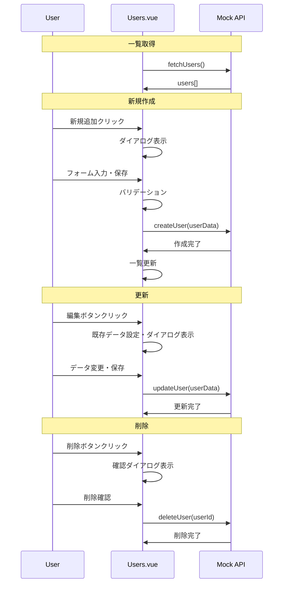

# ユーザー管理機能設計書

## 📋 機能概要

### 目的
- 社内ユーザーの登録・更新・削除・検索
- 部署・権限の管理
- ユーザー状態（有効/無効）の制御

### 対象画面
- Users.vue (ユーザー管理画面)

## 🏗️ システム構成

### 技術スタック
- **フロントエンド**: Vue 3 + TypeScript
- **UIコンポーネント**: Element Plus
- **データ管理**: Reactive形式
- **バリデーション**: Element Plus Form Rules

### データ構造
```typescript
interface User {
  id: number
  username: string        // ユーザー名（ログインID）
  name: string           // 表示名
  email: string          // メールアドレス
  department: string     // 部署コード
  role: string          // 権限レベル
  status: boolean       // 有効/無効
}

interface Department {
  value: string         // 部署コード
  label: string         // 部署名
}

interface Role {
  value: string         // 権限コード
  label: string         // 権限名
  type: string          // 表示タイプ
}
```

## 🔍 機能仕様

### 1. ユーザー一覧表示
- **表示項目**: ID、ユーザー名、氏名、メール、部署、権限、状態
- **ページネーション**: 10/20/50/100件表示切り替え
- **ソート**: 各列クリックでソート
- **選択機能**: チェックボックスによる複数選択

### 2. 検索機能
| 検索条件 | 形式 | 部分一致 |
|----------|------|----------|
| ユーザー名 | テキスト | ○ |
| 部署 | セレクトボックス | - |

### 3. ユーザー操作
#### 新規追加
- モーダルダイアログ形式
- 必須項目バリデーション
- 重複チェック（ユーザー名・メール）

#### 編集
- 既存データ表示・更新
- バリデーション適用
- 楽観的更新

#### 削除
- 確認ダイアログ表示
- 物理削除（データベースから完全削除）

#### 状態変更
- スイッチコンポーネントで即座に切り替え
- 確認メッセージ表示

## 📝 バリデーション仕様

### 入力項目検証
| 項目 | 必須 | 形式 | 制約 |
|------|------|------|------|
| ユーザー名 | ○ | 英数字 | 1-20文字 |
| 氏名 | ○ | 文字列 | 1-50文字 |
| メール | ○ | Email形式 | RFC準拠 |
| 部署 | ○ | 選択 | 既定リストから |
| 権限 | ○ | 選択 | 既定リストから |

### エラーメッセージ
```typescript
const userRules: FormRules = {
  username: [
    { required: true, message: 'ユーザー名を入力してください' },
    { min: 1, max: 20, message: '1-20文字で入力してください' }
  ],
  name: [
    { required: true, message: '氏名を入力してください' }
  ],
  email: [
    { required: true, message: 'メールアドレスを入力してください' },
    { type: 'email', message: '正しい形式で入力してください' }
  ]
}
```

## 🎨 UI設計

### レイアウト構成
```
[ヘッダー: タイトル + 新規追加ボタン]
[検索フォーム: ユーザー名 + 部署 + 検索/リセットボタン]
[データテーブル: ユーザー一覧 + 操作ボタン]
[ページネーション: ページ切り替え]
[モーダル: ユーザー編集フォーム]
```

### レスポンシブ対応
- **PC**: 横並びレイアウト
- **タブレット**: 一部縦積み
- **モバイル**: 完全縦積み、フォント拡大

### カラーコード
- **部署タグ**: 情報系（青）
- **権限タグ**:
  - 管理者: 危険系（赤）
  - 一般: デフォルト（グレー）
  - ゲスト: 情報系（青）

## 🔄 データフロー

### CRUD操作フロー


## 🧪 テスト仕様

### 単体テスト
- [ ] フォームバリデーション
- [ ] 検索フィルタリング
- [ ] ページネーション
- [ ] ソート機能

### 結合テスト
- [ ] CRUD操作完全フロー
- [ ] エラーハンドリング
- [ ] 状態管理

### E2Eテスト
- [ ] ユーザー登録〜一覧表示
- [ ] 検索〜編集〜削除フロー
- [ ] レスポンシブ表示確認

## 📊 マスターデータ

### 部署一覧
| コード | 部署名 |
|--------|--------|
| sales | 営業部 |
| development | 開発部 |
| hr | 人事部 |
| accounting | 経理部 |

### 権限一覧
| コード | 権限名 | 表示色 |
|--------|--------|--------|
| admin | 管理者 | danger (赤) |
| user | 一般ユーザー | default (グレー) |
| guest | ゲスト | info (青) |

## 🚀 実装状況

### 完了済み
- ✅ ユーザー一覧表示
- ✅ 検索・フィルタリング
- ✅ ページネーション
- ✅ 新規追加・編集・削除
- ✅ バリデーション
- ✅ レスポンシブUI

### 今後の課題
- ⚠️ 本番API連携
- ⚠️ 大量データ対応（仮想スクロール）
- ⚠️ エクスポート機能
- ⚠️ 一括操作機能
- ⚠️ ユーザー画像アップロード

## 📋 関連ドキュメント

- [認証機能設計書](../01_認証機能/)
- [共通コンポーネント設計書](../04_共通コンポーネント/)
- [レスポンシブ対応設計書](../05_レスポンシブ対応/)

---

**作成日**: 2025年1月20日
**最終更新**: 2025年1月20日
**作成者**: Claude
**レビュー者**: -