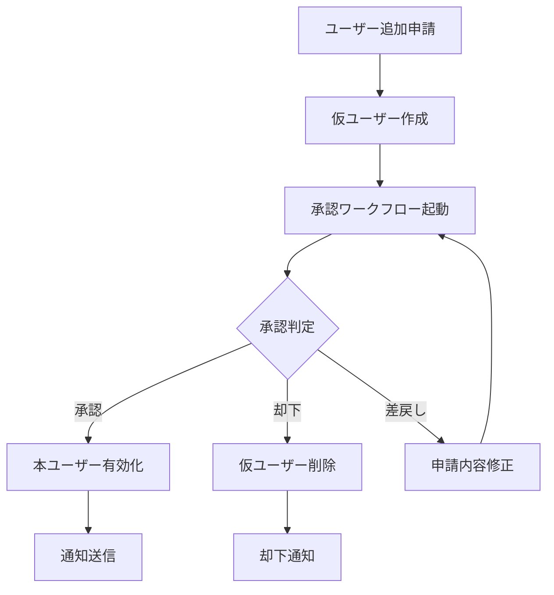

# ユーザー追加承認フロー設計書

## 1. 概要

ユーザー追加時に承認フローを通じて承認されてから有効になる仕組みを実装します。これにより、組織のセキュリティポリシーに従った適切なユーザー管理が可能になります。

## 2. 実装方式

### 2.1 基本フロー



### 2.2 データベース設計変更

#### usersテーブル拡張

```sql
-- 既存のusersテーブルに追加するカラム
ALTER TABLE users ADD COLUMN approval_status VARCHAR(20) DEFAULT 'PENDING';
-- PENDING: 承認待ち
-- APPROVED: 承認済み
-- REJECTED: 却下
-- DRAFT: 下書き

ALTER TABLE users ADD COLUMN approval_request_id INT;
ALTER TABLE users ADD COLUMN approved_at TIMESTAMP;
ALTER TABLE users ADD COLUMN approved_by INT;
ALTER TABLE users ADD COLUMN rejection_reason TEXT;

-- 外部キー追加
ALTER TABLE users
  ADD CONSTRAINT fk_users_approval_request
  FOREIGN KEY (approval_request_id)
  REFERENCES workflow_requests(id);

ALTER TABLE users
  ADD CONSTRAINT fk_users_approved_by
  FOREIGN KEY (approved_by)
  REFERENCES users(id);
```

## 3. ワークフロー設定

### 3.1 ユーザー追加用ワークフロータイプ

```json
{
  "code": "USER_ADDITION",
  "name": "ユーザー追加申請",
  "category": "USER_MANAGEMENT",
  "formSchema": {
    "fields": [
      {
        "name": "username",
        "label": "ユーザー名",
        "type": "text",
        "required": true,
        "validation": {
          "pattern": "^[a-zA-Z0-9_-]{3,30}$",
          "unique": true
        }
      },
      {
        "name": "email",
        "label": "メールアドレス",
        "type": "email",
        "required": true,
        "validation": {
          "unique": true
        }
      },
      {
        "name": "name",
        "label": "氏名",
        "type": "text",
        "required": true
      },
      {
        "name": "employeeCode",
        "label": "社員番号",
        "type": "text",
        "required": false
      },
      {
        "name": "departmentId",
        "label": "所属部署",
        "type": "select",
        "required": true,
        "dataSource": "departments"
      },
      {
        "name": "role",
        "label": "権限レベル",
        "type": "select",
        "required": true,
        "options": ["USER", "MANAGER", "ADMIN"]
      },
      {
        "name": "joinDate",
        "label": "入社日",
        "type": "date",
        "required": true
      },
      {
        "name": "reason",
        "label": "追加理由",
        "type": "textarea",
        "required": true
      }
    ]
  },
  "approvalRoutes": [
    {
      "stepNumber": 1,
      "approverType": "ROLE",
      "approverValue": {"role": "MANAGER", "department": "HR"},
      "name": "人事部門承認"
    },
    {
      "stepNumber": 2,
      "approverType": "ROLE",
      "approverValue": {"role": "ADMIN"},
      "name": "システム管理者承認"
    }
  ]
}
```

## 4. API設計

### 4.1 ユーザー追加申請API

```typescript
// POST /api/users/request-addition
interface UserAdditionRequest {
  username: string;
  email: string;
  password: string;
  name: string;
  employeeCode?: string;
  departmentId: number;
  role: UserRole;
  joinDate: Date;
  reason: string;
}

interface UserAdditionResponse {
  requestId: number;
  userId: number;  // 仮ユーザーID
  status: 'PENDING';
  message: string;
}
```

### 4.2 承認処理API

```typescript
// POST /api/workflow/approve/:requestId
interface ApprovalAction {
  action: 'APPROVE' | 'REJECT' | 'RETURN';
  comment?: string;
  // 承認時、ユーザーを自動的に有効化
  autoActivateUser: boolean;
}
```

## 5. 実装詳細

### 5.1 ユーザー追加申請処理

```typescript
export class UserManagementService {
  async requestUserAddition(data: UserAdditionRequest): Promise<UserAdditionResponse> {
    const transaction = await prisma.$transaction(async (tx) => {
      // 1. 仮ユーザー作成（非アクティブ状態）
      const tempUser = await tx.users.create({
        data: {
          ...data,
          isActive: false,
          approval_status: 'PENDING',
          password: await hashPassword(data.password)
        }
      });

      // 2. ワークフロー申請作成
      const workflowType = await tx.workflow_types.findFirst({
        where: { code: 'USER_ADDITION' }
      });

      const workflowRequest = await tx.workflow_requests.create({
        data: {
          workflowTypeId: workflowType.id,
          requestNumber: generateRequestNumber(),
          companyId: data.companyId,
          requesterId: currentUserId,
          departmentId: data.departmentId,
          title: `ユーザー追加申請: ${data.name}`,
          description: data.reason,
          formData: data,
          status: 'PENDING',
          submittedAt: new Date()
        }
      });

      // 3. ユーザーとワークフローを関連付け
      await tx.users.update({
        where: { id: tempUser.id },
        data: { approval_request_id: workflowRequest.id }
      });

      // 4. 承認者への通知
      await this.notifyApprovers(workflowRequest.id);

      return {
        requestId: workflowRequest.id,
        userId: tempUser.id,
        status: 'PENDING',
        message: '承認申請を受け付けました'
      };
    });

    return transaction;
  }
}
```

### 5.2 承認時の処理

```typescript
export class ApprovalService {
  async approveUserAddition(requestId: number, approverId: number): Promise<void> {
    const transaction = await prisma.$transaction(async (tx) => {
      // 1. ワークフロー承認処理
      const request = await tx.workflow_requests.findUnique({
        where: { id: requestId },
        include: { workflow_types: true }
      });

      if (request.workflow_types.code !== 'USER_ADDITION') {
        throw new Error('Invalid workflow type');
      }

      // 2. 承認履歴記録
      await tx.approval_history.create({
        data: {
          requestId,
          approverId,
          action: 'APPROVE',
          processedAt: new Date()
        }
      });

      // 3. 最終承認の場合、ユーザーを有効化
      if (await this.isFinalApproval(requestId)) {
        const user = await tx.users.findFirst({
          where: { approval_request_id: requestId }
        });

        await tx.users.update({
          where: { id: user.id },
          data: {
            isActive: true,
            approval_status: 'APPROVED',
            approved_at: new Date(),
            approved_by: approverId
          }
        });

        // 4. ワークフロー完了
        await tx.workflow_requests.update({
          where: { id: requestId },
          data: {
            status: 'APPROVED',
            completedAt: new Date()
          }
        });

        // 5. ユーザーへの通知（メール送信など）
        await this.sendWelcomeEmail(user.id);
      }
    });
  }
}
```

## 6. セキュリティ考慮事項

### 6.1 権限チェック
- 申請者は適切な権限（例：MANAGER以上）を持つ必要がある
- 承認者は指定されたロールを持つ必要がある

### 6.2 データ保護
- 仮ユーザーのパスワードは暗号化して保存
- 承認前のユーザーはログインできない
- 却下されたユーザー情報は一定期間後に削除

### 6.3 監査ログ
- すべての申請・承認・却下操作を記録
- 誰が、いつ、何を承認/却下したかを追跡可能

## 7. UI/UX設計

### 7.1 申請画面
- ユーザー情報入力フォーム
- 既存ユーザーとの重複チェック
- 申請理由の入力

### 7.2 承認画面
- 申請内容の詳細表示
- 承認/却下/差戻しボタン
- コメント入力欄

### 7.3 ステータス表示
- 申請中のユーザー一覧
- 承認待ち件数バッジ
- 承認履歴の表示

## 8. 拡張機能

### 8.1 自動承認ルール
```json
{
  "autoApproveRules": {
    "conditions": [
      {
        "field": "role",
        "operator": "equals",
        "value": "USER"
      },
      {
        "field": "department",
        "operator": "in",
        "value": ["営業部", "マーケティング部"]
      }
    ],
    "action": "AUTO_APPROVE_FIRST_STEP"
  }
}
```

### 8.2 一括承認
- 複数のユーザー追加申請を一括で承認
- 条件に基づく自動承認

### 8.3 期限管理
- 承認期限の設定
- 期限切れ時の自動エスカレーション
- リマインダー通知

## 9. 移行計画

### 9.1 既存ユーザーの扱い
- 既存ユーザーは自動的に「承認済み」ステータスに設定
- 移行スクリプトの作成

### 9.2 段階的導入
1. 新規ユーザーのみ承認フロー適用
2. 特定部署から順次展開
3. 全社展開

## 10. パフォーマンス最適化

### 10.1 インデックス追加
```sql
CREATE INDEX idx_users_approval_status ON users(approval_status);
CREATE INDEX idx_users_approval_request_id ON users(approval_request_id);
```

### 10.2 キャッシュ戦略
- 承認待ちユーザー数のキャッシュ
- 承認ルートのキャッシュ

## 11. テスト計画

### 11.1 単体テスト
- 申請API
- 承認API
- 権限チェック

### 11.2 統合テスト
- 申請から承認までの一連のフロー
- 却下・差戻しのフロー
- 通知機能

### 11.3 負荷テスト
- 大量申請時のパフォーマンス
- 同時承認処理

## 12. まとめ

ユーザー追加に承認フローを導入することで：
- **セキュリティ強化**: 不正なユーザー追加を防止
- **ガバナンス向上**: 組織の承認プロセスを標準化
- **監査対応**: すべての操作の追跡が可能
- **柔軟性**: 部署や役職に応じた承認ルート設定

この仕組みにより、企業のセキュリティポリシーに準拠した安全なユーザー管理が実現できます。