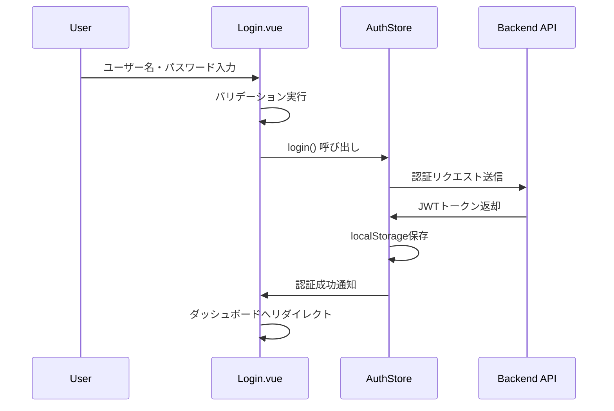
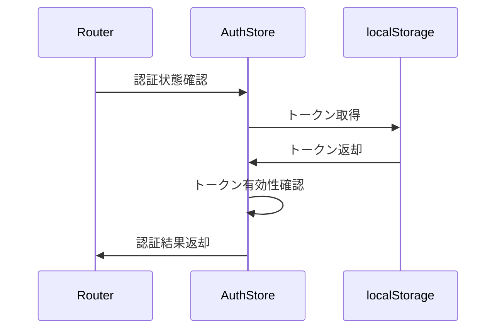

# 認証機能設計書

## 📋 機能概要

### 目的
- 社内システムへの安全なユーザー認証
- セッション管理による状態維持
- 権限に基づくアクセス制御

### 対象画面
- Login.vue (ログイン画面)
- Layout.vue (認証状態管理)

## 🏗️ システム構成

### 技術スタック
- **フロントエンド**: Vue 3 + TypeScript
- **状態管理**: Pinia
- **認証方式**: JWT (JSON Web Token)
- **ストレージ**: localStorage (一時的)

### アーキテクチャ
```
[Login.vue] → [useAuthStore] → [localStorage] → [Router Guard]
```

## 🔐 認証フロー

### 1. ログイン処理


### 2. セッション確認


## 📝 機能仕様

### 入力項目
| 項目名 | 必須 | 形式 | バリデーション |
|--------|------|------|---------------|
| ユーザー名 | ○ | 文字列 | 1文字以上 |
| パスワード | ○ | 文字列 | 6文字以上 |

### 画面要素
- ユーザー名入力フィールド
- パスワード入力フィールド（マスク表示）
- ログインボタン
- エラーメッセージ表示エリア
- ローディング表示

### 状態管理 (AuthStore)
```typescript
interface AuthState {
  user: User | null           // ユーザー情報
  token: string | null        // JWTトークン
  isAuthenticated: boolean    // 認証状態
}

interface User {
  id: number
  username: string
  name: string
  role?: string
}
```

## 🎨 UI設計

### レイアウト
- 中央配置カードレイアウト
- レスポンシブ対応（モバイル・PC）
- BIZ UDゴシックフォント適用

### カラー・デザイン
- プライマリカラー: Element Plus準拠
- グラデーション背景
- カードシャドウ効果

## 🔒 セキュリティ要件

### 認証セキュリティ
- パスワードのクライアントサイド非保存
- JWT有効期限管理
- HTTPS通信必須（本番環境）

### 入力検証
- XSS対策: 入力値エスケープ
- CSRF対策: CSRFトークン（将来実装）
- 入力長制限

## 🧪 テスト仕様

### 単体テスト
- [ ] ログインフォームバリデーション
- [ ] AuthStore状態管理
- [ ] ローカルストレージ操作

### 結合テスト
- [ ] ログイン成功フロー
- [ ] ログイン失敗フロー
- [ ] セッション期限切れ

### E2Eテスト
- [ ] ログイン〜ダッシュボード遷移
- [ ] 未認証時リダイレクト
- [ ] ログアウト機能

## 🚀 実装状況

### 完了済み
- ✅ ログイン画面UI
- ✅ フォームバリデーション
- ✅ AuthStore実装
- ✅ モックAPI連携
- ✅ ローカルストレージ保存

### 今後の課題
- ⚠️ 本番API連携
- ⚠️ トークンリフレッシュ機能
- ⚠️ パスワードリセット機能
- ⚠️ 多要素認証対応

## 📋 関連ドキュメント

- [ユーザー管理機能設計書](../02_ユーザー管理機能/)
- [共通コンポーネント設計書](../04_共通コンポーネント/)
- [システム基盤設計書](../99_システム基盤/)

---

**作成日**: 2025年1月20日
**最終更新**: 2025年1月20日
**作成者**: Claude
**レビュー者**: -