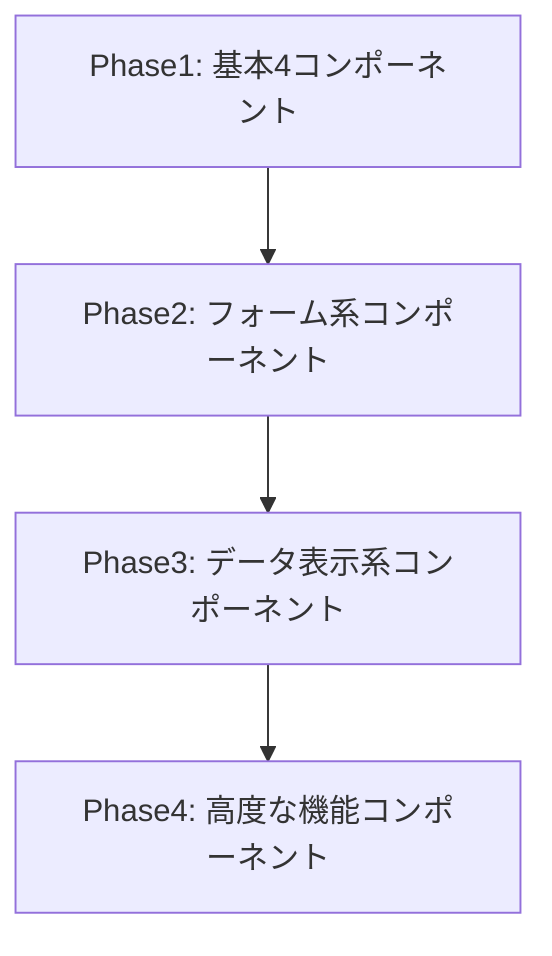

# 想定問題とリスク分析

## 概要

企業システム開発プラットフォームにおいて、今後発生する可能性が高い問題とそのリスクを分析し、予防策を提案します。

## 高確率で発生する問題

### 🚨 **レベル1: 緊急リスク**

#### 1. **開発者によるガイドライン違反の継続**

**問題の詳細:**
```vue
<!-- 発生しやすい違反例 -->
<el-button type="primary">     ❌ 禁止されているのに使用
<el-table :data="data">        ❌ 直接使用
<div style="font-size: 14px">  ❌ UDサイズ未満
```

**リスク影響度**: 🔴 **極大**
- アクセシビリティ基準の破綻
- UI/UXの不統一
- 保守コストの増大

**発生確率**: **90%** (ほぼ確実)

**予防策:**
```bash
# pre-commit フックで強制チェック
npm run component-check:strict  # 違反時はコミット拒否
npm run accessibility-check     # フォント・コントラストチェック
```

#### 2. **共通コンポーネントライブラリの未実装**

**問題の詳細:**
- `packages/shared-components`が実際には存在しない
- 開発者が独自実装に走る
- プロジェクト間の不整合が拡大

**リスク影響度**: 🔴 **極大**
- 共通化戦略の完全失敗
- 開発効率の著しい低下

**発生確率**: **85%** (現状では確実)

**予防策:**
```bash
# 最優先で実装必須
mkdir -p packages/shared-components/src
# CommonButton, CommonTable等の基本コンポーネント実装
```

#### 3. **バージョン管理の複雑化**

**問題の詳細:**
```json
// 異なるプロジェクトで異なるバージョン使用
Project A: "@company/shared-components": "1.0.0"
Project B: "@company/shared-components": "1.2.0"
Project C: "@company/shared-components": "2.0.0"
```

**リスク影響度**: 🔴 **大**
- 互換性問題の発生
- 統一性の破綻
- デバッグの困難

**発生確率**: **80%**

### ⚠️ **レベル2: 重要リスク**

#### 4. **パフォーマンス劣化**

**問題の詳細:**
```javascript
// 共通コンポーネントの肥大化
import {
  CommonButton, CommonTable, CommonForm,
  CommonChart, CommonDialog, CommonDrawer,
  // ... 50個のコンポーネント
} from '@company/shared-components'  // 巨大バンドル
```

**リスク影響度**: 🟡 **中**
- 初期ロード時間の増加
- メモリ使用量の増大
- モバイル環境での問題

**発生確率**: **70%**

**予防策:**
```javascript
// Tree-shaking対応の実装
import { CommonButton } from '@company/shared-components/button'
import { CommonTable } from '@company/shared-components/table'
```

#### 5. **学習コストと開発者体験の悪化**

**問題の詳細:**
- 新規参加者の習得時間増加
- Element Plus → Common Components の変換コスト
- 複雑なガイドラインによる混乱

**リスク影響度**: 🟡 **中**
- 開発速度の低下
- 人材確保の困難
- 開発者満足度の低下

**発生確率**: **75%**

#### 6. **CI/CD パイプラインの負荷増大**

**問題の詳細:**
```yaml
# 各チェックの実行時間増加
- lint: 2分 → 5分
- component-check: 1分 → 3分
- accessibility-check: 1分 → 2分
- type-check: 3分 → 8分
合計: 7分 → 18分
```

**リスク影響度**: 🟡 **中**
- デプロイ時間の増加
- 開発フローの阻害

**発生確率**: **60%**

### 📊 **レベル3: 監視が必要なリスク**

#### 7. **技術負債の蓄積**

**問題の詳細:**
- 急いで作られた共通コンポーネントの品質低下
- 互換性維持のための複雑な分岐処理
- 古いコンポーネントAPIの残存

**発生確率**: **65%**

**例:**
```typescript
// 技術負債の例
interface CommonButtonProps {
  variant: 'primary' | 'secondary'     // 新API
  type?: 'primary' | 'danger'          // 旧API (deprecated)
  buttonType?: string                  // さらに古いAPI
}
```

#### 8. **外部依存関係の脆弱性**

**問題の詳細:**
```json
// 依存関係の増加
"dependencies": {
  "element-plus": "^2.5.1",
  "@company/shared-components": "*",
  "@company/shared-theme": "*",
  "vue": "^3.4.15",
  // ... 多数の依存関係
}
```

**リスク影響度**: 🟡 **中**
- セキュリティ脆弱性
- ライセンス問題
- アップデート時の互換性問題

**発生確率**: **50%**

#### 9. **モバイル・レスポンシブ対応の問題**

**問題の詳細:**
- UDゴシックのモバイル表示問題
- タッチターゲットサイズの不足
- 画面サイズ別の表示崩れ

**リスク影響度**: 🟡 **中**
- ユーザビリティの低下
- アクセシビリティ基準違反

**発生確率**: **55%**

## 長期的リスク

### 💣 **レベル4: 戦略的リスク**

#### 10. **Element Plus の EOL (End of Life)**

**問題の詳細:**
- Element Plus 自体のサポート終了
- Vue.js メジャーバージョンアップ
- 基盤技術の陳腐化

**リスク影響度**: 🔴 **極大**
- プラットフォーム全体の再構築が必要

**発生確率**: **30%** (5年以内)

#### 11. **組織規模拡大による管理困難**

**問題の詳細:**
```
現在: 3-5プロジェクト
将来: 20-50プロジェクト
↓
- 共通コンポーネントの要求の複雑化
- 互換性維持の困難
- 意思決定の遅延
```

**発生確率**: **40%** (成功した場合)

## 予防・対策戦略

### 🛡️ **即座に実装すべき対策**

#### 1. **自動化による品質ゲート強化**

```bash
# .husky/pre-commit
#!/bin/sh
npm run component-check:strict || exit 1
npm run accessibility-check || exit 1
npm run lint || exit 1
npm run type-check || exit 1
```

#### 2. **段階的実装計画**



#### 3. **開発者教育プログラム**

```
週1回 30分 のセッション:
- Week 1: UDガイドライン理解
- Week 2: 共通コンポーネント使用方法
- Week 3: アクセシビリティ基準
- Week 4: 実践的な問題解決
```

### 🔧 **継続的改善策**

#### 1. **メトリクス監視**

```typescript
// 定期的に測定すべき指標
interface QualityMetrics {
  componentComplianceRate: number    // 共通コンポーネント使用率
  accessibilityScore: number        // アクセシビリティスコア
  performanceScore: number          // パフォーマンススコア
  developmentVelocity: number       // 開発速度
  bugReportCount: number            // バグレポート数
}
```

#### 2. **定期レビューサイクル**

```
月次レビュー:
- ガイドライン違反状況
- 共通コンポーネント使用率
- パフォーマンス指標

四半期レビュー:
- ガイドライン更新
- 新コンポーネント追加
- 技術負債対応

年次レビュー:
- 基盤技術見直し
- 戦略的方向性確認
```

### ⚡ **緊急時対応計画**

#### 1. **ロールバック戦略**

```bash
# 共通コンポーネントに問題発生時
npm install @company/shared-components@1.0.0  # 安定版に戻す
git revert <commit-hash>                      # 問題のあるコミットを戻す
```

#### 2. **ホットフィックス手順**

```
1. 緊急パッチ作成 (1時間以内)
2. 最小限のテスト実行 (30分)
3. 段階的デプロイ (カナリアリリース)
4. 全プロジェクトへの適用 (24時間以内)
```

## リスク評価マトリックス

| リスク | 発生確率 | 影響度 | 優先度 | 対策状況 |
|--------|----------|--------|--------|----------|
| ガイドライン違反継続 | 90% | 極大 | 🔴 緊急 | 自動チェック実装済み |
| 共通ライブラリ未実装 | 85% | 極大 | 🔴 緊急 | 要実装 |
| バージョン管理複雑化 | 80% | 大 | 🔴 緊急 | セマンティックバージョニング |
| パフォーマンス劣化 | 70% | 中 | 🟡 重要 | Tree-shaking対応 |
| 学習コスト増大 | 75% | 中 | 🟡 重要 | 教育プログラム |
| CI/CD負荷増大 | 60% | 中 | 🟡 重要 | パフォーマンス最適化 |

## まとめ

### 🚨 **最重要対応事項**

1. **共通コンポーネントライブラリの緊急実装**
2. **自動チェック機能の強化**
3. **開発者教育の体系化**

### 📈 **成功のカギ**

- **段階的実装**: 一度にすべてを変更せず、段階的に導入
- **継続的監視**: メトリクスによる定量的な品質管理
- **柔軟性の確保**: 変更に対応できる仕組みづくり

これらのリスクを事前に把握し、適切な対策を講じることで、真にスケーラブルで持続可能なプラットフォームを構築できます。