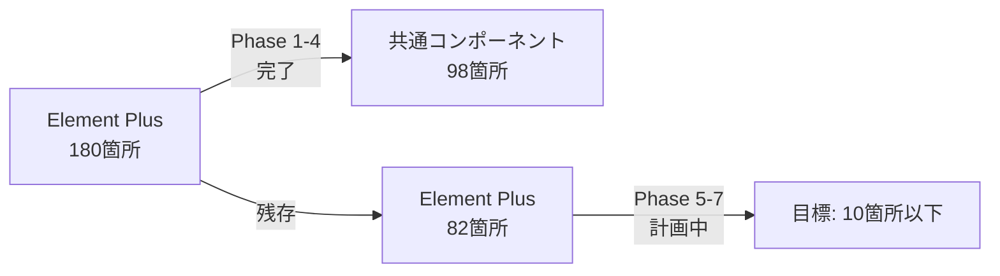

# フロントエンドコンポーネントリファレンス

## 概要

WebSys Platform フロントエンドコンポーネントの詳細仕様。独自の共通コンポーネントライブラリを中心に、Element Plusからの段階的移行を実現した最新アーキテクチャを解説。

### 🔄 最新ステータス (2025年1月)
- **Element Plus使用削減**: 180箇所 → 82箇所 (54.4%削減達成)
- **共通コンポーネント**: 15個実装完了
- **次期目標**: Element Plus依存を10箇所以下へ

## 基本構成

### プロジェクト構造

```
workspace/
├── packages/
│   └── shared-components/    # 共通コンポーネントライブラリ
│       ├── src/
│       │   ├── components/   # 独自コンポーネント (15個)
│       │   ├── composables/  # 共通ロジック
│       │   └── styles/       # 共通スタイル
│       └── package.json
├── frontend/
│   └── src/
│       ├── components/       # アプリ固有コンポーネント
│       ├── views/           # ページコンポーネント
│       ├── stores/          # Pinia ストア
│       ├── router/          # ルーティング設定
│       ├── api/             # API通信層
│       └── assets/          # 静的資源
└── backend/                  # バックエンドAPI
```

### コンポーネントインポート戦略

```typescript
// vite.config.ts - 共通コンポーネント優先設定
import Components from 'unplugin-vue-components/vite'
import { ElementPlusResolver } from 'unplugin-vue-components/resolvers'

export default {
  plugins: [
    Components({
      resolvers: [
        // 共通コンポーネントを優先解決
        (componentName) => {
          if (componentName.startsWith('Common')) {
            return {
              name: componentName,
              from: '@company/shared-components'
            }
          }
        },
        // Element Plusは後方互換性のため残す
        ElementPlusResolver({
          importStyle: false // スタイルは共通テーマで管理
        })
      ]
    })
  ]
}
```

## 共通コンポーネントライブラリ

### 🎯 実装済みコンポーネント (15個)

独自デザインシステムに基づく共通コンポーネント群。Element Plus依存を削減し、統一されたUI/UXを提供。

| カテゴリ | コンポーネント | バリアント | 用途 | Element Plus代替 |
|---------|---------------|-----------|------|-----------------|
| **ボタン** | CommonButton | 4種 (default/primary/action/ghost) | 汎用ボタン | el-button |
| **レイアウト** | CommonCard | 4種 (default/compact/bordered/shadow) | カードレイアウト | el-card |
| **レイアウト** | CommonRow/Col | 2種 (default/responsive) | グリッドシステム | el-row/el-col |
| **データ表示** | CommonTable | 4種 (default/striped/bordered/compact) | データテーブル | el-table |
| **データ表示** | CommonTableColumn | 4種 | テーブル列定義 | el-table-column |
| **データ表示** | CommonTag | 4種 (default/round/plain/gradient) | タグ表示 | el-tag |
| **データ表示** | CommonStatistic | 4種 (default/card/inline/dashboard) | 統計表示 | el-statistic |
| **データ表示** | CommonProgress | 4種 (line/circle/dashboard/custom) | 進捗表示 | el-progress |
| **フォーム** | CommonForm | 4種 (default/compact/card/inline) | フォーム | el-form |
| **フォーム** | CommonFormItem | 4種 | フォーム項目 | el-form-item |
| **フォーム** | CommonInput | 4種 (default/search/secure/numeric) | 入力フィールド | el-input |
| **フォーム** | CommonSelect | 4種 (default/multiple/searchable/grouped) | 選択フィールド | el-select |
| **フォーム** | CommonOption | 4種 | 選択オプション | el-option |
| **フォーム** | CommonSwitch | 4種 (default/text/icon/custom) | スイッチ | el-switch |
| **特殊** | CodePreview | - | コード表示 | - |

### 📦 使用方法

```typescript
// パッケージのインストール (package.json)
{
  "dependencies": {
    "@company/shared-components": "file:../../packages/shared-components"
  }
}

// コンポーネントの使用
import { CommonButton, CommonCard, CommonForm } from '@company/shared-components'

// 自動インポート設定済みの場合は直接使用可能
<template>
  <CommonCard variant="default" responsive>
    <CommonButton variant="primary" @click="handleClick">
      クリック
    </CommonButton>
  </CommonCard>
</template>
```

### 🔄 移行状況



## レイアウトコンポーネント

### Layout.vue

アプリケーション全体の基本レイアウト。共通コンポーネントとElement Plusのハイブリッド実装。

#### 構造 (最新実装)

```vue
<template>
  <!-- 共通コンポーネントベースのレイアウト -->
  <div class="app-layout">
    <CommonRow class="layout-container">
      <CommonCol :span="4" class="layout-aside" responsive>
        <NavigationMenu />
      </CommonCol>
      <CommonCol :span="20" class="layout-main">
        <header class="layout-header">
          <HeaderBar />
        </header>
        <main class="layout-content">
          <router-view v-slot="{ Component }">
            <transition name="fade" mode="out-in">
              <component :is="Component" />
            </transition>
          </router-view>
        </main>
      </CommonCol>
    </CommonRow>
  </div>
</template>

<script setup lang="ts">
import { CommonRow, CommonCol } from '@company/shared-components'
import NavigationMenu from '@/components/NavigationMenu.vue'
import HeaderBar from '@/components/HeaderBar.vue'
</script>
```

#### Props

| プロパティ | 型 | デフォルト | 説明 |
|-----------|-----|----------|------|
| なし | - | - | - |

#### Events

| イベント | 説明 | パラメータ |
|---------|------|-----------|
| なし | - | - |

#### スタイルカスタマイズ

```scss
// カスタムCSS変数で色調整
.layout-aside {
  --el-color-primary: #409eff;
  --sidebar-bg-color: #304156;
  --sidebar-text-color: #bfcbd9;
}
```

### Navigation Menu

サイドバーナビゲーション。Element Plusから段階的移行中。

#### 現在の実装 (ハイブリッド)

```vue
<template>
  <!-- Element Plus使用（Phase 5で共通コンポーネント化予定） -->
  <el-menu
    :default-active="activeMenu"
    :collapse="isCollapsed"
    class="nav-menu"
    router
  >
    <template v-for="item in menuItems" :key="item.path">
      <el-menu-item v-if="!item.children" :index="item.path">
        <el-icon><component :is="item.icon" /></el-icon>
        <span>{{ item.title }}</span>
      </el-menu-item>
      <el-sub-menu v-else :index="item.path">
        <template #title>
          <el-icon><component :is="item.icon" /></el-icon>
          <span>{{ item.title }}</span>
        </template>
        <el-menu-item
          v-for="child in item.children"
          :key="child.path"
          :index="child.path"
        >
          {{ child.title }}
        </el-menu-item>
      </el-sub-menu>
    </template>
  </el-menu>
</template>
```

#### カスタマイズ

```vue
<script setup lang="ts">
// アクティブメニューの計算
const route = useRoute()
const activeMenu = computed(() => route.path)

// メニュー項目の定義
interface MenuItem {
  index: string
  title: string
  icon: string
}

const menuItems: MenuItem[] = [
  { index: '/dashboard', title: 'ダッシュボード', icon: 'DataAnalysis' },
  { index: '/users', title: 'ユーザー管理', icon: 'User' }
]
</script>
```

## ページコンポーネント

### Login.vue

ログイン画面。共通コンポーネントで完全リニューアル。

#### 機能

- ユーザー名・パスワード入力
- バリデーション
- ログイン処理
- エラーハンドリング
- レスポンシブ対応
- タッチ最適化

#### 共通コンポーネント実装

```vue
<template>
  <div class="login-container">
    <!-- 共通コンポーネント使用 -->
    <CommonCard variant="bordered" class="login-card">
      <h2 class="login-title">システムログイン</h2>
      <CommonForm
        ref="loginFormRef"
        :model="loginForm"
        :rules="loginRules"
        variant="compact"
        responsive
      >
        <CommonFormItem prop="username">
          <CommonInput
            v-model="loginForm.username"
            variant="default"
            placeholder="ユーザー名"
            :clearable="true"
            responsive
            touch-optimized
          />
        </CommonFormItem>
        <CommonFormItem prop="password">
          <CommonInput
            v-model="loginForm.password"
            variant="secure"
            type="password"
            placeholder="パスワード"
            :show-password="true"
            responsive
            touch-optimized
          />
        </CommonFormItem>
        <CommonFormItem>
          <CommonButton
            variant="primary"
            :loading="loading"
            @click="handleLogin"
            class="login-button"
            responsive
            touch-optimized
          >
            ログイン
          </CommonButton>
        </CommonFormItem>
      </CommonForm>
    </CommonCard>
  </div>
</template>

<script setup lang="ts">
import {
  CommonCard,
  CommonForm,
  CommonFormItem,
  CommonInput,
  CommonButton
} from '@company/shared-components'
import type { FormRules } from '@company/shared-components/types'
</script>
```

#### バリデーションルール

```typescript
const loginRules = reactive<FormRules>({
  username: [
    { required: true, message: 'ユーザー名を入力してください', trigger: 'blur' }
  ],
  password: [
    { required: true, message: 'パスワードを入力してください', trigger: 'blur' },
    { min: 6, message: 'パスワードは6文字以上で入力してください', trigger: 'blur' }
  ]
})
```

### Dashboard.vue

ダッシュボード画面コンポーネント。

#### 機能

- 統計情報表示
- グラフ・チャート
- クイックアクション
- 最近のアクティビティ

#### データ構造

```typescript
interface DashboardStats {
  totalUsers: number
  activeUsers: number
  todayVisits: number
  completedTasks: number
}

interface ActivityItem {
  time: string
  user: string
  action: string
  status: 'success' | 'warning' | 'error'
}
```

#### カスタマイズ例

```vue
<script setup lang="ts">
// 統計データの取得
const stats = ref<DashboardStats>({
  totalUsers: 0,
  activeUsers: 0,
  todayVisits: 0,
  completedTasks: 0
})

// データ取得
const fetchStats = async () => {
  try {
    const response = await api.get('/dashboard/stats')
    stats.value = response.data
  } catch (error) {
    ElMessage.error('データの取得に失敗しました')
  }
}

onMounted(() => {
  fetchStats()
})
</script>
```

### Users.vue

ユーザー管理画面。共通コンポーネントへの移行進行中。

#### 機能

- ユーザー一覧表示
- 検索・フィルタリング
- ページネーション
- CRUD操作
- モーダルダイアログ
- レスポンシブテーブル

#### 共通コンポーネントでのデータテーブル実装

```vue
<template>
  <div class="users-container">
    <!-- 共通コンポーネントテーブル -->
    <CommonTable
      :data="tableData"
      :loading="loading"
      variant="striped"
      responsive
      @row-click="handleRowClick"
    >
      <CommonTableColumn type="selection" width="55" />
      <CommonTableColumn prop="id" label="ID" width="80" sortable />
      <CommonTableColumn prop="username" label="ユーザー名" width="150" />
      <CommonTableColumn prop="name" label="氏名" width="150" />
      <CommonTableColumn prop="email" label="メール" width="200" />
      <CommonTableColumn prop="department" label="部署" width="120">
        <template #default="{ row }">
          <CommonTag :type="getDepartmentType(row.department)">
            {{ getDepartmentLabel(row.department) }}
          </CommonTag>
        </template>
      </CommonTableColumn>
      <CommonTableColumn label="操作" fixed="right" width="150">
        <template #default="{ row }">
          <CommonButton
            variant="ghost"
            size="small"
            @click="handleEdit(row)"
          >
            編集
          </CommonButton>
          <CommonButton
            variant="ghost"
            size="small"
            type="danger"
            @click="handleDelete(row)"
          >
            削除
          </CommonButton>
        </template>
      </CommonTableColumn>
    </CommonTable>

    <!-- ページネーション（Element Plus→Phase 5で移行予定） -->
    <el-pagination
      v-model:current-page="currentPage"
      v-model:page-size="pageSize"
      :total="total"
      layout="total, sizes, prev, pager, next, jumper"
      @current-change="handlePageChange"
    />
  </div>
</template>

<script setup lang="ts">
import {
  CommonTable,
  CommonTableColumn,
  CommonTag,
  CommonButton
} from '@company/shared-components'
// el-paginationはPhase 5でCommonPaginationへ移行予定
import { ElPagination } from 'element-plus'
</script>
```

#### 検索・フィルタ機能

```vue
<el-form :inline="true" :model="searchForm" class="search-form">
  <el-form-item label="ユーザー名">
    <el-input
      v-model="searchForm.username"
      placeholder="検索..."
      clearable
      @clear="handleSearch"
      @keyup.enter="handleSearch"
    />
  </el-form-item>
  <el-form-item label="部署">
    <el-select v-model="searchForm.department" placeholder="選択" clearable>
      <el-option label="営業部" value="sales" />
      <el-option label="開発部" value="development" />
      <el-option label="人事部" value="hr" />
    </el-select>
  </el-form-item>
  <el-form-item>
    <el-button type="primary" @click="handleSearch">検索</el-button>
    <el-button @click="handleReset">リセット</el-button>
  </el-form-item>
</el-form>
```

## 状態管理（Pinia）

### useAuthStore

認証状態管理ストア。

#### 状態

```typescript
interface AuthState {
  token: string | null
  user: User | null
  isAuthenticated: boolean
}
```

#### アクション

```typescript
export const useAuthStore = defineStore('auth', () => {
  const token = ref<string | null>(null)
  const user = ref<User | null>(null)

  const isAuthenticated = computed(() => !!token.value)

  const setToken = (newToken: string) => {
    token.value = newToken
    localStorage.setItem('token', newToken)
  }

  const setUser = (newUser: User) => {
    user.value = newUser
  }

  const logout = () => {
    token.value = null
    user.value = null
    localStorage.removeItem('token')
  }

  const initializeAuth = () => {
    const storedToken = localStorage.getItem('token')
    if (storedToken) {
      token.value = storedToken
    }
  }

  return {
    token,
    user,
    isAuthenticated,
    setToken,
    setUser,
    logout,
    initializeAuth
  }
})
```

#### 使用例

```vue
<script setup lang="ts">
const authStore = useAuthStore()

// ログイン処理
const handleLogin = async () => {
  try {
    const response = await api.login(username, password)
    authStore.setToken(response.token)
    authStore.setUser(response.user)
    router.push('/dashboard')
  } catch (error) {
    ElMessage.error('ログインに失敗しました')
  }
}

// ログアウト処理
const handleLogout = () => {
  authStore.logout()
  router.push('/login')
}
</script>
```

## API通信

### APIクライアント設定

```typescript
// api/index.ts
import axios from 'axios'
import { ElMessage } from 'element-plus'

const api = axios.create({
  baseURL: import.meta.env.VITE_API_BASE_URL,
  timeout: 10000
})

// リクエストインターセプター
api.interceptors.request.use(
  (config) => {
    const token = localStorage.getItem('token')
    if (token) {
      config.headers.Authorization = `Bearer ${token}`
    }
    return config
  },
  (error) => Promise.reject(error)
)

// レスポンスインターセプター
api.interceptors.response.use(
  (response) => response.data,
  (error) => {
    if (error.response?.status === 401) {
      ElMessage.error('認証エラー: 再度ログインしてください')
      // ログアウト処理
    }
    return Promise.reject(error)
  }
)
```

### APIサービス

```typescript
// api/users.ts
export const userAPI = {
  // ユーザー一覧取得
  getUsers: (params?: {
    page?: number
    limit?: number
    search?: string
  }) => api.get('/api/users', { params }),

  // ユーザー詳細取得
  getUser: (id: number) => api.get(`/api/users/${id}`),

  // ユーザー作成
  createUser: (userData: CreateUserRequest) =>
    api.post('/api/users', userData),

  // ユーザー更新
  updateUser: (id: number, userData: UpdateUserRequest) =>
    api.put(`/api/users/${id}`, userData),

  // ユーザー削除
  deleteUser: (id: number) => api.delete(`/api/users/${id}`)
}
```

## カスタムコンポーネント

### アプリケーション固有コンポーネントの作成

#### PageHeader.vue (共通コンポーネントを活用)

```vue
<template>
  <CommonCard variant="bordered" class="page-header" responsive>
    <CommonRow align="middle" justify="space-between">
      <CommonCol :span="16">
        <h1 class="page-title">{{ title }}</h1>
        <p v-if="description" class="page-description">
          {{ description }}
        </p>
      </CommonCol>
      <CommonCol :span="8" class="text-right">
        <div v-if="$slots.actions" class="page-actions">
          <slot name="actions" />
        </div>
      </CommonCol>
    </CommonRow>
  </CommonCard>
</template>

<script setup lang="ts">
import { CommonCard, CommonRow, CommonCol } from '@company/shared-components'

interface Props {
  title: string
  description?: string
}

defineProps<Props>()
defineSlots<{
  actions?: () => any
}>()
</script>

<style scoped>
.page-header {
  margin-bottom: 24px;
}

.page-title {
  font-size: 24px;
  font-weight: 600;
  margin: 0;
}

.page-description {
  color: var(--text-secondary);
  margin-top: 8px;
}
</style>
```

#### 使用例

```vue
<template>
  <!-- PageHeaderコンポーネント -->
  <PageHeader
    title="ユーザー管理"
    description="システムユーザーの管理と権限設定"
  >
    <template #actions>
      <!-- 共通コンポーネントボタン -->
      <CommonButton
        variant="primary"
        @click="handleAdd"
        responsive
        touch-optimized
      >
        <template #prefix>
          <Icon name="add" />
        </template>
        新規追加
      </CommonButton>
    </template>
  </PageHeader>
</template>

<script setup lang="ts">
import PageHeader from '@/components/PageHeader.vue'
import { CommonButton } from '@company/shared-components'
import Icon from '@/components/Icon.vue'

const handleAdd = () => {
  // 新規追加処理
}
</script>
```

### DataTable.vue

再利用可能なデータテーブルコンポーネント。

```vue
<template>
  <div class="data-table">
    <el-table
      :data="data"
      v-loading="loading"
      :empty-text="emptyText"
      v-bind="$attrs"
    >
      <slot />
    </el-table>

    <el-pagination
      v-if="showPagination"
      v-model:current-page="currentPage"
      v-model:page-size="pageSize"
      :page-sizes="pageSizes"
      :total="total"
      layout="total, sizes, prev, pager, next, jumper"
      @size-change="handleSizeChange"
      @current-change="handleCurrentChange"
    />
  </div>
</template>

<script setup lang="ts">
interface Props {
  data: any[]
  loading?: boolean
  emptyText?: string
  showPagination?: boolean
  total?: number
  currentPage?: number
  pageSize?: number
  pageSizes?: number[]
}

interface Emits {
  (e: 'page-change', page: number): void
  (e: 'size-change', size: number): void
}

const props = withDefaults(defineProps<Props>(), {
  loading: false,
  emptyText: 'データがありません',
  showPagination: true,
  currentPage: 1,
  pageSize: 20,
  pageSizes: () => [10, 20, 50, 100]
})

const emit = defineEmits<Emits>()

const handleSizeChange = (size: number) => {
  emit('size-change', size)
}

const handleCurrentChange = (page: number) => {
  emit('page-change', page)
}
</script>
```

## スタイリング

### CSS変数カスタマイズ

```scss
// assets/styles/variables.scss
:root {
  // Primary Colors
  --el-color-primary: #409eff;
  --el-color-primary-light-3: #79bbff;
  --el-color-primary-light-5: #a0cfff;
  --el-color-primary-light-7: #c6e2ff;
  --el-color-primary-light-8: #d9ecff;
  --el-color-primary-light-9: #ecf5ff;
  --el-color-primary-dark-2: #337ecc;

  // Success Colors
  --el-color-success: #67c23a;
  --el-color-warning: #e6a23c;
  --el-color-danger: #f56c6c;
  --el-color-info: #909399;

  // Text Colors
  --el-text-color-primary: #303133;
  --el-text-color-regular: #606266;
  --el-text-color-secondary: #909399;
  --el-text-color-placeholder: #a8abb2;
  --el-text-color-disabled: #c0c4cc;

  // Background Colors
  --el-bg-color: #ffffff;
  --el-bg-color-page: #f2f3f5;
  --el-bg-color-overlay: #ffffff;

  // Border Colors
  --el-border-color: #dcdfe6;
  --el-border-color-light: #e4e7ed;
  --el-border-color-lighter: #ebeef5;
  --el-border-color-extra-light: #f2f6fc;
  --el-border-color-dark: #d4d7de;
  --el-border-color-darker: #cdd0d6;

  // Component Sizes
  --el-component-size-large: 40px;
  --el-component-size: 32px;
  --el-component-size-small: 24px;
}
```

### テーマカスタマイズ

```scss
// assets/styles/theme.scss
.dark-theme {
  --el-bg-color: #1d1e1f;
  --el-bg-color-page: #0a0a0a;
  --el-bg-color-overlay: #1d1e1f;
  --el-text-color-primary: #e5eaf3;
  --el-text-color-regular: #cfd3dc;
  --el-text-color-secondary: #a3a6ad;
  --el-border-color: #4c4d4f;
  --el-border-color-light: #414243;
  --el-border-color-lighter: #363637;
}
```

## 国際化（i18n）

### 多言語対応設定

```typescript
// plugins/i18n.ts
import { createI18n } from 'vue-i18n'

const messages = {
  ja: {
    common: {
      save: '保存',
      cancel: 'キャンセル',
      delete: '削除',
      edit: '編集'
    },
    user: {
      name: '氏名',
      email: 'メールアドレス',
      department: '部署'
    }
  },
  en: {
    common: {
      save: 'Save',
      cancel: 'Cancel',
      delete: 'Delete',
      edit: 'Edit'
    },
    user: {
      name: 'Name',
      email: 'Email',
      department: 'Department'
    }
  }
}

export const i18n = createI18n({
  locale: 'ja',
  fallbackLocale: 'en',
  messages
})
```

### 使用例

```vue
<template>
  <el-button>{{ $t('common.save') }}</el-button>
  <el-form-item :label="$t('user.name')">
    <el-input v-model="form.name" />
  </el-form-item>
</template>

<script setup lang="ts">
import { useI18n } from 'vue-i18n'

const { t } = useI18n()

// JavaScript内での使用
const message = t('common.save')
</script>
```

## パフォーマンス最適化

### 遅延読み込み

```typescript
// router/index.ts
const routes = [
  {
    path: '/dashboard',
    component: () => import('@/views/Dashboard.vue')
  },
  {
    path: '/users',
    component: () => import('@/views/Users.vue')
  }
]
```

### 仮想スクロール

```vue
<template>
  <el-table-v2
    :columns="columns"
    :data="data"
    :width="700"
    :height="400"
    fixed
  />
</template>
```

### メモ化

```vue
<script setup lang="ts">
const expensiveComputation = computed(() => {
  // 重い計算処理
  return data.value.map(item => processItem(item))
})

// コンポーネントのメモ化
const MemoizedComponent = defineAsyncComponent(() =>
  import('@/components/ExpensiveComponent.vue')
)
</script>
```

## テスト

### コンポーネントテスト

```typescript
// tests/components/Login.spec.ts
import { mount } from '@vue/test-utils'
import { describe, it, expect } from 'vitest'
import Login from '@/views/Login.vue'

describe('Login.vue', () => {
  it('renders login form', () => {
    const wrapper = mount(Login)
    expect(wrapper.find('h2').text()).toBe('ログイン')
    expect(wrapper.find('input[placeholder="ユーザー名"]').exists()).toBe(true)
    expect(wrapper.find('input[placeholder="パスワード"]').exists()).toBe(true)
  })

  it('validates required fields', async () => {
    const wrapper = mount(Login)
    const button = wrapper.find('button[type="submit"]')

    await button.trigger('click')

    expect(wrapper.text()).toContain('ユーザー名を入力してください')
  })
})
```

## デバッグ

### Vue DevTools

```typescript
// main.ts
if (process.env.NODE_ENV === 'development') {
  app.config.performance = true
}
```

### エラーハンドリング

```typescript
// エラーバウンダリ
app.config.errorHandler = (error, instance, info) => {
  console.error('Global error:', error)
  // 共通メッセージサービス使用を推奨
  showErrorMessage('予期しないエラーが発生しました')
}
```

## 🚀 移行ロードマップ

### Phase 1-4 (完了) ✅
- **期間**: 2024年10月 - 2025年1月
- **実績**: Element Plus使用 180箇所 → 82箇所
- **導入コンポーネント**: 基本15個の共通コンポーネント

### Phase 5: ナビゲーション系 (計画中) 🔄
- **期間**: 2025年2月
- **対象コンポーネント**:
  - CommonPagination (el-pagination代替)
  - CommonBreadcrumb (el-breadcrumb代替)
  - CommonDropdown (el-dropdown代替)
  - CommonMenu (el-menu代替)
- **予想削減**: 82箇所 → 50箇所

### Phase 6: レイアウト系 (計画中) 📅
- **期間**: 2025年3月
- **対象コンポーネント**:
  - CommonContainer (el-container代替)
  - CommonAside (el-aside代替)
  - CommonHeader (el-header代替)
  - CommonMain (el-main代替)
- **予想削減**: 50箇所 → 25箇所

### Phase 7: フィードバック系 (計画中) 📅
- **期間**: 2025年4月
- **対象コンポーネント**:
  - CommonDialog (el-dialog代替)
  - CommonMessage (el-message代替)
  - CommonNotification (el-notification代替)
  - CommonLoading (el-loading代替)
- **予想削減**: 25箇所 → 10箇所以下

### 最終目標 🎯
- **Element Plus依存**: 10箇所以下（コアシステムのみ）
- **共通コンポーネント**: 30個以上
- **デザインシステム**: 完全独立

## 📚 関連ドキュメント

### 設計書
- [共通コンポーネント設計書](./01_機能設計書/04_共通コンポーネント/共通コンポーネント設計書.md) - 詳細仕様
- [レスポンシブ対応設計書](./01_機能設計書/05_レスポンシブ対応/レスポンシブ対応設計書.md) - レスポンシブ実装
- [アクセシビリティ設計書](./01_機能設計書/06_アクセシビリティ/アクセシビリティ設計書.md) - アクセシビリティ対応

### 実装ガイド
- [開発ガイドライン](./09-開発ガイドライン.md) - コーディング規約
- [共通コンポーネント仕様](architecture/common-components.md) - 使用方法
- [ユニバーサルデザインガイドライン](./12-ユニバーサルデザインガイドライン.md) - UI/UX指針

### API・バックエンド
- [API仕様書](architecture/api-specification.md) - バックエンドAPI
- [システム基盤設計書](./01_機能設計書/99_システム基盤/システム基盤設計書.md) - インフラ構成

---

**作成日**: 2024年1月19日
**最終更新**: 2025年1月23日
**バージョン**: 2.0.0
**作成者**: WebSys Development Team
**レビュー済み**: ✅